# ООП и C++

- [ООП и C++](#ООП-и-c)
  - [Вопросы по C++](#Вопросы-по-c)
    - [Язык С++ считается низкоуровневым или высокоуровневым?](#Язык-С-считается-низкоуровневым-или-высокоуровневым)
    - [Другие характеристики языка C++](#Другие-характеристики-языка-c)
      - [Мультипарадигмальный](#Мультипарадигмальный)
      - [Эффективный](#Эффективный)
      - [Компилируемый](#Компилируемый)
      - [Статически типизируемый](#Статически-типизируемый)
      - [Используется компилятор](#Используется-компилятор)
    - [Какие отличия между указателем и ссылкой?](#Какие-отличия-между-указателем-и-ссылкой)
    - [Что такое rvlaue и lvalue переменные?](#Что-такое-rvlaue-и-lvalue-переменные)
    - [Что такое rvalue и lvalue ссылки?](#Что-такое-rvalue-и-lvalue-ссылки)
    - [Как связаны lvalue и rvalue ссылки и переменные?](#Как-связаны-lvalue-и-rvalue-ссылки-и-переменные)
    - [Для чего и на какие файлы производится разбиение программы на С++?](#Для-чего-и-на-какие-файлы-производится-разбиение-программы-на-С)
    - [Что такое union в C++, когда оно может быть применимо?](#Что-такое-union-в-c-когда-оно-может-быть-применимо)
    - [Что такое перечисление (enum) в C++ и особенности его использования?](#Что-такое-перечисление-enum-в-c-и-особенности-его-использования)
    - [Что такое указатель на функцию и как он может быть использован?](#Что-такое-указатель-на-функцию-и-как-он-может-быть-использован)
    - [Какие способы группировки данных в С++ вам известны?](#Какие-способы-группировки-данных-в-С-вам-известны)
    - [Для чего предназначены структуры?](#Для-чего-предназначены-структуры)
    - [Где может быть определена структура или класс?](#Где-может-быть-определена-структура-или-класс)
    - [Допустимо ли использование указателей/ссылок/массивов структур?](#Допустимо-ли-использование-указателейссылокмассивов-структур)
    - [Какие существуют способы передачи параметров в функцию?](#Какие-существуют-способы-передачи-параметров-в-функцию)
    - [Для чего предназначены классы, в чем их отличие от структур?](#Для-чего-предназначены-классы-в-чем-их-отличие-от-структур)
    - [Что такое выравнивание памяти в структурах и классах?](#Что-такое-выравнивание-памяти-в-структурах-и-классах)
    - [В чем отличие функций от методов?](#В-чем-отличие-функций-от-методов)
    - [В каких случаях используются значения по умолчанию в функциях?](#В-каких-случаях-используются-значения-по-умолчанию-в-функциях)
    - [Что такое публичный интерфейс?](#Что-такое-публичный-интерфейс)
    - [Какие существуют модификаторы доступа, для чего они используются?](#Какие-существуют-модификаторы-доступа-для-чего-они-используются)
    - [Где применяется неявный указатель this?](#Где-применяется-неявный-указатель-this)
    - [Для чего используется ключевое слово const?](#Для-чего-используется-ключевое-слово-const)
      - [Константные методы](#Константные-методы)
    - [Что такое константные ссылки/указатели, указатели/ссылки на константу?](#Что-такое-константные-ссылкиуказатели-указателиссылки-на-константу)
      - [Константные указатели](#Константные-указатели)
      - [Константные ссылки](#Константные-ссылки)
    - [В чем отличие синтаксической и логической константности методов?](#В-чем-отличие-синтаксической-и-логической-константности-методов)
      - [Для чего используется ключевое слово default?](#Для-чего-используется-ключевое-слово-default)
    - [Для чего используется ключевое слово mutable?](#Для-чего-используется-ключевое-слово-mutable)
    - [Какие методы в классе генерируются компилятором?](#Какие-методы-в-классе-генерируются-компилятором)
    - [Что такое конструктор?](#Что-такое-конструктор)
    - [В каких случаях используется перегрузка конструкторов?](#В-каких-случаях-используется-перегрузка-конструкторов)
    - [Какую цель может преследовать создание приватного конструктора?](#Какую-цель-может-преследовать-создание-приватного-конструктора)
    - [Каким образом и в какой последовательности происходит инициализация полей объекта?](#Каким-образом-и-в-какой-последовательности-происходит-инициализация-полей-объекта)
    - [Для чего используется ключевое слово explicit?](#Для-чего-используется-ключевое-слово-explicit)
    - [В чем заключается предназначение конструктора по умолчанию?](#В-чем-заключается-предназначение-конструктора-по-умолчанию)
    - [Что такое деструктор, для чего он используется?](#Что-такое-деструктор-для-чего-он-используется)
    - [Каков порядок вызова деструкторов при разрушении объекта?](#Каков-порядок-вызова-деструкторов-при-разрушении-объекта)
    - [В какой момент вызывается деструктор объекта?](#В-какой-момент-вызывается-деструктор-объекта)
    - [Каково время жизни объекта?](#Каково-время-жизни-объекта)
      - [Константная ссылка на временный объект](#Константная-ссылка-на-временный-объект)
    - [Зачем нужен виртуальный деструктор?](#Зачем-нужен-виртуальный-деструктор)
    - [Как осуществляется работа с динамической памятью в С/С++?](#Как-осуществляется-работа-с-динамической-памятью-в-СС)
      - [C-style работы с динамической памятью](#c-style-работы-с-динамической-памятью)
      - [Работа с динамической памятью в C++](#Работа-с-динамической-памятью-в-c)
    - [В чем различие delete и delete[]?](#В-чем-различие-delete-и-delete)
    - [Перечислите основные подходы к обработке ошибок](#Перечислите-основные-подходы-к-обработке-ошибок)
    - [Для чего предназначен механизм обработки исключительных ситуаций?](#Для-чего-предназначен-механизм-обработки-исключительных-ситуаций)
    - [Что такое исключение?](#Что-такое-исключение)
    - [Какие типы данных допустимы для использования в качестве объектов exception?](#Какие-типы-данных-допустимы-для-использования-в-качестве-объектов-exception)
    - [Как происходит возбуждение исключения?](#Как-происходит-возбуждение-исключения)
    - [Кто отвечает за обработку возникших исключительных ситуаций?](#Кто-отвечает-за-обработку-возникших-исключительных-ситуаций)
    - [Какие 3 уровня гарантии в механизме исключений?](#Какие-3-уровня-гарантии-в-механизме-исключений)
    - [Что такое раскрутка стека?](#Что-такое-раскрутка-стека)
    - [Что такое делегирующие конструкторы?](#Что-такое-делегирующие-конструкторы)
    - [Что вы можете сказать о генерации исключений в конструкторе/деструкторе?](#Что-вы-можете-сказать-о-генерации-исключений-в-конструкторедеструкторе)
      - [Исключения в конструкторе](#Исключения-в-конструкторе)
      - [Исключения в деструкторе](#Исключения-в-деструкторе)
    - [Что такое ассоциация?](#Что-такое-ассоциация)
    - [Что такое композиция и агрегация, чем они отличаются?](#Что-такое-композиция-и-агрегация-чем-они-отличаются)
      - [Агрегация](#Агрегация)
      - [Композиция](#Композиция)
      - [Различия между композицией и агрегацией](#Различия-между-композицией-и-агрегацией)
    - [Время жизни агрегируемого объекта меньше времени жизни агрегата?](#Время-жизни-агрегируемого-объекта-меньше-времени-жизни-агрегата)
    - [Какие классы называются дружественными, для каких целей используется это отношение?](#Какие-классы-называются-дружественными-для-каких-целей-используется-это-отношение)
    - [В каком случае можно говорить об отношение "реализация"?](#В-каком-случае-можно-говорить-об-отношение-реализация)
    - [Как представлены объекты в памяти при использовании механизма наследования?](#Как-представлены-объекты-в-памяти-при-использовании-механизма-наследования)
    - [Какие существуют типы наследования, чем они различаются?](#Какие-существуют-типы-наследования-чем-они-различаются)
    - [Наследуются ли конструкторы и деструкторы?](#Наследуются-ли-конструкторы-и-деструкторы)
    - [Наследуются ли приватные поля базового класса?](#Наследуются-ли-приватные-поля-базового-класса)
    - [Что такое полиморфный класс?](#Что-такое-полиморфный-класс)
    - [Что такое виртуальная функция?](#Что-такое-виртуальная-функция)
    - [Как осуществить вызов базовой реализации функции при её переопределении в дочернем классе?](#Как-осуществить-вызов-базовой-реализации-функции-при-её-переопределении-в-дочернем-классе)
    - [Как связаны виртуальные функции и полиморфизм?](#Как-связаны-виртуальные-функции-и-полиморфизм)
    - [Что такое переопределение функций?](#Что-такое-переопределение-функций)
    - [Работает ли переопределение для приватных функций?](#Работает-ли-переопределение-для-приватных-функций)
    - [Что такое таблица виртуальных функций?](#Что-такое-таблица-виртуальных-функций)
    - [Как себя ведут виртуальные функции в конструкторе и деструкторе?](#Как-себя-ведут-виртуальные-функции-в-конструкторе-и-деструкторе)
    - [В каких случаях допустимо приведение указателей/ссылок на дочерний класс к базовому?](#В-каких-случаях-допустимо-приведение-указателейссылок-на-дочерний-класс-к-базовому)
    - [Что такое чистая виртуальная функция?](#Что-такое-чистая-виртуальная-функция)
    - [Какой класс называется абстрактным?](#Какой-класс-называется-абстрактным)
    - [Как в С++ реализуются интерфейсы?](#Как-в-С-реализуются-интерфейсы)
    - [Что такое перегрузка функций?](#Что-такое-перегрузка-функций)
    - [Как ведет себя перегрузка при наследовании?](#Как-ведет-себя-перегрузка-при-наследовании)
    - [Опишите процесс выбора функции среди перегруженных.](#Опишите-процесс-выбора-функции-среди-перегруженных)
    - [Чем отличаются механизмы раннего и позднего связывания?](#Чем-отличаются-механизмы-раннего-и-позднего-связывания)
    - [Что такое множественное наследование?](#Что-такое-множественное-наследование)
    - [Что такое ромбовидное наследование?](#Что-такое-ромбовидное-наследование)
      - [Виртуальное наследование](#Виртуальное-наследование)
      - [Абстрактный класс](#Абстрактный-класс)
      - [Интерфейс](#Интерфейс)
    - [Как представлены объекты в памяти при виртуальном наследовании?](#Как-представлены-объекты-в-памяти-при-виртуальном-наследовании)
    - [Как реализовано приведение типов в Си?](#Как-реализовано-приведение-типов-в-Си)
    - [Что такое статическое приведение типов?](#Что-такое-статическое-приведение-типов)
    - [Что такое динамическое приведение типов?](#Что-такое-динамическое-приведение-типов)
    - [Что такое константное приведение типов?](#Что-такое-константное-приведение-типов)
    - [Что такое приведение типа без проверки?](#Что-такое-приведение-типа-без-проверки)
    - [Как работает преобразование в Си-стиле на языке С++?](#Как-работает-преобразование-в-Си-стиле-на-языке-С)
    - [Что такое умные указатели?](#Что-такое-умные-указатели)
    - [Опишите принцип работы boost::scoped_ptr.](#Опишите-принцип-работы-boostscoped_ptr)
    - [Опишите принцип работы std::auto_ptr.](#Опишите-принцип-работы-stdauto_ptr)
    - [Опишите принцип работы std::shared_ptr.](#Опишите-принцип-работы-stdshared_ptr)
      - [Блок управления shared_ptr](#Блок-управления-shared_ptr)
      - [make_shared](#make_shared)
      - [Перекрестные ссылки](#Перекрестные-ссылки)
    - [Опишите принцип работы std::weak_ptr.](#Опишите-принцип-работы-stdweak_ptr)
    - [Опишите принцип работы std::unique_ptr.](#Опишите-принцип-работы-stdunique_ptr)
    - [В чем особенности работы умных указателей с массивами?](#В-чем-особенности-работы-умных-указателей-с-массивами)
    - [Какие группы операторов в С++ вам известны?](#Какие-группы-операторов-в-С-вам-известны)
      - [Специальные операторы](#Специальные-операторы)
    - [Что такое перегрузка операторов, для чего она используется?](#Что-такое-перегрузка-операторов-для-чего-она-используется)
      - [Когда стоит перегружать операторы?](#Когда-стоит-перегружать-операторы)
    - [Для каких типов допустима перегрузка операторов?](#Для-каких-типов-допустима-перегрузка-операторов)
    - [Где может быть объявлена перегрузка оператора?](#Где-может-быть-объявлена-перегрузка-оператора)
    - [Какие особенности у перегрузки операторов инкремента и декремента?](#Какие-особенности-у-перегрузки-операторов-инкремента-и-декремента)
    - [Как ведут себя операторы с особым порядком вычисления при перегрузке?](#Как-ведут-себя-операторы-с-особым-порядком-вычисления-при-перегрузке)
    - [Что такое ООП?](#Что-такое-ООП)
    - [Что подразумевает абстракция с точки зрения ООП?](#Что-подразумевает-абстракция-с-точки-зрения-ООП)
    - [Где и для чего используется спецификатор throw?](#Где-и-для-чего-используется-спецификатор-throw)
    - [Где и для чего используется спецификатор noexcept?](#Где-и-для-чего-используется-спецификатор-noexcept)
    - [К чему приводит вызов throw без аргументов?](#К-чему-приводит-вызов-throw-без-аргументов)
    - [Что такое exception-safe операция?](#Что-такое-exception-safe-операция)
    - [Что такое инкапсуляция?](#Что-такое-инкапсуляция)
    - [Что такое наследование?](#Что-такое-наследование)
    - [Что такое полиморфизм?](#Что-такое-полиморфизм)
    - [Какие существуют виды полиморфизма?](#Какие-существуют-виды-полиморфизма)
    - [Что подразумевается под идиомой RAII?](#Что-подразумевается-под-идиомой-raii)
    - [Что такое инвариант класса?](#Что-такое-инвариант-класса)
    - [Что такое геттеры и сеттеры?](#Что-такое-геттеры-и-сеттеры)
    - [Что такое принципы SOLID?](#Что-такое-принципы-solid)
      - [Принцип единственной ответственности](#Принцип-единственной-ответственности)
      - [Принцип открытости/закрытости](#Принцип-открытостизакрытости)
      - [Принцип подстановки Барбары Лисков](#Принцип-подстановки-Барбары-Лисков)
      - [Принцип разделения интерфейсов](#Принцип-разделения-интерфейсов)
      - [Принцип инверсии зависимости](#Принцип-инверсии-зависимости)
      - [Правила для соблюдения](#Правила-для-соблюдения)

## Вопросы по C++

### Язык С++ считается низкоуровневым или высокоуровневым?

C++ сочетает свойства как высокоуровневых, так и низкоуровневых языков.

Большая часть низкоуровнености связана с высокой сомвестимостью с языком Си: код на Си может быть с минимальными переделками скомпилирован компилятором C++.

В доказательство данного пункта он обладает следующими особенностями:

- Работает напрямую с ресурсами компьютера;

- Позволяет писать системные приложения;

- Некорректная работа может привести к падению системы;

- Не имеет автоматического управления памятью (умные указатели (англ. smart pointers) зародислись в C++98 и обрели нынешний вид только в C++11). Путь их развития долог и до сих пор [не определён](https://habr.com/ru/post/352570/).

В силу его высокоуровневой состоявляющей можно заметить следующее:

- Хорошим тоном считается использование библиотечных STL структур данных и алгоритмов, а не создание своих.

- Оборачивание в синтаксический сахар работу с памятью (операторы `new` и `delete`, умные указатели (см. ссылку выше)). 

- Уход от использования макросов (`#define`) в сторону новых средств оптимизации: `inline`-функции, `const` переменных и `template` для определения семейств функций или типов.

### Другие характеристики языка C++

#### Мультипарадигмальный

- Процедурное программирование (код "в стиле C")

- Объектно-ориентированное программирование (классы, наследование, виртуальные функции,...)

- Обобщённое программирование (шаблоны функций и классов)

- Функциональное программирование (функторы, безымянные функции, замыкания)

- Генеративное программирование (метапрограммирование на шаблонах)

#### Эффективный

Отстутсвуют неявные накладные расходы:

- Программист сам выбирает уровень абстракции, на котором писать каждую отдульную часть программы.

- Можно реализовывать критические по производительности участки программы максимально эффективно.

#### Компилируемый

Компиляция - преобразование текста программы на языке программирования в машинный код.

- Нет накладных расходов при исполнении программы.

- При компиляции можно отлавливать ошибки.

- Требуется компилировать для каждой платформы отдельно.

#### Статически типизируемый

1. Каждая сущность в программе (переменная, функция и пр.) имеет свой тип,
2. и этот тип определяется на момент компиляции.

Это нужно для того, чтобы:

1. вычислить размер памяти, который будет занимать каждая переменная в программе,
2. определить, какая фунция будет вызываться в каждом конкретном месте.

#### Используется компилятор

Плюсы:

- эффективность: программа компилируется и оптимизируется для конкретного процессора;

- нет необходимости устанавливать сторонние приложения (такие как интепретатор или вирутальная машина).

Минусы:

- нужно компилировать отдельно для каждой платформы;

- сложность внесения изменений в программу - нужно перекомилировать заново.

### Какие отличия между указателем и ссылкой?

По сути, ссылка в C++ — это безопасные указатель, которые ссылается на адрес какой-либо переменной.

**Принципиальные различия:**

- ссылка, в отличии от указателя, не может быть неинициализированной;

- ссылка не может быть изменена после инициализации.

Отсюда и получаем плюсы и минусы использования того и другого:

- ссылки лучше использовать когда нежелательно или не планируется изменение связи ссылка → объект;

- указатель лучше использовать, когда возможны следующие моменты в течении жизни ссылки:

  - ссылка не указывает ни на какой объект;

  - ссылка указаывает на разные объекты в течении своего времени жизни.

**Ещё отличия:**

- Нельзя объявить массив ссылок.

- У ссылки нет адреса.

- Существует арифметика указателей, но нет арифметики ссылок.

- Указатель может иметь «невалидное» значение с которым его можно сравнить перед использованием. (`NULL` или `nullptrr`)

```c++
void f(int* num, int& num2)
{
   if(num != nullptr) // if nullptr ignored algorithm
   {
   }
   // can't check num2 on need to use or not
}
```

> **(Standart)** A null pointer constant is an integer literal (2.13.2) with value zero or a prvalue of type std::nullptr_t. A null pointer constant can be converted to a pointer type; the result is the null pointer value of that type and is distinguishable from every other value of object pointer or function pointer type.

* Ссылка не обладает квалификатором const:

```c++
#include <iostream>
int main()
{
    std::cout << "Hello, world!\n";

    const int v = 10;
    //int& const r = v; // Ошибка
    const int& r = v;

    enum
    {
        is_const = std::is_const<decltype(r)>::value
    };

    if(!is_const)
        std::cout << "const int& r is not const\n";
    else
        std::cout << "const int& r is const\n";
}
```

> Offtop: Необходимость знать данную разницу хорошо описана в книге "Закон Дырявых Абстракций" Джоэла Спольски.

### Что такое rvlaue и lvalue переменные?

*lvalue (locator value)* представляет собой объект, который занимает идентифицируемое место в памяти (например, имеет адрес).

*rvalue (read value)* определено путём исключения, говоря, что любое выражение является либо lvalue, либо rvalue. Таким образом из определения lvalue следует, что rvalue — это выражение, которое не представляет собой объект, который занимает идентифицируемое место в памяти. То есть lvalue существует за пределами одного выражения, а rvalue - нет, оно является временным.

Можно определять как right и left values.

lvalue -> rvalue - OK

vise versa - BAD

### Что такое rvalue и lvalue ссылки?

[Кратко](https://habr.com/ru/post/226229/) и [подробно](https://habr.com/ru/post/322132/) на Хабре.

Ссылки на rvalue были добавлены в C++11.

Они позволяют реализовать "семантику переноса". За примерами [сюда](https://habr.com/ru/post/348198/).

**Ссылки l-value**

Ссылки l-value могут быть инициализированы только изменяемыми l-values.

|     Ссылки l-value    | Могут ли быть инициализированы | Могут ли значения изменяться |
|:---------------------:|:------------------------------:|:----------------------------:|
|  Изменяемые l-values  |               Да               |              Да              |
| Неизменяемые l-values |               Нет              |              Нет             |
|        r-values       |               Нет              |              Нет             |

Ссылки l-value на константные объекты могут быть инициализированы с помощью как l-values, так и r-values. Однако эти значения не могут быть изменены (константы не изменяют свои значения).

| Ссылки l-value на const | Могут ли быть инициализированы | Могут ли значения изменяться |
|:-----------------------:|:------------------------------:|:----------------------------:|
|   Изменяемые l-values   |               Да               |              Нет             |
|  Неизменяемые l-values  |               Да               |              Нет             |
|         r-values        |               Да               |              Нет             |

Ссылки l-value на константные объекты особенно полезны, так как позволяют передавать аргументы любого типа (l-value или r-value) в функцию без выполнения копирования аргумента.

**Ссылки r-value**

Ссылки r-value — это ссылки, которые инициализируются только значениями r-values. Хотя ссылка l-value создаётся с использованием одного амперсанда, ссылка r-value создаётся с использованием двойного амперсанда:

```c++
int x = 7;
int &lref = x;  // инициализация ссылки l-value переменной x (значение l-value)
int &&rref = 7; // инициализация ссылки r-value литералом 7 (значение r-value)
```

Ссылки r-value не могут быть инициализированы значениями l-values.

|     Ссылки r-value    | Могут ли быть инициализированы | Могут ли значения изменяться |
|:---------------------:|:------------------------------:|:----------------------------:|
|  Изменяемые l-values  |               Нет              |              Нет             |
| Неизменяемые l-values |               Нет              |              Нет             |
|        r-values       |               Да               |              Да              |

И ссылки r-value на константные объекты:

| Ссылки r-value на const | Могут ли быть инициализированы | Могут ли значения изменяться |
|:-----------------------:|:------------------------------:|:----------------------------:|
|   Изменяемые l-values   |               Нет              |              Нет             |
|  Неизменяемые l-values  |               Нет              |              Нет             |
|         r-values        |               Да               |              Нет             |

Ссылки r-value имеют два полезных свойства:

* Они увеличивают продолжительность жизни объекта, которым инициализируются, до продолжительности жизни ссылки r-value (ссылки l-value на константные объекты также могут это делать).

* Неконстантные ссылки r-value позволяют нам изменять значения r-values, на которые указывают ссылки r-value!

Больше информации [здесь](https://ravesli.com/urok-190-ssylki-r-value/).

### Как связаны lvalue и rvalue ссылки и переменные?

Неконстантные ссылки могут быть связаны только с l-значениями (описывающими объект, живущий дольше выражения, тем, что может быть расположено в левой части оператора присваивания), а константные — как с r-значениями, так и с l-значениями. В стандарте С++11 были введены специальные ссылки, которые связываются только с r-значениями (rvalue references), задаваемые двумя знаками амперсанда.

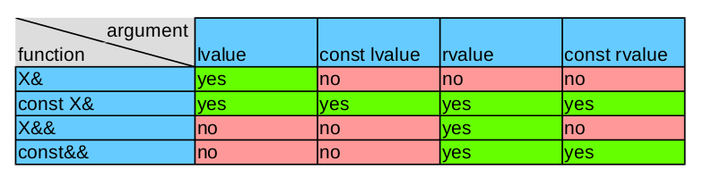

Подробнее [здесь](https://pro-prof.com/forums/topic/cplusplus_references).

### Для чего и на какие файлы производится разбиение программы на С++?

Разбиение производиться на header (.h/.hpp) - заголовочные файлы c объявлением структур данных, кода и т.п., source (.cpp) - файлы исходного кода с реализацией методов или функций, перечисленных в header файлах. 

Разбиение проводится для легкого модифицирования кода в будущем, быстрого расширения; в большом проекте позволяет избежать перекомпилирования всех файлов при добавлении небольших изменений в одном файле. Также позволяет решить проблему циклического подключения заголовочных файлов.

### Что такое union в C++, когда оно может быть применимо?

> Начиная с C++17 Core Guidelines советует использовать std::variant для замены union.

- union позволяет переиспользовать одну и ту же область памяти для хранения разных полей данных

- идентификаторы полей анонимного union попадают во внешнюю область видимости

Применяется в тех случаях, когда необходимо преобразовывать несовместимые типы данных. В качестве примера можно привести обработку изображений (.bmp и другие). Удобно считывать блоками(строками) и далее эта область разбивается по отдельным типам внутри структуры, т.е.

```c++
union
{
    char[256];
    struct
    {
        int
        word
        ...
    }
}
```

### Что такое перечисление (enum) в C++ и особенности его использования?

enum — это сгруппированный набор целочисленных констант

> Тип enum хорошо использовать везде, где есть состояния.

[Enum.1](https://isocpp.github.io/CppCoreGuidelines/CppCoreGuidelines.html#enum1-prefer-enumerations-over-macros): предпочитайте макросам перечислимые типы. Т.е. вместо макросов константы лучше записывать в виде перечисляемых типов.

### Что такое указатель на функцию и как он может быть использован?

Указатель на функцию (function pointer) хранит адрес функции. По сути указатель на функцию содержит адрес первого байта в памяти, по которому располагается выполняемый код функции.

Самым распространенным указателем на функцию является ее имя. С помощью имени функции можно вызывать ее и получать результат ее работы.

Но также указатель на функцию мы можем определять в виде отдельной переменной с помощью следующего синтаксиса:

```
тип (*имя_указателя) (параметры);
```

- Здесь тип представляет тип возвращаемого функцией значения.

- имя_указателя представляет произвольно выбранный идентификатор в соответствии с правилами о наименовании переменных.

- И параметры определяют тип и название параметров через запятую при их наличии.

Кроме одиночных указателей на функции мы можем определять их массивы. Для этого используется следующий формальный синтаксис:

```
тип (*имя_массива[размер]) (параметры)
```

Один из сценариев использования: вместо использования большого списка для оператора switch, можно использовать массив указателей на функции, в котором доступ к необходимым осуществляется с помощью индекса.

### Какие способы группировки данных в С++ вам известны?

- Sturct

- Class

- Union

- Enum

### Для чего предназначены структуры?

Способ синтаксически и физически сгруппировать логически связанные данные (для реализации инкапсуляции). Также позволяют реализовывать пользовательские типы данных.

### Где может быть определена структура или класс?

Везде

### Допустимо ли использование указателей/ссылок/массивов структур?

Да, допустимо

### Какие существуют способы передачи параметров в функцию?

- По значению (создается локальная копия)

- По указателю (передается адрес)

- По ссылке (передается значение по адресу) - можно определить, как указатель с автоматическим разыменованием

### Для чего предназначены классы, в чем их отличие от структур?

- По умолчанию у структур модификатор доступа - public, а у класса - private.

- Аналогичное отличие спецификатора доступа при наследовании

```c++
class myclass {
//private members
    int i;
    void f();
public:
//...
};
 
class myclass_2 : myclass /*private inheritance*/{
};
 
struct mystruct {
//public members
    int i;
    void f();
private:
//...
};
 
struct mystruct_2 : mystruct /*public inheritance*/{
};
```

- Ключевое слово class может использоваться для объявления параметров шаблона, а struct - нет

### Что такое выравнивание памяти в структурах и классах?

На процессорах x86 и ARM примитивные типы не могут находиться в произвольной ячейке памяти. Каждый тип, кроме char, требует выравнивания. char может начинаться с любого адреса, однако двухбайтовый short должен начинаться только с четного адреса, четырехбайтный int или float — с адреса, кратного 4, восьмибайтные long или double — с адреса, кратного 8. Наличие или отсутствие знака значения не имеет. Указатели — 32-битные (4 байта) или 64-битные (8 байт) — также выравниваются.

Выравнивание ускоряет доступ к памяти за счет генерации кода, в котором на чтение и запись ячейки памяти требуется по одной инструкции. Без выравнивания мы можем столкнуться с ситуацией, когда процессору придется использовать две и более инструкции для доступа к данным, расположенным между адресами, кратными размеру машинного слова. char — особый случай, они занимают ровно одно машинное слово и всегда требуют одинакового количества инструкций для доступа. Поэтому для них нет предпочтительного выравнивания.

Память компьютера работает следующим образом. Память программы можно представить себе как большой массив байт, а адрес — индекс в этом массиве.

```
[байт 0] [байт 1] [байт 2] [байт 3] [байт 4] [байт 5] [байт 6] [байт 7]...
```

Ну или иногда легче представлять так:

```
... [байт 7] [байт 6] [байт 5] [байт 4] [байт 3] [байт 2] [байт 1] [байт 0
```

\- Big Endian и Little Endian.

Байт, как минимально адресуемую единицу памяти, можно адресовать как угодно. Но обычно вы работаете с более крупными единицами. Например, это машинное слово: размер регистра процессора. Для 32-битной архитектуры это четырёхбайтовая структура.

Теперь, байты прекрасно организовываются в четвёрки:

```
[байт 0] [байт 1] [байт 2] [байт 3] [байт 4] [байт 5] [байт 6] [байт 7]...
[        машинное слово 0         ] [        машинное слово 1         ]...
```

Но заметьте, что в принципе байты можно бы комбинировать в машинные слова и по-другому:

```
[байт 0] [байт 1] [байт 2] [байт 3] [байт 4] [байт 5] [байт 6] [байт 7] [байт 8]...
         [          машинное слово         ] [     ещё одно машинное слово     ]...
```

\- машинное слово может начинаться по любому адресу!

Большинство компьютеров устроено так, что машинные слова, скомбинированные в четвёрки верхним образом читаются быстро, а вот машинные слова второго типа (то есть, те, которые не получаются шагами по 4 от нуля) — медленно. (Хотя требования по выравниванию могут быть и сложнее, и не совпадать с кратностью машинного слова.) Хуже того, очень многие архитектуры вовсе не позволяют читать такие слова, и для того, чтобы прочитать вот такое слово:

```
[байт 0] [байт 1] [байт 2] [байт 3] [байт 4] [байт 5] [байт 6] [байт 7]...
         [          машинное слово         ]
```

приходится читать машинные слова по адресу 0 и 4:

```
[байт 0] [байт 1] [байт 2] [байт 3] [байт 4] [байт 5] [байт 6] [байт 7]...
         [    нужно это машинное слово     ]
[     но приходится читать это    ] [              и это              ]
```

выбирать из них нужные байты, перетасовывать и собирать «вручную» в нужное машинное слово! Понятно, что это сложная и сравнительно дорогостоящая операция.

Поэтому компиляторы языка программирования C (да и большинства других тоже) проводят такую оптимизацию: между полями структуры вставляются незначащие байты для того, чтобы у всех полей было хорошее выравнивание.

Поэтому компиляторы языка программирования C (да и большинства других тоже) проводят такую оптимизацию: между полями структуры вставляются незначащие байты для того, чтобы у всех полей было хорошее выравнивание.

```c++
struct
{
    char x; // 1 байт
    int y;  // 4 байта
    char z; // 1 байт
};
```

память выделяется так:

```
[    ] [    ] [    ] [    ] [    ] [    ] [    ] [    ] [    ] [    ] [    ] [    ]
[  x ] { потерянные байты } [             y           ] [  z ] { потерянные байты }
```

Если сама структура будет выровнена в памяти (об этом компилятор тоже заботится), то `y` будет выровнено, и доступ к нему будет быстрым (а на некоторых платформах, напомню, вообще только в этом случае возможен).

Но в этом случае наша структура занимает больше памяти, чем если бы порядок переменных был таким:

```
[    ] [    ] [    ] [    ] [    ] [    ] [    ] [    ]
[  x ] [  z ] {  потеряно } [             y           ]
```

Бóльшая структура означает бóльший расход памяти и бóльшие затраты на копирование, чтение этой структуры и тому подобное. Таким образом, переставив поля структуры, мы можем сэкономить.

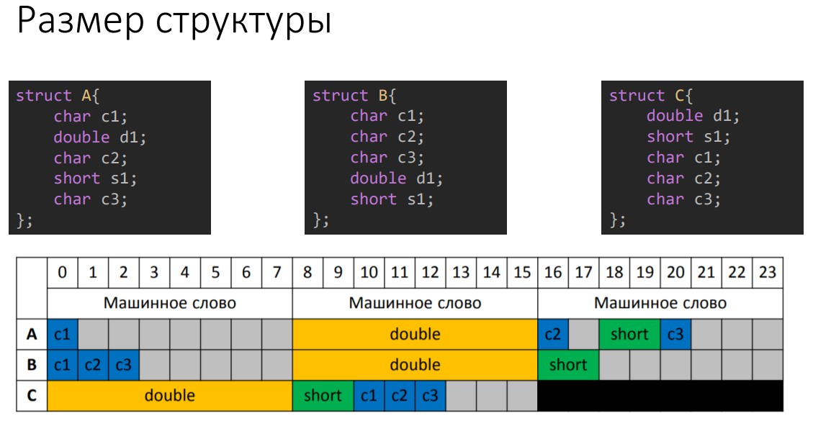

### В чем отличие функций от методов?

Функция - подпрограмма, выполняющая какие-либо операции и возвращающая значение.

Метод - это функция или процедура, которая принадлежит классу или экземпляру класса.

Процедура - подпрограмма, которая только выполняет операции, без возврата значения.

> Методы объявлены внутри класса, имеют доступ ко всем полям класса. Вызов метода через объект (если static, то через пространство имён класса). Функции не имеют доступа к приватным полям класса.

### В каких случаях используются значения по умолчанию в функциях?

Для каждого вызова функции, значения аргументов по умолчанию должны быть переданы вызываемой функции. Это приводит к повторяемости в коде. Аргументы по умолчанию избавляют позволяют избежать этого.

Если аргумент по умолчанию — это не просто литерал, а выражение, то это выражение может быть вычислено один раз для всей программы.

### Что такое публичный интерфейс?

Открытый (public) интерфейс предназначен для пользователей класса и включает открытые функции-члены, а также открытые базовые классы и друзей класса.

### Какие существуют модификаторы доступа, для чего они используются?

- Public — доступ открыт всем, кто видит определение данного класса.

- Protected — доступ открыт классам, производным от данного. То есть, производные классы получают свободный доступ к таким свойствам или метода. Все другие классы такого доступа не имеют.

- Private — доступ открыт самому классу (т.е. функциям-членам данного класса) и друзьям (friend) данного класса - как функциям, так и классам. Однако производные классы не получают доступа к этим данным совсем. И все другие классы такого доступа не имеют.

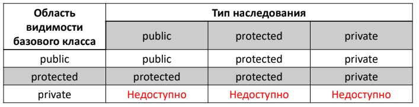

### Где применяется неявный указатель this?

Ключевое слово this представляет собой неявно определенный указатель на сам объект. С его помощью метод класса определяет, с данными какого объекта ему предстоит работать. Каждый метод класса неявно содержит в качестве поля данных указатель:

```
ИмяКласса *this;
```

При вызове метода ему передается неявный аргумент, содержащий адрес объекта, для которого эта функция вызывается.

```c++
class example
{
private:
    int m;
public:
    int readm() { return m; }   // return this->m
};

void f()
{
    example aa, bb;
    int a = aa.readm();     // this указывает на aa
    int b = bb.readm();     // this указывает на bb
}
```

В первом случае функции `readm()` неявно передается указатель на объект aa, а во втором случае – bb.

Использование this необходимо в функциях, которые непосредственно работают с указателем на объект:

- `this`  – указатель на объект (адрес объекта)

- `*this`  – указатель на объект (адрес объекта)

Указатель this удобно использовать, например, в конструкторах, когда имена передаваемых параметров совпадают с именами полей класса, для указания, что мы хотим обратиться именно к полю.

### Для чего используется ключевое слово const?

[Многоликий const](https://habr.com/ru/post/59558/)

- Ключевое слово const позволяет определять типизированные константы

- Ключевое слово const позволяет определять типизированные константы

- Попытка изменить константные данные приводит к неопределённому поведению

Указатель на константу:

```c++
int a = 10;
const int *firstConstPointer = &a;
const *int secondConstPointer = &a;
*firstConstPointer = 10; // Compile error
secondConstPointer = NULL;
```

Константный указатель:

```c++
int *const pointerToConst = &a;
*pointerToConst = 20;
pointerToConst = NULL; // Compile error
```

Константный указатель на константу:

```c++
int const *const constPointerToConst = &a;
*constPointerToConst = 30; // Compile error
constPointerToConst = NULL; // Compile error
```

#### Константные методы

- Методы классов и структур могут быть помечены модификатором const

- Не могут изменять поля объекта

- Указатель `this` является `Type const *this`

- У константных объектов можно вызывать только константные методы

- Является частью сигнатуры методы

```c++
class IntArray {
    int size;
    int *data;
public:
    int get(int index) const
    {
        return data[index];
    }
    int &get(int index)
    {
        return data[index];
    }
};
```

```c++
struct Example
{
    int n1;
    mutable int n2;
};

const A a;
a.n1 = 2; //ошибка
a.n2 = 2;
```

### Что такое константные ссылки/указатели, указатели/ссылки на константу?

Константный указатель позволяет изменять состояние объекта, на который он ссылается, но не позволяет изменять сам указатель, т.е. адрес. Ссылка - сама по себе неизменяемая, после присваивания изменить объект, на который она ссылается, нельзя, также позволяет менять состояние объекта. Указатель/ссылка на константу не позволяет изменять состояние объекта по адресу, который они содержат, при этом можно изменить адрес объекта, на который они ссылаются.

#### Константные указатели

> Модификатор const делает неизменяемым тип слева от него

```c++
int a = 10;
int *pointer = &a;
// Указатель на указатель на константу int.
int const **pointerToPointerToConst = &pointer;
// Указатель на константный указатель на int.
int * const *pointerToConstPointer = &pointer;
// Константный указатель на указатель на int.
int ** const constPointerToPointer = &pointer;
```

- Разрешены неявные преобразования `T*` к `T const*`

- Запрещены неявные преобразования `T**` к `T const**`

```c++
int const value = 1;
int *pointer = NULL;
pointer = &value; //!Compile error, т.к. это преобразование int const* -> int*
int const **ppointer = &pointer; //!Запрещенное преобразование int** -> int const**
*ppointer = &value; //!Скомпилируется, т.к. *ppointer имеет тип int const*
*pointer = 2; //!Изменяет значение константной переменной
```

#### Константные ссылки

Ссылка сама по себе является неизменяемой:

```c++
int a = 10;
int & const reference = a; // Compile error
int const & constReference = a;
```

Позволяет избежать копирования объектов при передаче в функцию:

```c++
Point2D midPoint(Segment const &seg);
```

### В чем отличие синтаксической и логической константности методов?

- Синтаксическая – константные методы не могут модифицировать поля
(обеспечивается компилятором)

- Логическая – запрещено изменение данных, определяющих состояние
объекта в константных методах

```c++
class IntArray
{
    int size;
    int *data;
public:
    void method() const
    {
        data[10] = 1; // Нарушение логической константности.
    }
};
```

#### Для чего используется ключевое слово default?

Определение функции как `default` возможно только для специальных функций-членов класса: конструкторов, деструкторов и операторов присваивания. Определяться эти функции будут так, как они неявно определялись испокон веков - через делегирование соответствующих действий каждому полю класса. Произвольную постороннюю функцию нельзя просто взять и определить, как `default`.

Польза от возможности такого определения происходит в первую очередь из того, что в С++11 явное объявление перемещающего конструктора копирования или оператора присваивания подавляет неявное объявление/определение всех остальных функций из Правила Пяти (и наоборот). А в будущем объявление вообще любой функции из Правила Пяти будет подавлять объявление всех остальных функций Правила Пяти. Чтобы в такой ситуации "спасти" потерянные объявления/определения (если они вас устраивают) как раз и подходит default

```c++
struct S
{
    S& operator =(S &&) { return *this; }
    // Подавляет неявное объявление копирующего оператора присваивания
};

int main()
{
    S s, t;
    s = t; // Ошибка - нет копирующего оператора присваивания
}
```

Чтобы "восстановить" работоспособность этого кода достаточно добавить в класс:

```c++
S& operator =(const S&) = default;
```

Некоторые тонкости зависят от того, где именно функция определена как `default`. Если такое определение сделано в точке первого объявления в классе, то такая функция ничем не отличается от неявно определенной функции - она не считается _предоставленной пользователем (user-provided)_. А вот если функция была сначала объявлена в классе, а затем определена как `default` за пределами класса, то такая функция является предоставленной пользователем. Это влияет на такие свойства класса, как _агрегатность_ и пр.

```c++
struct S
{
    int i;
    S() = default;
};

struct T
{
    int i;
    T();
};

T::T() = default;

// Класс `S` по-прежнему является агрегатом, а вот класс `T`
// агрегатом не является

int main()
{
    S s = { 1 }; // Все в порядке, обычная агрегатная инициализация
    T t = { 1 }; // Ошибка, агрегатная инициализация недоступна
}
```

> Описание деструктора как `default` никак не влияет на его виртуальность.

### Для чего используется ключевое слово mutable?

- Позволяет определять поля доступные для изменения внутри константных методов

- Можно использовать только с полями не являющимися частью состояния объекта

```c++
class IntArray
{
    int size;
    int *data;
    mutable int counter;
public:
    int Size() const
    {
        ++counter;
        return size;
    }
};
```

### Какие методы в классе генерируются компилятором?

1. конструктор по-умолчанию (default constructor)
2. конструктор копирования (copy constructor)
3. оператор присваивания (assignment operator)
4. деструктор (destructor)
5. конструктор перемещения (move constructor)
6. оператор присваивания перемещением (move assignment operator)

### Что такое конструктор?

Метод, имя которого совпадает с именем класс, предназначенный для инициализации объектов класса. Конструкторы не имеют возвращаемого значения.

### В каких случаях используется перегрузка конструкторов?

Имеется три основных причины перегрузки конструктора, которая, как правило, выполняется либо для обеспечения гибкости, либо для поддержки массивов, либо для создания конструкторов копий.

### Какую цель может преследовать создание приватного конструктора?

Например, для запрета копирования и перемещения.

Цель контроля при создании и конструировании объекта, например, мы хотим, чтобы нельзя было создать больше одного объекта данного класса. (singleton)

### Каким образом и в какой последовательности происходит инициализация полей объекта?

- Объекты создаются "снизу-вверх" - от базовых к производным

- Порядок вызовов конструкторов:

  1. Конструкторы виртуальных базовых классов

  2. Конструкторы виртуальных базовых классов

  3. Конструкторы полей

  4. Конструктор класса

- Деструкторы вызываются в обратном порядке

### Для чего используется ключевое слово explicit?

> Запрещает неявное преобразование

```c++
class Segment
{
private:
    Point first; Point second;
public:
    Segment() : first(0, 0), second(0, 0) {}
    explicit Segment(int length) : first(0, 0), second(length, 0) {}
};
int main()
{
    egment first; Segment second(10);
    Segment third = 20; // Compile error
}
```

### В чем заключается предназначение конструктора по умолчанию?

Определяется неявным образом, не имеет аргументов (nullary constructor), используется для инициализации полей объекта класса. Если программист явно указал только конструктор с параметрами, то компилятор не будет создавать конструктор по умолчанию.

В C++, стандарт описывает конструктор по умолчанию как конструктор, который может быть вызван без передачи аргументов (включая конструктор с параметрами, имеющими значение по умолчанию). Например:

```c++
class MyClass
{
public:
    MyClass();  // конструктор описан

private:
    int x;
};

MyClass :: MyClass() : x(100)  // конструктор определён
{
}

int main()
{
    MyClass m;  // во время работы программы создаётся объект m И вызывается конструктор по умолчанию
}
```

Когда динамически выделяется память под объект, конструктор может быть вызван при помощи добавления пустых скобок после имени класса. В некотором смысле, это явный вызов конструктора:

```c++
int main()
{
    MyClass * pointer = new MyClass();  // во время работы (рантайм) объект создаётся, и
                                        // вызывается конструктор по умолчанию
}
```

Если у конструктора есть один или несколько параметров по умолчанию — это по прежнему конструктор по умолчанию. Каждый класс может иметь не более одного конструктора по умолчанию: либо без параметров, либо с параметрами, имеющими значения по умолчанию, как в этом примере:

```c++
class MyClass
{
public:
    MyClass (int i = 0, std::string s = "");  // конструктор описан (прототип)

private:
    int x;
    int y;
    std::string z;
};

MyClass :: MyClass(int i, std::string s)     // конструктор определён
{
    x = 100;
    y = i;
    z = s;
}
```

В C ++ конструкторы по умолчанию имеют существенное значение, поскольку они автоматически вызываются при определенных обстоятельствах, и, следовательно, при определённых условиях класс обязан иметь конструктор по умолчанию, иначе возникнет ошибка:

- Когда объект объявляется без аргументов (например, `MyClass x;`) или создаётся новый экземпляр в памяти (например, `new MyClass;` или `new MyClass();`).

- Когда объявлен массив объектов, например, `MyClass x[10];`; или объявлен динамически, например `new MyClass [10]`. Конструктор по умолчанию инициализирует все элементы.

- Когда в классе потомке не указан явно конструктор класса родителя в списке инициализации.

- Когда конструктор класса не вызывает явно конструктор хотя бы одного из своих полей-объектов в списке инициализации.

- В стандартной библиотеке определённые контейнеры заполняют свои значения используя конструкторы по умолчанию, если значение не указано явно. Например, `vector<MyClass>(10);` заполняет вектор десятью элементами, инициализированными конструктором по умолчанию.

Если в классе не определён конструктор по-умолчанию, компилятор неявно создаст его. Он будет аналогичен явно объявленному конструктору с пустым телом. Напримeр:

```c++
class MyClass
{
    int x;
};

int main()
{
    MyClass m;   // ошибки во время работы программы нет, вызывается неявный конструктор
}
```

Если определены конструкторы для класса, но среди них нет конструктора по умолчанию, компилятор не создаст неявно таковой. Это приводит к ошибкам, как в этом примере:

```c++
class MyClass
{
public:
    MyClass (int y);  // объявление конструктора не по умолчанию

private:
    int x;
};

MyClass :: MyClass (int y)
{
    x = y;
}

int main()
{
    MyClass m(100);     // вызывается конструктор не по умолчанию
    MyClass * p;        // при объявлении указателя компилятору не нужно знать о конструкторах
    p = new MyClass();  // ошибка во время компиляции: нет конструктора по умолчанию
    return 0;
}
```

С другой стороны, с `C++11` конструктор по умолчанию может быть явно указан:

```c++
class MyClass
{
public:
    MyClass () = default;  // force generation of a default constructor
};
```
Или явно удалён:

```c++
class MyClass
{
public:
    MyClass () = delete;  // prevent generation of default constructor
};
```

### Что такое деструктор, для чего он используется?

Деструктор выполняет освобождение использованных объектом ресурсов и удаление нестатических переменных объекта. По сути деструктор - это функция, которая называется по имени класса (как и конструктор) и перед которой стоит тильда (~). Деструктор не имеет возвращаемого значения и не принимает параметров. Каждый класс может иметь только один деструктор.

### Каков порядок вызова деструкторов при разрушении объекта?

> Конструкторы - сначала базовый, потом производный. Деструкторы наоборот.

1. Деструктор текущего класса.
2. Деструктор полей класса
3. Деструктор прямых базовых классов
4. Деструктор виртуальных базовых классов

Например:

```c++
class Derived : public Base
{
    Property1 m_property1;
    Property2 m_property2;
};
```

Порядок вызова конструкторо и деструкторов будет следующий:

1. Конструктор Base
2. Конструктор Property1
3. Конструктор Property2
4. Конструктор Derived
5. Деструктор Derived
6. Деструктор Property2
7. Деструктор Property1
8. Деструктор Base

### В какой момент вызывается деструктор объекта?

Деструктор автоматически вызывается, когда удаляется объект. Удаление объекта происходит в следующих случаях:

- когда завершается выполнение области видимости, внутри которой определены объекты;

- когда удаляется контейнер (например, массив), который содержит объекты;

- когда удаляется объект, в котором определены переменные, представляющие другие объекты;

- динамически созданные объекты удаляются при применении к указателю на объект оператора `delete`.

### Каково время жизни объекта?

[l-value ссылки и время жизни объекта](https://habr.com/ru/post/186790/)

- Переменная, объявленная глобально (т.е. вне всех блоков), существует на протяжении всего времени выполнения программы.

- Локальные переменные (т.е. объявленные внутри блока) с классом памяти register или auto, имеют время жизни только на период выполнения того блока, в котором они объявлены. Если локальная переменная объявлена с классом памяти static или extern, то она имеет время жизни на период выполнения всей программы.

#### Константная ссылка на временный объект

```c++
string f() { return "abc"; }

void g() {
    const string& s = f();
    cout << s << endl; // ??
}
```

В С++ явно специфицировано, что если привязать временный объект к ссылке на const в стеке, то жизнь временного объекта будет продлена. Теперь он будет жить столько, сколько живет константная ссылка на него. В приведенном примере все валидно, время жизни s заканчивается с закрывающей фигурной скобкой.

> Это все относится только к объектам в стеке. На члены класса это не действует.

Ещё один момент:

```c++
Derived factory(); // construct a Derived object

void g() {
  const Base& b = factory(); // здесь вызов Derived::Derived
  // … используем b …
} // здесь вызывается Derived::~Derived напрямую 
//-- а не Base::~Base + virtual dispatch!
```

### Зачем нужен виртуальный деструктор?

Виртуальный деструктор нужен, чтобы при удалении объекта производного класса, например через указатель на родительский, были вызваны все деструкторы до него и его собственный. Следует добавлять его, если в классе есть хотя бы одна виртуальная функция. Если базовый класс предназначен для полиморфного использования, то его деструктор должен объявляться виртуальным.

### Как осуществляется работа с динамической памятью в С/С++?

#### C-style работы с динамической памятью

- `void* malloc(size_t sizemem)` - выделяет блок памяти, размером sizemem байт и возвращает указатель на начало блока. Содержание выделенного блока памяти не инициализируется (остается с неопределенными значениями).

- `void* calloc(size_t nmemb, size_t size)` - выделяет память для массива размером nmemb, каждый элемент которого равен size байт и возвращает указатель на выделенную память. Память при этом очищается (зануляется).

- `void* realloc(void *ptr, size_t size)` - меняет размер блока памяти, на который указывает ptr, на размер, равный size байт. Содержание будет неизменным в пределах наименьшего из старых и новых размеров, а новая распределенная память будет не инициализирована.

- `void free(void *ptr)` - освобождает место в памяти, на который указывает ptr, полученный динамическим выделением памяти. Иначе (если функция free уже вызывалась для этого участка памяти, дальнейший ход событий непредсказуем – undefined behavior). Если ptr == NULL, то не выполняется никаких действий.

Вызов функции realloc с параметром size равным нулю эквивалентен free(ptr).

#### Работа с динамической памятью в C++

Создание объекта `new` – отвечает за вызов конструктора.

При вызове оператора `delete` вызывается деструктор объекта.
> `new` выделяет память и инициализирует ее, а `malloc`  просто выделяет

### В чем различие delete и delete[]?

- `delete` - применяется для указателей

- `delete[]` - применяется для массивов

- Если `delete` вызывается для массива удаляется только первый элемент

### Перечислите основные подходы к обработке ошибок

1. Аварийная остановка программы;
2. Возврат кода ошибки из вызванного метода;
3. Сообщение об ошибке через внешнюю переменную – `errno`;
4. Использование функций-обработчиков (бросание исключений).

### Для чего предназначен механизм обработки исключительных ситуаций?

Исключение — это событие при выполнении программы, которое приводит к её ненормальному или неправильному поведению.

Существует два вида исключений:

- Аппаратные (структурные, SE-Structured Exception), которые генерируются процессором. К ним относятся, например,

  - деление на 0;

  - выход за границы массива;

  - обращение к невыделенной памяти;

  - переполнение разрядной сетки.

- Программные, генерируемые операционной системой и прикладными программами – возникают тогда, когда программа их явно инициирует. Когда встречается аномальная ситуация, та часть программы, которая ее обнаружила, может сгенерировать, или возбудить, исключение.

Механизм структурной обработки исключений позволяет однотипно обрабатывать как программные, так и аппаратные исключения.

_Фундаментальная идея_ обработки исключительных ситуаций состоит в том, что функция, обнаружившая проблему, но не знающая как её решить, генерирует исключение в надежде, что вызвавшая её (непосредственно или косвенно) функция сможет решить возникшую проблему. Функция, которая может решать проблемы данного типа, указывает, что она перехватывает такие исключения.

Для реализации обработки исключений в C++ используйте выражения `try`, `throw` и `catch`.

Позволяет программистам разделить код на:

1. Реализующий естественное поведение программы;
2. Обрабатывающий исключительные ситуации.

### Что такое исключение?

Исключение — это событие при выполнении программы, которое приводит к её ненормальному или неправильному поведению.

Характеристики исключений в C++:

- Доставляют информацию из точки, где обнаружена ошибка в точку, где она может быть обработана;

- Хорошо подходят для библиотек;

- Название говорит не о редкости их возникновения, а об особом способе обработки подобных ситуаций;

- Объекты исключений могут быть любого типа, допускающего копирование;

- Рекомендуется использовать специальные типы для объектов, которые «бросаются» в исключительных ситуациях.

### Какие типы данных допустимы для использования в качестве объектов exception?

Возможны все, в которых определены конструкторы копирования, но рекомендуется использовать либо базовые, либо пользовательские классы исключений.

### Как происходит возбуждение исключения?

1. Создание объекта-исключения и «пробрасывание» его вверх с использованием оператора throw
2. Запускает "раскручивание" стека в поисках обработчика

### Кто отвечает за обработку возникших исключительных ситуаций?

Блок try и catch. Когда какая-то инструкция внутри try возбуждает исключение, рассматривается последовательно список блоков catch, в которых может быть обработано возникшее исключение.

### Какие 3 уровня гарантии в механизме исключений?

1. basic - соблюдается базовый инвариант для всех объектов, нет утечки ресурсов
2. strong - дополнительно операция выполняется либо полностью, либо не имеет эффекта совсем
3. nothrow - гарантируют отсутствие возможности возбуждения исключения при выполнении операции

### Что такое раскрутка стека?

[Хабр](https://habr.com/ru/post/208006/)

Поиск catch-обработчикадля возбужденного исключения происходит следующим образом. Когда выражение throw находится в try-блоке, все ассоциированные с ним предложения catch исследуются с точки зрения того, могут ли они обработать исключение. Если подходящее предложение catch найдено, то исключение обрабатывается. В противном случае поиск продолжается в вызывающей функции. Предположим, что вызов функции, выполнение которой прекратилось в результате исключения, погружен в try-блок; в такой ситуации исследуются все предложения catch, ассоциированные с этим блоком. Если один из них может обработать исключение, то процесс заканчивается. В противном случае переходим к следующей по порядку вызывающей функции. Этот поиск последовательно проводится во всей цепочке вложенных вызовов. Как только будет найдено подходящее предложение, управление передается в соответствующий обработчик.

Если в программе нет предложения `catch`, способного обработать исключение, оно остается необработанным. Но исключение – это настолько серьезная ошибка, что программа не может продолжать выполнение. Поэтому, если обработчик не найден, вызывается функция `terminate()` из стандартной библиотеки C++. По умолчанию `terminate()` активизирует функцию `abort()`, которая аномально завершает программу. (В большинстве ситуаций вызов `abort()` оказывается вполне приемлемым решением. Однако иногда необходимо переопределить действия, выполняемые функцией `terminate()`.

Во время раскрутки поочередно происходят аномальные выходы из просмотренных функций. Если функция захватила некоторый ресурс (например, открыла файл или выделила из хипа память), он в таком случае не освобождается.

Существует прием, позволяющий решить эту проблему. Всякий раз, когда во время поиска обработчика происходит выход из составной инструкции или блока, где определен некоторый локальный объект, для этого объекта автоматически вызывается деструктор

Процесс обработки исключений в C++ строится на технике RAII, основной принцип которой можно сформулировать так: “захват ресурса – это инициализация; освобождение ресурса – это уничтожение”. Если ресурс реализован в виде класса и, значит, действия по его захвату сосредоточены в конструкторе, а действия по освобождению – в деструкторе, то локальный для функции объект такого класса автоматически уничтожается при выходе из функции в результате необработанного исключения. Действия, которые должны быть выполнены для освобождения ресурса, не будут пропущены при раскрутке стека, если они инкапсулированы в деструкторы, вызываемые для локальных объектов.

### Что такое делегирующие конструкторы?

- Позволяет вызывать конструктор из конструктора того же класса.

- Сокращает дублирование кода

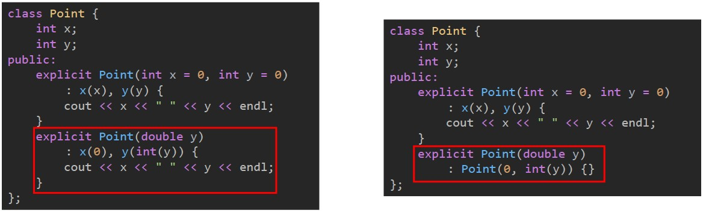

### Что вы можете сказать о генерации исключений в конструкторе/деструкторе?

#### Исключения в конструкторе

Если конструктор класса завершает работу исключением, значит он не завершает свою работу — следовательно объект не будет создан. Из-за этого могут возникать утечки памяти, т.к. для не полностью сконструированных объектов не будет вызван деструктор. Из-за этого распространено мнение, что конструктор никогда не должен вырабатывать исключения, однако это не так — утечки памяти возникнут не во всех случаях.

Стандарт языка С++ гарантирует, что если исключение возникнет в конструкторе, то памяти из под членов-данных класса будет освобождена корректно вызовом деструктора — т.е. если вы используете идиому RAII, то проблем не будет. Часто для этого достаточно использовать std::vector/std::string вместо старых массивов и строк, и умные указатели вместо обычных. Если же вы продолжите использовать сырые указатели и динамически выделять память — нужно будет очень тщательно следить за ней, например в следующем фрагменте кода нет утечки, т.к. исключение будет выработано только если память не будет выделена:

```c++
template <class ElementType>
Array<ElementType>::Array() : m_realSize(Step), m_size(0), m_array(0) {
    m_array = (ElementType*)malloc(sizeof(ElementType)*m_realSize);
    if (0 == m_array) {
        throw bad_allocation();
    }
}
```

#### Исключения в деструкторе

Выбрасыванние исключения в деструкторе может привести к печальным последствиям.

Во-первых, программа не должна вырабатывать исключения во время обработки другого исключения (когда происходит раскрутка стека) — это приведет к аварийному завершению работы программы (фактически вызову `abort()`), которое уже не получится корректно обработать. Причина такой ошибки заключается в том, что один из деструкторов вырабатывает исключение или не обрабатывает исключение функции, которую вызывает.

Во-вторых, если деструктор завершает работу исключением, то может возникать утечка памяти — в памяти могут остаться как части текущего класса, так и базовых классов. Из этого ясно, что **деструктор никогда не должен вырабатывать исключения**, а также обрабатывать все возможные исключения функций, которые вызывает — они могут приводить как к утечкам, так и к очень трудноуловимым ошибкам.

Когда исключение покидает блок, все локальные объекты, созданные в этом блоке, уничтожаются. Если деструктор объекта, уничтожаемого во время развертки стека, генерирует исключение, то программа будет завершена досрочно, и ее уже ничего не спасет.

### Что такое ассоциация?

> Ассоциация – это когда один класс включает в себя другой класс в качестве одного из полей. Ассоциация описывается словом «имеет». 
>
>Автомобиль имеет двигатель. Вполне естественно, что он не будет являться наследником двигателя (хотя такая архитектура тоже возможна в некоторых ситуациях).

Ассоциация показывает, что объекты одной сущности (класса) связаны с объектами другой сущности таким образом, что можно перемещаться от объектов одного класса к другому. Является общим случаем композиции и агрегации.

Например, класс Человек и класс Школа имеют ассоциацию, так как человек может учиться в школе. Ассоциации можно присвоить имя «учится в».

Двойные ассоциации представляются линией без стрелочек на концах, соединяющей два классовых блока. Ассоциации более высокой степени имеют более двух концов и представляются линиями, один конец которых идёт к классовому блоку, а другой к общему ромбику. В представлении однонаправленной ассоциации добавляется стрелка, указывающая на направление ассоциации.

Ассоциация может быть именованной, и на концах представляющей её линии могут быть подписаны роли, принадлежности, индикаторы, мультипликаторы, видимости или другие свойства.

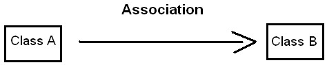

### Что такое композиция и агрегация, чем они отличаются?

#### Агрегация

> Агрегация – это когда экземпляр двигателя создается где-то в другом месте кода, и передается в конструктор автомобиля в качестве параметра.

Агрегация — это разновидность ассоциации при отношении между целым и его частями. Как тип ассоциации агрегация может быть именованной. Одно отношение агрегации не может включать более двух классов (контейнер и содержимое).

Агрегация встречается, когда один класс является коллекцией или контейнером других. Причём по умолчанию, агрегацией называют агрегацию по ссылке, то есть когда время существования содержащихся классов не зависит от времени существования содержащего их класса. Если контейнер будет уничтожен, то его содержимое — нет.

Графически агрегация представляется пустым ромбом на блоке класса, и линией, идущей от этого ромба к содержащемуся классу.

Пример:

```c++
class Person { ..
};
class Group { Person *members;
public:
    void addMember(Person *member) {
        // Добавление участника
    }

    void removeMember(Person *member) {
        // Исключение участника
    }
};
```

#### Композиция

> Композиция – это когда двигатель не существует отдельно от автомобиля. Он создается при создании автомобиля и полностью управляется автомобилем. В типичном примере, экземпляр двигателя будет создаваться в конструкторе автомобиля.

Композиция — более строгий вариант агрегации. Известна также как агрегация по значению.

Композиция имеет жёсткую зависимость времени существования экземпляров класса контейнера и экземпляров содержащихся классов. Если контейнер будет уничтожен, то всё его содержимое будет также уничтожено.

Графически представляется, как и агрегация, но с закрашенным ромбиком.

Пример:

```c++
class Point {
    int x; int y; public:
    Point(int x, int y): x(x), y(y) {}
};

class Circle { Point *center; int radius;
public:
    Circle(int x, int y, int radius) : center(new Point(x, y)), radius(radius) {};
    ~Circle() { delete center; }
};
```

#### Различия между композицией и агрегацией

Приведём наглядный пример. Комната является частью квартиры, следовательно здесь подходит композиция, потому что комната без квартиры существовать не может. А, например, мебель не является неотъемлемой частью квартиры, но в то же время, квартира содержит мебель, поэтому следует использовать агрегацию.

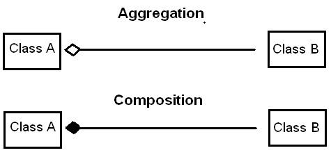

### Время жизни агрегируемого объекта меньше времени жизни агрегата?

Время жизни агрегируемого объекта не зависит от жизни агрегата.

### Какие классы называются дружественными, для каких целей используется это отношение?

Дружественные классы – это классы, которые имеют доступ к приватным полям другого класса. Дружественность не наследуется.

### В каком случае можно говорить об отношение "реализация"?

- Структурное отношение;

- Наследование от интерфейса;

- Интерфейс - класс, содержащий только чисто виртуальные методы и не обладающий состоянием.

Пример:

```c++
class Serializable {
public:
    virtual char* serialize() const = 0;
};

class MyClass : public Serializable {
public:
    char* serialize() const override {
        // Логика сериализации объекта
    }
};
```

### Как представлены объекты в памяти при использовании механизма наследования?

- Дополнительная память только для новых полей;

- Внутренний объект родительского класса располагается в начале дочернего;

- Ссылку или указатель на объект дочернего класса можно использовать везде, где допустимо использование ссылки или указателя на объект родительского класса.

### Какие существуют типы наследования, чем они различаются?

- Базовый класс может быть объявлен с одним из следующих модификаторов доступа:

  - private

  - protected

  - public

- Приватные члены базового класса недоступны в дочернем ни при каком типе наследования

- Конструкторы и деструкторы не наследуются

**Доступ к полям при наследовании:**

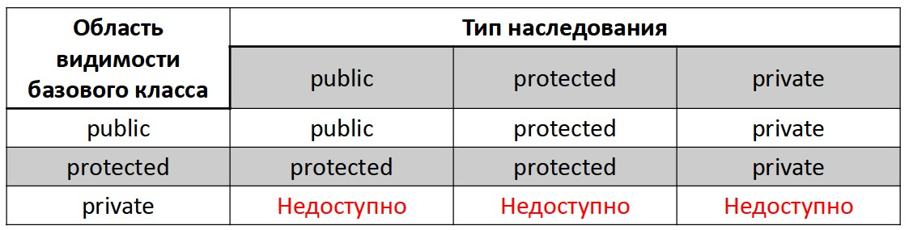

### Наследуются ли конструкторы и деструкторы?

Конструкторы и деструкторы не наследуются.

### Наследуются ли приватные поля базового класса?

Да, но мы не можем к ним обращаться из производных классов.

### Что такое полиморфный класс?

- Любой класс, содержащий по крайней мере одну виртуальную функцию является полиморфным.

- Каждый объект такого класса содержит таблицу виртуальных функций (vtable).

- При использовании ссылки / указателя разрешение методов происходит динамически в момент вызова.

### Что такое виртуальная функция?

Виртуальная функция в С++ — это особый тип функции, которая, при её вызове, вызывает «наиболее» дочерний метод, который существует между родительским и дочерними классами. Эта возможность ещё известна как полиморфизм. Дочерний метод вызывается тогда, когда совпадает сигнатура (имя, типы параметров и является ли метод константным) и тип возврата дочернего метода с сигнатурой и типом возврата метода родительского класса. Такие методы называются переопределениями (или ещё «переопределёнными методами»).

### Как осуществить вызов базовой реализации функции при её переопределении в дочернем классе?

Напрямую указав пространство имён требуемого базового класса.

```c++
class Employee {
public:
    virtual void print() {
        std::cout << "I'm employee" << std::endl;
    }
};

class Manager : public Employee {
    void print() {
        Employee::print();
        std::cout << "I'm also manager" << std::endl;
    }
};
```

### Как связаны виртуальные функции и полиморфизм?

Виртуальные методы - динамический полиморфизм (позднее связывание): выбор метода происходит в момент выполнения на основе типа объекта, на котором осуществляется вызов.

### Что такое переопределение функций?

Переопределение метода (англ. Method overriding) в объектно-ориентированном программировании — одна из возможностей языка программирования, позволяющая подклассу или дочернему классу обеспечивать специфическую реализацию метода, уже реализованного в одном из суперклассов или родительских классов. Реализация метода в подклассе переопределяет (заменяет) его реализацию в суперклассе, описывая метод с тем же названием, что и у метода суперкласса, а также у нового метода подкласса должны быть те же параметры или сигнатура, тип возвращаемого результата, что и у метода родительского класса.

### Работает ли переопределение для приватных функций?

Да, работает.

### Что такое таблица виртуальных функций?

- Координирующая таблица (vtable)

- Указатель на vtable хранится в каждом объекте

- Содержит адреса динамически связанных методов объекта

- Выбор реализации метода при вызове осуществляется определением адреса требуемого метода из таблицы

```c++
struct Person {
    virtual ~Person() {}
    string name() const;
    virtual string position() const = 0;
};

struct Student : Person {
    string position() const;
    virtual int group();
};
```

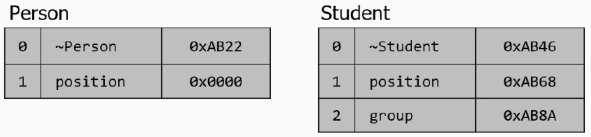

### Как себя ведут виртуальные функции в конструкторе и деструкторе?

> Никогда не вызывайте виртуальные функции в конструкторе или деструкторе

Поскольку конструкторы базовых классов вызываются раньше, чем конструкторы производных, то данные-члены производного класса еще не инициализированы во время работы конструктора базового класса. Это может стать причиной неопределенного поведения и близкого знакомства с отладчиком. Обращение к тем частям объекта, которые еще не были инициализированы, опасно, поэтому C++ не дает такой возможности.

Есть даже более фундаментальные причины. Пока над созданием объекта производного класса трудится конструктор базового класса, типом объекта является базовый класс. Не только виртуальные функции считают его таковым, но и все прочие механизмы языка, использующие информацию о типе во время исполнения.

То же относится и к деструкторам. Как только начинает исполнение деструктор производного класса, предполагается, что данные-члены, принадлежащие этому классу, не определены, поэтому C++ считает, что их больше не существует. При входе в деструктор базового класса наш объект становится объектом базового класса, и все части C++ – виртуальные функции, оператор `dynamic_cast` и т. п. – воспринимают его именно так.

### В каких случаях допустимо приведение указателей/ссылок на дочерний класс к базовому?

- Использование ссылки производного класса допустимо везде, где предполагается ссылка базового класса

```c++
Manager manager(“Name”, “Surname”, “Sales”);
Employee &ref = manager; // Manager& -> Employee&
Employee *ptr = &manager; // Manager* -> Employee*
```

- Допустимо присвоение переменной базового класса объекта производного

- При этом используется конструктор копирования родительского класса

```c++
Manager manager(“Name”, “Surname”, “Sales”);
Employee employee = manager; // Employee(“Name”, “Surname”);
```

- При использовании публичного наследования использование ссылки на производный класс допустимо везде

```c++
class Class {};
class PublicChild : public Class{};
class ProtectedChild : protected Class{};
class PrivateChild : private Class{};
```

- При наследовании с модификатором protected, о том что Class является базовым для ProtectedChild знают сам класс и его наследники

- При использовании модификатора private приведение ссылки к базовому допустимо только внутри PrivateChild

### Что такое чистая виртуальная функция?

- Функция, которая объявляется в базовом классе, но не имеет в нем определения

- Всякий производный класс обязан иметь свою собственную версию

- Для объявления чистой виртуальной функции следует:

  1. Использовать ключевое слово virtual, расположив его перед типом возвращаемого значения
  2. Указать = 0; после списка аргументов
  3. Исключить тело функции (оставить её без реализации)

### Какой класс называется абстрактным?

- Любой класс, содержащий по крайней мере одну чистую виртуальную функцию является абстрактным

- Предназначен для хранения общей реализации и поведения некоторого множества дочерних классов

- Объекты абстрактного класса создать нельзя

- Может содержать чисто виртуальный деструктор

### Как в С++ реализуются интерфейсы?

- В С++ отсутствует специальная синтаксическая конструкция для определения интерфейса

- Интерфейсом является класс, содержащий только public секцию и только чистые виртуальные методы

- Интерфейс не должен содержать поля

- Каждый интерфейс является абстрактным классом, но не каждый абстрактный класс интерфейс

- При использовании интерфейс реализуют, абстрактный класс – наследуют

### Что такое перегрузка функций?

- Переопределение функций – создание функции в дочернем классе с сигнатурой, совпадающей с функцией в родительском классе

- Для определения вызываемой функции компилятор сначала ищет ее в дочернем классе, если не находит, то ищет в базовых классах по цепочке наследования

- Переопределение функций позволяет изменять поведение базового класса

### Как ведет себя перегрузка при наследовании?

[Хабр](https://habr.com/ru/post/149287/)

> Компилятор трактует объявление и переопределение метода по разному и в начале ищет подходящий метод в классе текущей переменной и если подходящая перегрузка будет найдена (даже если понадобится неявное приведение типов), то он на этом и успокоится и рассматривать базовые классы не будет, даже если там есть более подходящая версия метода, переопределяемая наследником.

- using позволяет не переопределять каждую перегруженную функцию базового класса

- using позволяет задать использование базового конструктора в качестве дочернего

- using позволяет изменить спецификатор доступа функций

### Опишите процесс выбора функции среди перегруженных.

- При наличии точного совпадения сигнатуры – используется найденная функция

- Если не найдена функции, которая могла бы подойти с учетом типом преобразований – выдается ошибка

- Если есть функции, подходящие с учетом преобразований:

  - Расширение типов:

    - char, signed char, short -> int

    - unsigned char, unsigned short -> int / unsigned int

    - float -> double

  - Стандартные преобразования (числа, указатели)

  - Пользовательские преобразования

Подходящая функция должна быть единственной и строго лучше остальных по каждому из параметров.

### Чем отличаются механизмы раннего и позднего связывания?

Связывание — это процесс, который используется для конвертации идентификаторов (таких как имена переменных или функций) в адреса. Связывание используется как для переменных, так и для функций.

Большинство вызовов функций, которые встречает компилятор, являются прямыми вызовами функций. Прямой вызов функции — это стейтмент, который напрямую вызывает функцию. Например:

```c++
#include <iostream>
 
void printValue(int value)
{
    std::cout << value;
}
 
int main()
{
    printValue(7); // это прямой вызов функции
    return 0;
}
```

Прямые вызовы функций выполняются с помощью раннего связывания. **Раннее связывание** (или ещё **"статическая привязка"**) означает, что компилятор (или линкер) может напрямую связать имя идентификатора (например, имя функции или переменной) с машинным адресом. Помните, что все функции имеют свой уникальный адрес. Поэтому, когда компилятор (или линкер) встречает вызов функции, он заменяет его инструкцией машинного кода, которая сообщает процессору перейти к адресу функции.

В некоторых программах невозможно знать наперёд, какая функция будет вызываться первой. В таком случае используется **позднее связывание** (или ещё «динамическая привязка»). В C++ для выполнения позднего связывания используются указатели на функции. Вкратце, указатель на функцию — это тип указателя, который указывает на функцию вместо переменной. Функция, на которую указывает указатель, может быть вызвана через указатель и оператор вызова функции.

Вызов функции через указатель на функцию также известен как непрямой (или ещё «косвенный») вызов функции.

Позднее связывание менее эффективное, так как присутствует «посредник» между процессором и функцией. С ранним связыванием процессор может перейти непосредственно к адресу функции. С поздним связыванием процессор должен прочитать адрес, хранящийся в указателе, а затем только перейти к этому адресу. Этот дополнительный шаг и замедляет весь процесс. Однако, преимущество позднего связывания заключается в том, что оно более гибкое, нежели раннее связывание, так как не нужно решать, какую функцию следует вызывать, до, собственно, запуска самой программы.

### Что такое множественное наследование?

Множественное наследование происходит, когда подкласс имеет два или более суперкласса. В этом примере, класс Laptop наследует и Monitor и Computer одновременно.

```c++
#include <iostream>
using namespace std;

class Computer {
    private:
        void turn_on() {
            cout << "Computer is on." << endl;
        }
};

class Monitor {
    public:
        void turn_on() {
            cout << "Monitor is on." << endl;
        }
};

class Laptop: public Computer, public Monitor {};

int main() {
    Laptop Laptop_instance;
    // Laptop_instance.turn_on();
    // will cause compile time error
    return 0;
}
```

Несмотря на то, что приватные данные не наследуются, разрешить неоднозначное наследование изменением уровня доступа к данным на приватный невозможно. При компиляции, сначала происходит поиск метода или переменной, а уже после — проверка уровня доступа к ним.

### Что такое ромбовидное наследование?

Проблема ромба (Diamond problem)- классическая проблема в языках, которые поддерживают возможность множественного наследования. Эта проблема возникает когда классы B и C наследуют A, а класс D наследует B и C.

К примеру, классы A, B и C определяют метод `print_letter()`. Если `print_letter()` будет вызываться классом D, неясно какой метод должен быть вызван — метод класса A, B или C. Разные языки по-разному подходят к решению ромбовидной проблем. В C ++ решение проблемы оставлено на усмотрение программиста.

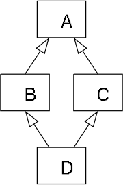

Ромбовидная проблема — прежде всего проблема дизайна, и она должна быть предусмотрена на этапе проектирования. На этапе разработки ее можно разрешить следующим образом:

- вызвать метод конкретного суперкласса;

- обратиться к объекту подкласса как к объекту определенного суперкласса;

- переопределить проблематичный метод в последнем дочернем классе (в коде — turn_on() в подклассе Laptop).

```c++
#include <iostream>
using namespace std;

class Device {
    public:
        void turn_on() {
            cout << "Device is on." << endl;
        }
};

class Computer: public Device {};

class Monitor: public Device {};

class Laptop: public Computer, public Monitor {
    /*
    public:
        void turn_on() {
            cout << "Laptop is on." << endl;
        }
    // uncommenting this function will resolve diamond problem
    */
};

int main() {
    Laptop Laptop_instance;

    // Laptop_instance.turn_on();
    // will produce compile time error
    // if Laptop.turn_on function is commented out

    // calling method of specific superclass
    Laptop_instance.Monitor::turn_on();

    // treating Laptop instance as Monitor instance via static cast
    static_cast<Monitor&>( Laptop_instance ).turn_on();
    return 0;
}
```

Если метод `turn_on()` не был переопределен в Laptop, вызов `Laptop_instance.turn_on()`, приведет к ошибке при компиляции. Объект Laptop может получить доступ к двум определениям метода `turn_on()` одновременно: `Device:Computer:Laptop.turn_on()` и `Device:Monitor:Laptop.turn_on()`.

Подробнее читай на [Хабр](https://habr.com/ru/post/445948/).

#### Виртуальное наследование

Виртуальное наследование (virtual inheritance) предотвращает появление множественных объектов базового класса в иерархии наследования. Таким образом, конструктор базового класса Device будет вызван только единожды, а обращение к методу `turn_on()` без его переопределения в дочернем классе не будет вызывать ошибку при компиляции.

```c++
#include <iostream>
using namespace std;

class Device {
    public:
        Device() {
            cout << "Device constructor called" << endl;
        }
        void turn_on() {
            cout << "Device is on." << endl;
        }
};

class Computer: virtual public Device {
    public:
        Computer() {
            cout << "Computer constructor called" << endl;
        }
};

class Monitor: virtual public Device {
    public:
        Monitor() {
            cout << "Monitor constructor called" << endl;
        }
};

class Laptop: public Computer, public Monitor {};

int main() {
    Laptop Laptop_instance;
    Laptop_instance.turn_on();
    return 0;
}
```

_Примечание:_ виртуальное наследование в классах Computer и Monitor не разрешит ромбовидное наследование если дочерний класс Laptop будет наследовать класс Device не виртуально ( `class Laptop: public Computer, public Monitor, public Device {};` ).

#### Абстрактный класс

В С++, класс в котором существует хотя бы один чистый виртуальный метод (pure virtual) принято считать абстрактным. Если виртуальный метод не переопределен в дочернем классе, код не скомпилируется. Также, в С++ создать объект абстрактного класса невозможно — попытка тоже вызовет ошибку при компиляции.

```c++
#include <iostream>
using namespace std;

class Device {
    public:
       void turn_on() {
            cout << "Device is on." << endl;
        }
        virtual void say_hello() = 0;
};

class Laptop: public Device {
    public:
       void say_hello() {
            cout << "Hello world!" << endl;
        }
};

int main() {
    Laptop Laptop_instance;
    Laptop_instance.turn_on();
    Laptop_instance.say_hello();

    // Device Device_instance;
    // will cause compile time error
    return 0;
}
```

#### Интерфейс

С++, в отличии от некоторых ООП языков, не предоставляет отдельного ключевого слова для обозначения интерфейса (interface). Тем не менее, реализация интерфейса возможна путем создания чистого абстрактного класса (pure abstract class) — класса в котором присутствуют только декларации методов. Такие классы также часто называют абстрактными базовыми классами (Abstract Base Class — ABC).

```c++
#include <iostream>
using namespace std;

class Device {
    public:
        virtual void turn_on() = 0;
};

class Laptop: public Device {
    public:
       void turn_on() {
            cout << "Device is on." << endl;
        }
};

int main() {
    Laptop Laptop_instance;
    Laptop_instance.turn_on();

    // Device Device_instance;
    // will cause compile time error
    return 0;
}
```

### Как представлены объекты в памяти при виртуальном наследовании?

```c++
class A{ 
public:
    void foo();
};
class B: public virtual A{
};
class C: public virtual A{
};
class D: public B, public C{
};
```

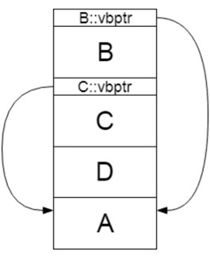

### Как реализовано приведение типов в Си?

При явном приведении перед выражением следует указать в круглых скобках имя типа, к которому необходимо преобразовать исходное значение. При неявном приведении преобразование происходит автоматически, по правилам, заложенным в языке Си.

### Что такое статическое приведение типов?

Приведение типов на [Хабр](https://habr.com/ru/post/106294/).

```c++
TYPE static_cast<TYPE> (object);
```

`static_cast` преобразует выражения одного статического типа в объекты и значения другого статического типа. Поддерживается преобразование численных типов, указателей и ссылок по иерархии наследования как вверх, так и вниз. Проверка производится на уровне компиляции, так что в случае ошибки сообщение будет получено в момент сборки приложения или библиотеки.

### Что такое динамическое приведение типов?

```c++
TYPE& dynamic_cast<TYPE&> (object);
TYPE* dynamic_cast<TYPE*> (object);
```

Используется для динамического приведения типов во время выполнения. В случае неправильного приведения типов для ссылок вызывается исключительная ситуация `std::bad_cast`, а для указателей будет возвращен 0. Использует систему _RTTI_ (Runtime Type Information). Безопасное приведение типов по иерархии наследования, в том числе для виртуального наследования.

### Что такое константное приведение типов?

```c++
TYPE const_cast<TYPE> (object);
```

Пожалуй самое простое приведение типов. Снимает `cv qualifiers` — `const` и `volatile`, то есть константность и отказ от оптимизации компилятором переменной. Это преобразование проверяется на уровне компиляции и в случае ошибки приведения типов будет выдано сообщение.

### Что такое приведение типа без проверки?

```c++
TYPE reinterpret_cast<TYPE> (object);
```

Приведение типов без проверки. `reinterpret_cast` — непосредственное указание компилятору. Применяется только в случае полной уверенности программиста в собственных действиях. Не снимает константность и `volatile`. применяется для приведения указателя к указателю, указателя к целому и наоборот.

### Как работает преобразование в Си-стиле на языке С++?

```c++
TYPE (TYPE*) object;
```

Си-шный метод приведения типов. Пожалуй самый нежелательный способ приведения типов. Страуструп пишет:

> "Например, что это значит выражение — x = (T)y;. Мы не знаем. Это зависит от типа T, типов x и y. T может быть названием типа, typedef или может быть параметр template-а. Может быть, х и у являются скалярными переменными и Т представляет собой значение преобразования. Может быть, х объекта класса, производного от класса Y и Т — нисходящее преобразование. По этой причине программист может не знать, что он делает на самом деле."

Вторая причина нежелательного использования приведения типов в C-style — трудоемкость процесса поиска мест приведения типов.

### Что такое умные указатели?

- Объект, с которым можно работать как с обычным указателем

- Представляет дополнительный функционал - например автоматическое освобождение памяти

- Используются для борьбы с утечками памяти

- Обеспечивают безопасность исключений

- Реализуют идиому RAII

### Опишите принцип работы boost::scoped_ptr.

- Рекомендуется для использования в качестве поля класса

- Нельзя копировать и перемещать

- Нельзя использовать в stl

```c++
template<class T> class scoped_ptr : noncopyable {
public:
    typedef T element_type;
    explicit scoped_ptr(T * p = 0);
    ~scoped_ptr();
    void reset(T * p = 0);
    T & operator*() const;
    T * operator->() const;
    T * get() const;
    operator unspecified-bool-type() const;
    void swap(scoped_ptr & b);
};
```

### Опишите принцип работы std::auto_ptr.

- В стандарте C++17 auto_ptr был удален.

- Имеет операторы присваивания и конструкторы копирования, но никак не реализует семантику перемещения

- Передача объекта и снятие с себя полномочий по контролю за временем его жизни

- Нельзя использовать в контейнерах

### Опишите принцип работы std::shared_ptr.

- Содержит количество ссылок на объект

- Объект удаляется, когда на него не остается ссылок

- Удобен для разделения владения

- Можно возвращать из функции

- Можо класть в любые stl контейнеры

- `use_conunt` – позволяет узнать кол-во ссылок на объект

- `unique` – проверяет единственность владения

- Можно приводить к другим типам:

  - static_pointer_cast

  - dynamic_pointer_cast

  - const_pointer_cast

#### Блок управления shared_ptr

- Указатель на управляемый объект или сам управляемый объект

- Функцию удаления объекта

- Аллокатор

- Счетчик указателей `shared_ptr`, владеющих управляемым объектом

- Счетчик указателей `weak_ptr`, которые ссылаются на управляемый объект

#### make_shared

При передаче `shared_ptr` в функцию могут возникнуть проблемы:

```c++
foo(shared_ptr<A> ptr, int val){ ... }
    int bar(){
    //может быть исключение
}

foo(shared_ptr<A>(new A), bar()); //not safe
foo(make_shared(a,b,c), bar()); // safe
```

#### Перекрестные ссылки

```c++
struct A{
    shared_ptr<A> ptr;
}

shared_ptr<A> a = new A;
shared_ptr<A> b = new A;
a->ptr = b;
b->ptr = a;
```

```c++
struct A{
    typedef shared_ptr<B> B_ptr;
    vector<B_ptr> B_vec;
};
struct B{
    shared_ptr<A> A_ptr;
}
```

### Опишите принцип работы std::weak_ptr.

- Содержит "слабую" ссылку на объект управляемый shared_ptr

- Можно превратить в shared_ptr функцией lock

- expired позволяет проверить, существует ли объект

```c++
struct A{
    weak_ptr<A> ptr;
}

shared_ptr<A> a = new A;
shared_ptr<A> b = new A;
a->ptr = b;
b->ptr = a;
```

```c++
struct A{
    typedef shared_ptr<B> B_ptr;
    vector<B_ptr> B_vec;
};

struct B{
    weak_ptr<A> A_ptr;
}
```

### Опишите принцип работы std::unique_ptr.

- Владеет объектом единолично

- Нельзя копировать, но можно перемещать

- Не рекомендуется хранить в stl контейнерах

- Заменяет scoped_ptr

- Есть функция release и get

```c++
template <
    class T,
    class Deleter = std::default_delete<T>
> class unique_ptr;

template <
    class T,
    class Deleter
> class unique_ptr<T[],Deleter>;
```

### В чем особенности работы умных указателей с массивами?

- Рассмотренные ранее указатели не предназначены для владения массивами 

- unique_ptr поддерживает предопределенную специализацию для массивов

```c++
std::unique_ptr<MyClass[]> ptrArray (new MyClass[2]);
ptrArray[0].method();
```

- Кроме этого, в boost есть специальный класс boost::shared_array

### Какие группы операторов в С++ вам известны?

- Оператор - функция обозначенная специальным символом

- Сигнатура оператора такая же как функций, но с ключевым словом operator #, где # знак оператора

- Существуют унарные и бинарные операторы

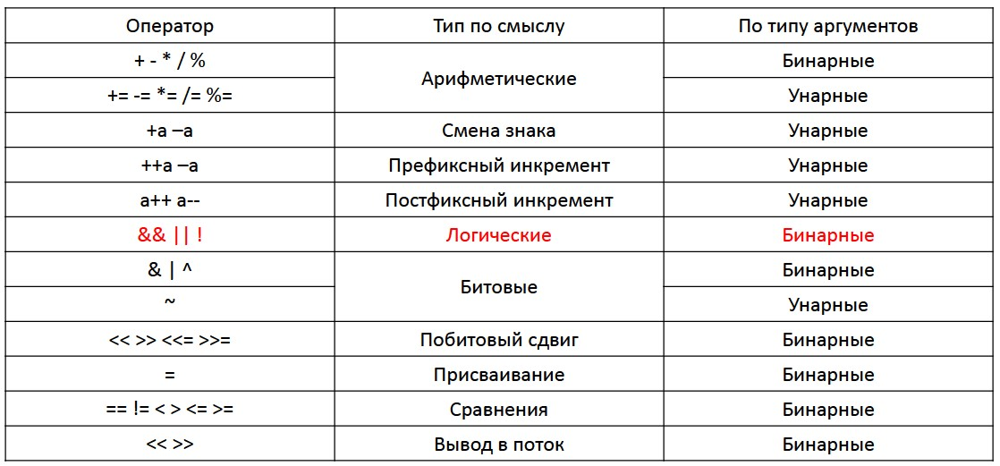

#### Специальные операторы

- `a->` `a->*` - доступ к полям по указателям перегружать не рекомендуется

- `a.` `a.*` - доступ к полям перегружать нельзя

- `?:` - тернарный оператор перегружать нельзя

- `::` - доступ к полю перегружать нельзя

- `()` – вызов функции

- `(type)` – приведение к типу

- `new` и `delete` – выделение и освобождение памяти перегружать не рекомендуется

### Что такое перегрузка операторов, для чего она используется?

Перегрузка операторов - один из способов реализации полиморфизма, заключающийся в возможности одновременного существования в одной области видимости нескольких различных вариантов применения оператора, имеющих одно и то же имя, но различающихся типами параметров, к которым они применяются.

#### Когда стоит перегружать операторы?

[Tproger](https://tproger.ru/translations/cpp-operator-overload-p1/)

Запомните главное: перегружайте операторы тогда и только тогда, когда это имеет смысл. То есть если смысл перегрузки очевиден и не несёт в себе скрытых сюрпризов. Перегруженные операторы должны действовать так же, как и их базовые версии. Естественно, допустимы исключения, но лишь в тех случаях, когда они сопровождаются понятными объяснениями. Наглядным примером являются операторы `<<` и `>>` стандартной библиотеки `iostream`, которые явно ведут себя не как обычные операторы битового сдвига.

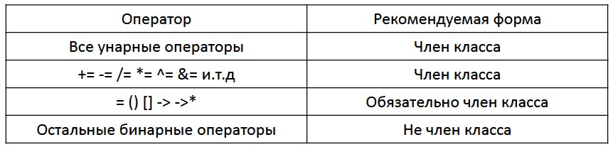

### Для каких типов допустима перегрузка операторов?

Для всех, кроме:

- `?:` (тернарный оператор);

- `::` (доступ к вложенным именам);

- `.` (доступ к полям);

- `.*` (доступ к полям по указателю);

- `sizeof`, `typeid` и операторы каста.

### Где может быть объявлена перегрузка оператора?

Везде.  (Объявление перегрузки внутри класса с использование friend или просто внутри класса)

### Какие особенности у перегрузки операторов инкремента и декремента?

Инкрементные и декрементные операторы в языке C++ могут быть перегружены. Особенность перегрузки этих операторов состоит в том, что нужно перегружать как префиксную так и постфиксную форму этих операторов.
Как известно, в языке C++ операции `++` и `––` имеют префиксную и постфиксную формы, как показано в примере:

- если перегружается префиксная форма оператора `++`, то в классе нужно реализовать операторную функцию `operator++()` без параметров;

- если перегружается префиксная форма оператора `--`, то в классе нужно реализовать операторную функцию `operator--()` без параметров;

- если перегружается постфиксная форма оператора `++`, то в классе нужно реализовать операторную функцию `operator++(int d)` с одним целочисленным параметром. В этом случае параметр `d` не используется в функции. Он указывается только для того, чтобы указать что это именно постфиксная реализация оператора `++`. Имя `d `может быть заменено другим именем;

- если перегружается постфиксная форма оператора `--`, то в классе нужно реализовать операторную функцию `operator--(int d)` с одним параметром. Параметр `d` необходим для указания того, что перегружается именно постфиксная реализация оператора `--`.

### Как ведут себя операторы с особым порядком вычисления при перегрузке?

Их особое поведение теряется, т.к. порядок вычисления не определен, т.е. перегруженные операторы в итоге будут вычислять все выражения, в отличии от стандартных.

### Что такое ООП?

Объектно-ориентированное программирование (ООП) - методология программирования, основанная на представлении программы в виде совокупности объектов, каждый из которых является экземпляром определённого класса, а классы образуют иерархию наследования.

### Что подразумевает абстракция с точки зрения ООП?

Абстракция — отделение концепции от ее экземпляра.

Абстракция в ООП — это придание объекту характеристик, которые чётко определяют его концептуальные границы, отличая от всех других объектов. Фундаментальная идея состоит в разделении несущественных деталей реализации подпрограммы от характеристик, существенных для корректного её использования. Такое разделение может быть выражено через специальный "интерфейс", сосредотачивающий описание всех возможных применений программы.

### Где и для чего используется спецификатор throw?

Как и в языке Java, в C++ можно перечислить типы ис-ключений, которые может порождать вызов функции. Для этого после списка формальных параметров следует разместить спецификатор `throw`:

```
throw (список типов исключений )
```

Семантика:

- вызов функции, для которой разрешённые исключения не указаны, может порождать любые исключения;

- вызов функции со спецификатором throw() не порожда-ет никаких исключений;

- компилятор не следит за тем, какие исключения порож-даются внутри функции: вместо этого неразрешённые исключения просто не могут выйти за пределы функции и приводят к аварийному завершению программы.

- По очевидным соображениям, связанным с поддержкой полиморфизма, переопределение виртуальных методов не должно ослаблять ограничения, накладываемые специфика-тором throw, т.е. переопределённому методу не разрешается порождать исключения, не порождаемые методом базового класса.

### Где и для чего используется спецификатор noexcept?

Гарантирует, что функция не сгенерирует исключение во время выполнения, если это случится, то вызывается `terminate()` без раскрутки стека.

### К чему приводит вызов throw без аргументов?

Приводит к вызову функции `terminate()`, которая по умолчанию вызывает `abort()` и программа завершается.

### Что такое exception-safe операция?

Операция считается exception-safe если она оставляет программу в консистентном состоянии. Применительно к объектам консистентное состояние значит что:

1. Конструктор объекта успешно выполнился;
2. Деструктор еще не был вызван;
3. Объект соответствует инварианту класса.

### Что такое инкапсуляция?

- Размещение одного объекта или класса внутри другого для разграничения доступа к ним.

- Свойство системы, позволяющее объединить данные и методы, работающие с ними в классе, и скрыть детали реализации от пользователя.

- Это механизм контроля доступа.

Цель инкапсуляции – уйти от зависимости внешнего интерфейса класса (то, что могут использовать другие классы) от реализации. Чтобы малейшее изменение в классе не влекло за собой изменение внешнего поведения класса.

### Что такое наследование?

Наследование — это свойство системы, позволяющее описать новый класс на основе уже существующего с частично или полностью заимствующейся функциональностью. Класс, от которого производится наследование, называется базовым, родительским или суперклассом. Новый класс — потомком, наследником или производным классом.

Это главный механизм для повторного использования кода. Наследственное отношение классов четко определяет их иерархию.

- Позволяет объекту наследовать от своего родителя общие атрибуты, а самому определять только те характеристики, которые делают его уникальным.

- Поддерживает понятие иерархической̆ классификации.

### Что такое полиморфизм?

[Википедия](https://ru.wikipedia.org/wiki/%D0%9F%D0%BE%D0%BB%D0%B8%D0%BC%D0%BE%D1%80%D1%84%D0%B8%D0%B7%D0%BC_(%D0%B8%D0%BD%D1%84%D0%BE%D1%80%D0%BC%D0%B0%D1%82%D0%B8%D0%BA%D0%B0)) про полиморфизм

Полиморфизм — реализация задач одной и той же идеи разными способами.

> Один интерфейс – множество реализаций.

> Выбор конкретной реализации возлагается на компилятор.

### Какие существуют виды полиморфизма?

В С++ присутствует: 

- параметрический (parametric) - одна реализация не зависимо от типа;

- ситуативный (ad hoc - много реализаций зависимо от типа);

- полиморфизм подтипов (subtype polymorphism - наследование реализаций).

Другая классификация:

- Статический – реализуется на этапе компиляции с помощью перегрузки функций и операций;

- Динамический – реализуется во время выполнения программы с помощью механизма виртуальных функций;

- Параметрический – реализуется на этапе компиляции с использованием механизма шаблонов.

### Что подразумевается под идиомой RAII?

Получение ресурса есть инициализация (англ. Resource Acquisition Is Initialization (RAII)) — программная идиома объектно-ориентированного программирования, смысл которой заключается в том, что получение некоторого ресурса совмещается с инициализацией, а освобождение — с уничтожением объекта.

Типичным (хотя и не единственным) способом реализации является организация получения доступа к ресурсу в конструкторе, а освобождения — в деструкторе соответствующего класса. Например, открытие / закрытие файла.

В C++ данная концепция является ключевой для написания кода, безопасного при исключениях.

Эта концепция может использоваться для любых разделяемых объектов или ресурсов:

- для выделения памяти,

- для открытия файлов или устройств,

- для мьютексов или критических секций и т. д.

Важный случай использования RAII — _"умные указатели"_: классы, инкапсулирующие владение памятью.

Пример класса на языке C++, реализующего захват ресурсов при инициализации:

```C++
#include <cstdio>
#include <stdexcept>
  
class file {
public:
    file( const char* filename ) : m_file_handle(std::fopen(filename, "w+")) 
    {
        if( !m_file_handle )
            throw std::runtime_error("file open failure") ;
    }
    ~file() 
    {
        if( std::fclose(m_file_handle) != 0 )
        {
            // fclose() может вернуть ошибку при записи на диск последних изменений
        }
    }

    void write( const char* str ) 
    {
        if( std::fputs(str, m_file_handle) == EOF )
            throw std::runtime_error("file write failure") ;
    }

private:
    std::FILE* m_file_handle ;

    // Копирование и присваивание не реализовано.  Предотвратим их использование,
    // объявив соответствующие методы закрытыми.
    file( const file & ) ;
    file & operator=( const file & ) ;
};

// пример использования этого класса
void example_usage() {
   // открываем файл (захватываем ресурс)
    file logfile("logfile.txt") ;
  
    logfile.write("hello logfile!") ;

    // продолжаем использовать logfile...
    // Можно возбуждать исключения или выходить из функции не беспокоясь о закрытии файла; 
    // он будет закрыт автоматически когда переменная logfile выйдет из области видимости.
}
```

Суть идиомы RAII в том, что класс инкапсулирует владение (захват и освобождение) некоторого ресурса — например, открытого файлового дескриптора. Когда объекты-экземпляры такого класса являются автоматическими переменными, гарантируется, что когда они выйдут из области видимости, будет вызван их деструктор — а значит, ресурс будет освобождён. В данном примере файл будет закрыт корректно, даже если вызов `std::fopen()` вернёт ошибку и будет возбуждено исключение. Более того, если конструктор класса file завершился корректно, это гарантирует то, что файл действительно открыт. В случае ошибки при открытии файла конструктор возбуждает исключение.

### Что такое инвариант класса?

Инвариант класса - набор утверждений, которые должны быть истинны применительно к любому объекту данного класса в любой момент времени, за исключением переходных процессов в методах объекта. Для сохранения инварианта класса:

- Все поля должны быть закрытыми

- Публичные методы должны сохранять инвариант класса

### Что такое геттеры и сеттеры?

Методы, с помощью которых предоставляется доступ к приватным полям класса (private или protected).

### Что такое принципы SOLID?

- S – Single Responsibility Principle (SRP) – принцип единственной ответственности

- O – Open-Closed Principle (OCP) – принцип открытости/закрытости

- O – Open-Closed Principle (OCP) – принцип открытости/закрытости

- Interface Segregation Principle (ISP) – принцип разделения интерфейсов

- Dependency Inversion Principle (DIP) – принцип инверсии зависимости

> Принципы SOLID определяют объединение функций и структур даных

**Цель принципов** – создание программных сущностей среднего уровня:

- Терпимы к изменениям

- Просты и понятны

- Образуют основу для компонентов, который могут использоваться во многих программных средствах

#### Принцип единственной ответственности

- Ошибочное определения: ~~"Функция должна делать что-то одно и только одно"~~

- Традиционное определение: "Модуль должен иметь одну и только одну причину для изменения"

- Более точное определение: "Модель должен отвечать за одного и только за одного пользователя или заинтересованное лицо"

- Самое точное определение: **"Модуль должен отвечать за одного и только одного актора"**

#### Принцип открытости/закрытости

- Определение:

> Программные сущности должны быть открыты для расширения и закрыты для изменения

- Если простое расширение требований ведет к значительным изменениям в программном обеспечении архитектура плохая

#### Принцип подстановки Барбары Лисков

- Определение:

> Здесь требуется что-то вроде следующего свойства подстановки: если для каждого объекта o1 типа S существует такой объект o2 типа T, что для всех программ P, определенных в терминах T, поведение P не изменяется при подстановке o1 вместо o2, то S является подтипом T

- Простое определение:

> Функции, которые используют базовый тип, должны иметь возможность использовать подтипы базового типа, не зная об этом

#### Принцип разделения интерфейсов

- Много интерфейсов, специально предназначенных для клиентов, лучше, чем один интерфейс общего назначения

- Разделение интерфейса облегчает использование и тестирование модулей

#### Принцип инверсии зависимости

- Модули верхних уровней не должны зависеть от модулей нижних уровней. Оба типа модулей должны зависеть от абстракций

- Например, в разных языках инструкции use, import, include должны ссылаться на модули только с интерфейсами

- Не всегда можно выполнить, поэтому необходимо избегать от неустойчивых модулей

- Изменение интерфейса влечет изменения конкретной реализации, но изменение конкретной реализации не всегда требует изменения интерфейса

#### Правила для соблюдения

- Не ссылайтесь на изменчивые конкретные классы

- Не наследуйте изменчивые конкретные классы

- Не переопределяйте конкретные функции

- **Не ссылайтесь на имена конкретных и изменчивых сущностей**
