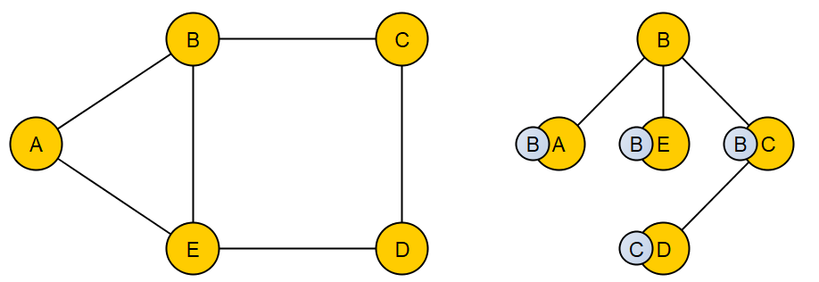
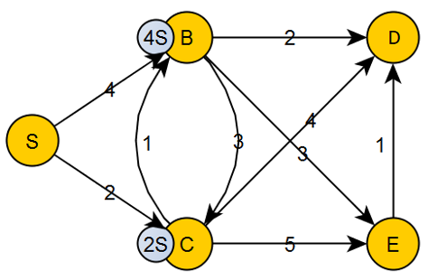
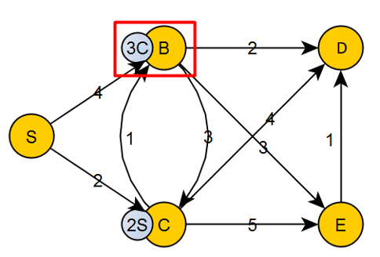
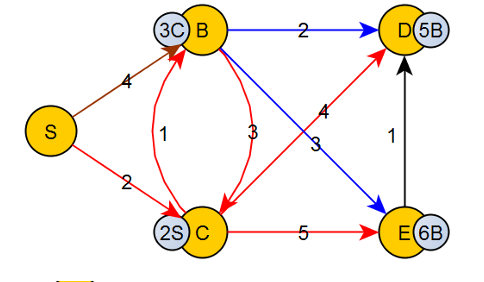
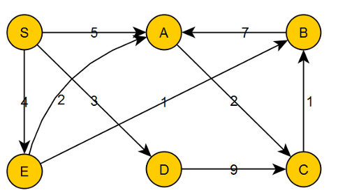
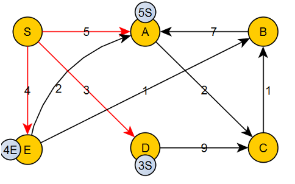
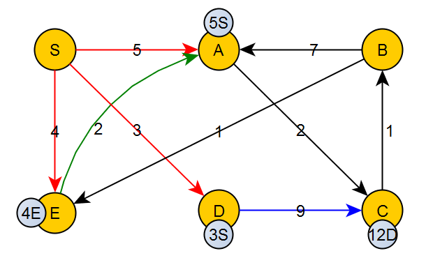
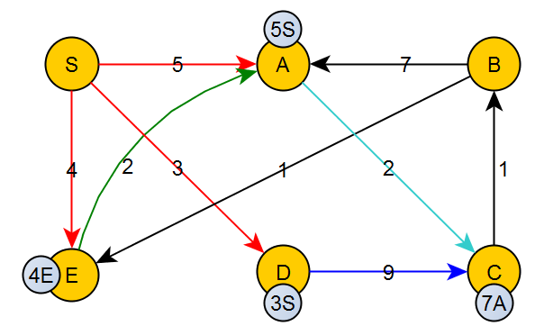
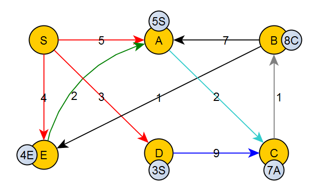
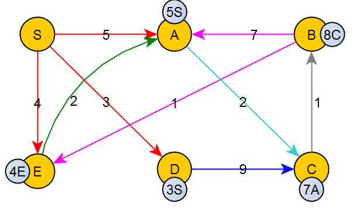

Задача о кратчайшем пути

- [Задача о кратчайшем пути](#задача-о-кратчайшем-пути)
  - [Постановка задачи](#постановка-задачи)
  - [Алгоритм Дейкстры (случай неотрицательных весов)](#алгоритм-дейкстры-случай-неотрицательных-весов)
    - [Идея алгоритма](#идея-алгоритма)
    - [Псевдокод](#псевдокод)
    - [Сложность алгоритма](#сложность-алгоритма)
    - [Применение алгоритма](#применение-алгоритма)
    - [Пример для невзвешенного графа](#пример-для-невзвешенного-графа)
    - [Пример для взвешенного графа](#пример-для-взвешенного-графа)
    - [Пример](#пример)
  - [Алгоритм Флойда-Уоршелла вычисления расстояний между всеми парами вершин](#алгоритм-флойда-уоршелла-вычисления-расстояний-между-всеми-парами-вершин)
    - [Идея алгоритма](#идея-алгоритма-1)

# Задача о кратчайшем пути

## Постановка задачи

**Задача о кратчайшем пути** - задача поиска кратчайшего пути от заданной вершины до заданной или до всех остальных. 

Существует множество алгоритмов поиска кратчайшего пути:

- **Алгоритм Дейкстры** находит кратчайший путь от одной из вершин графа до всех остальных. Алгоритм работает только для графов _без рёбер отрицательного веса_.

- **Алгоритм Форда-Беллмана** - в отличие от алгоритма Дейкстры, способен корректно обработать отрицательный вес.

- **Алгоритм A*** - эвристический алгоритм поиска.

## Алгоритм Дейкстры (случай неотрицательных весов)

### Идея алгоритма

1. Каждый раз, когда мы хотим посетить новый узел, мы выберем узел с наименьшим известным расстоянием.

2. Как только мы переместились в узел, мы проверяем каждый из соседних узлов. Мы вычисляем расстояние от соседних узлов до корневых узлов, суммируя стоимость ребер, которые ведут к этому новому узлу.

3. Если расстояние до узла меньше известного расстояния, мы обновим самое короткое расстояние.

На каждом шаге существует множество уже обработанных вершин и еще не обработанных. 

### Псевдокод

```
Инициализация:
	for (v ∈ V)
		DIST[v] = ∞
		PREV[v] = ∅
	DIST[v' ∈  V] = 0  // стартовая вершина
Первый шаг:
	H ← MakeQueue() // формирование очереди с приоритетами для вершины v'. Все инцидентные вершины попадают сюда
Один шаг
	while (H ≠ ∅)
		v ← min(H) // из очереди с приоритетами выбирается минимальный DIST[v]
		for (vu ∈  E) //для каждого инцидентного ребра
			if (DIST[u] > DIST[v] + w(v,u) // если расстояние до вершины больше, чем то, по которому мы проходим - условие релаксации
				DIST[u] ← DIST[V] + w(v,u)
				PREV[u] ←
UpdatePriorities(H)
```

### Сложность алгоритма

Худший случай - каждый путь содержит в себе все остальные ($v$ вершин). Если каждый такой путь будет хранится к каждой вершине, память будет $v^2$. Для оптимизации в каждой вершине хранится не весь путь, а только предыдущую вершину, из которой можно попасть в текущую.

Общая сложность алгоритма:

- $O(v^2)$ при работе на массиве;

- $O( ln⁡(v) )$  при работе на куче.

Если количество ребер небольшое, выгоднее использовать реализацию на куче, если же ребер намного больше, чем вершин, лучше использовать работу на массиве.

### Применение алгоритма

Одно из применений алгоритма - маршрутизация. Например, алгоритм OSPF (Open Shortest Pass First). Каждый маршрутизатор строит некоторый граф и использует алгоритм Дейкстры в чистом виде.

### Пример для невзвешенного графа



1. Инициализация:

    Берется стартовая вершина, она помещается в множестве рассмотренных вершин.

    Формируются две структуры данных:

    - Расстояние от этой вершины до всех остальных

        | A | B | C | D | E |
        |:-:|:-:|:-:|:-:|:-:|
        |   |   |   |   |   |

    - Массив из предыдущих вершин, которые нужно пройти, чтобы дойти до следующей вершине.

2. Посещена вершина $B$.

    | A | B | C | D | E |
    |:-:|:-:|:-:|:-:|:-:|
    |   | 0 |   |   |   |

3. Ведется обход графа в ширину - просматриваются все ребра, инцидентные данной вершине, из них выбирается минимальное и добавляется в множество. 
    
    Посещена вершина $A$.

    | A | B | C | D | E |
    |:-:|:-:|:-:|:-:|:-:|
    | 1 | 0 |   |   |   |

4. Посещена вершина $C$.

    | A | B | C | D | E |
    |:-:|:-:|:-:|:-:|:-:|
    | 1 | 0 | 1 |   |   |

5. Посещена вершина $E$.

    | A | B | C | D | E |
    |:-:|:-:|:-:|:-:|:-:|
    | 1 | 0 | 1 |   | 1 |

6. Посещена вершина $D$:

    | A | B | C | D | E |
    |:-:|:-:|:-:|:-:|:-:|
    | 1 | 0 | 1 | 2 | 1 |

### Пример для взвешенного графа



На данном шаге:

| S | B | C | D | E |
|:-:|:-:|:-:|:-:|:-:|
| 0 | 4 | 2 |   |   |

Из очереди с приоритетами берется минимальное ребро.

При обработке каждой новой вершины происходит пересчёт весов в массиве - **релаксация**. Если найденный путь до вершины меньше чем тот, что мы нашли ранее, путь уменьшается.

В данном случае идём от $C$ к $B$:

| S | B | C | D | E |
|:-:|:-:|:-:|:-:|:-:|
| 0 | 3 | 2 |   |   |

...



| S | B | C | D | E |
|:-:|:-:|:-:|:-:|:-:|
| 0 | 3 | 2 | 6 | 7 |

Берется вершина $B$. Из неё путь в $D$ занимает 2 - релаксируется вершина $D$.

| S | B | C | D | E |
|:-:|:-:|:-:|:-:|:-:|
| 0 | 3 | 2 | 5 | 7 |

Путь из $B$ в $E$ занимает 3. Релаксируется $E$:

| S | B | C | D | E |
|:-:|:-:|:-:|:-:|:-:|
| 0 | 3 | 2 | 5 | 6 |

Из вершины $B$ в $C$ переход занимает больше, поэтому релаксации не происходит



Вершина $B$ исключается из очереди.

Осталось обработать вершину $Ε$. Из неё путь в $D$ занимает 1, поэтому релаксации также не происходит.

### Пример



**Инициализация:**

**DIST:**

|    $S$   |    $A$   |    $B$   |    $C$   |    $D$   |    $E$   |
|:--------:|:--------:|:--------:|:--------:|:--------:|:--------:|
| $\infty$ | $\infty$ | $\infty$ | $\infty$ | $\infty$ | $\infty$ |

**PREV:**

|      $S$    |     $A$     |      $B$    |      $C$    |     $D$     |      $E$    |
|:-----------:|:-----------:|:-----------:|:-----------:|:-----------:|:-----------:|
| $\emptyset$ | $\emptyset$ | $\emptyset$ | $\emptyset$ | $\emptyset$ | $\emptyset$ |

$H$ - очередь с приоритетами

|   |
|---|
|   |
|   |
|   |

1. Берем $S$ и делаем первую очередь приоритетов

    |      $S$    |    $A$   |      $B$    |      $C$    |     $D$     |      $E$    |
    |:-----------:|:--------:|:-----------:|:-----------:|:-----------:|:-----------:|
    |      0      | $\infty$ |   $\infty$  |   $\infty$  |   $\infty$  |   $\infty$  |
    |      $S$    |    $A$   |      $B$    |      $C$    |     $D$     |      $E$    |
    | $\emptyset$ |    $S$   | $\emptyset$ | $\emptyset$ | $\emptyset$ | $\emptyset$ |

    Берется путь из $S$ в $A$:

    |      $S$    | $A$ |      $B$    |      $C$    |     $D$     |      $E$    |
    |:-----------:|:---:|:-----------:|:-----------:|:-----------:|:-----------:|
    |      0      |  5  |   $\infty$  |   $\infty$  |   $\infty$  |   $\infty$  |
    |      $S$    | $A$ |      $B$    |      $C$    |     $D$     |      $E$    |
    | $\emptyset$ | $S$ | $\emptyset$ | $\emptyset$ | $\emptyset$ | $\emptyset$ |

    $H$:

    | $(5, A)$ |
    |----------|
    |          |
    |          |
    |          |

    Берется путь из $S$ в $D$:

    |      $S$    | $A$ |      $B$    |      $C$    | $D$ | $E$ |
    |:-----------:|:---:|:-----------:|:-----------:|:---:|:-----------:|
    |      0      |  5  |   $\infty$  |   $\infty$  |  3  |   $\infty$  |
    |      $S$    | $A$ |      $B$    |      $C$    | $D$ | $E$ |
    | $\emptyset$ | $S$ | $\emptyset$ | $\emptyset$ | $S$ | $\emptyset$ |

    $H$:

    | $(3, D)$ |
    |:--------:|
    | $(5, A)$ |
    |          |
    |          |

    Берется путь из $S$ в $E$:

    |      $S$    | $A$ |      $B$    |      $C$    | $D$ | $E$ |
    |:-----------:|:---:|:-----------:|:-----------:|:---:|:---:|
    |      0      |  5  |   $\infty$  |   $\infty$  |  3  |  4  |
    |      $S$    | $A$ |      $B$    |      $C$    | $D$ | $E$ |
    | $\emptyset$ | $S$ | $\emptyset$ | $\emptyset$ | $S$ | $S$ |

    $H$:

    | $(3, D)$ |
    |:--------:|
    | $(4, E)$ |
    | $(5, A)$ |
    |          |

    
    
2. 	Из очереди приоритетов берется и удаляется вершина $D$.
	Берутся инцидентные ей вершины и производится релаксация:
    
    Берется ребро DC

    $$
    DIST[C] < DIST[D] + W(DC)
    $$
    $$
    \infty < 3 + 9 \Rightarrow DIST[C] := 12; PREV[C] := D
    $$

    |     $S$     | $A$ |     $B$     | $C$ | $D$ | $E$ |
    |:-----------:|:---:|:-----------:|:---:|:---:|:---:|
    |      0      |  5  |   $\infty$  |  12 |  3  |  4  |
    |     $S$     | $A$ |     $B$     | $C$ | $D$ | $E$ |
    | $\emptyset$ | $S$ | $\emptyset$ | $D$ | $S$ | $S$ |

    В очередь добавляется $C$.

    $H$:

    |  $(4, E)$ |
    |:---------:|
    |  $(5, A)$ |
    | $(12, C)$ |
    |           |

    Обработка $D$ закончена.

3. Берется вершина $E$. При обработке $E$ никакой релаксации не происходит.

    

4. Берется вершина $A$.

    $$
    DIST[C] < DIST[A] + W(AC)
    $$
    $$
    9 < 5 + 2 \Rightarrow DIST[C] = 7; PREV[C] := A
    $$

    |     $S$     | $A$ |     $B$     | $C$ | $D$ | $E$ |
    |:-----------:|:---:|:-----------:|:---:|:---:|:---:|
    |      0      |  5  |   $\infty$  |  7  |  3  |  4  |
    |     $S$     | $A$ |     $B$     | $C$ | $D$ | $E$ |
    | $\emptyset$ | $S$ | $\emptyset$ | $A$ | $S$ | $S$ |

    $H$:

    | $(7, C)$ |
    |:--------:|
    |          |
    |          |
    |          |

    

5. Берется вершина $C$.

    $$
    DIST[B] < DIST[C] + W(CB)
    $$
    $$
    \infty < 7 + 1 \Rightarrow DIST[7] := 8; PREV[B] := C
    $$

    |     $S$     | $A$ | $B$ | $C$ | $D$ | $E$ |
    |:-----------:|:---:|:---:|:---:|:---:|:---:|
    |      0      |  5  |  8  |  7  |  3  |  4  |
    |     $S$     | $A$ | $B$ | $C$ | $D$ | $E$ |
    | $\emptyset$ | $S$ | $C$ | $A$ | $S$ | $S$ |

    $H$:

    | $(8, B)$ |
    |:--------:|
    |          |
    |          |
    |          |

    

6. Берется вершина $B$.

    $$
    DIST[E] < DIST[B] + W(BE)
    $$
    $$
    4 < 8 + 1
    $$
    $$
    DIST[A] < DIST[B] + W(BA)
    $$
    $$
    5 < 8 + 7
    $$

    Релаксации не происходит.

    |     $S$     | $A$ | $B$ | $C$ | $D$ | $E$ |
    |:-----------:|:---:|:---:|:---:|:---:|:---:|
    |      0      |  5  |  8  |  7  |  3  |  4  |
    |     $S$     | $A$ | $B$ | $C$ | $D$ | $E$ |
    | $\emptyset$ | $S$ | $C$ | $A$ | $S$ | $S$ |

    $H$:

    |   |
    |:-:|
    |   |
    |   |
    |   |

    

7. Очередь приоритетов пуста. Работа алгоритма закончена.

## Алгоритм Флойда-Уоршелла вычисления расстояний между всеми парами вершин

Алгоритм Флойда — Уоршелла — алгоритм для нахождения кратчайших расстояний между всеми вершинами взвешенного графа без циклов с отрицательными весами с использованием метода динамического программирования.

### Идея алгоритма

Будем считать, что в графе $n$ вершин, пронумерованных числами от $0$ до $n - 1$. Граф задан матрицей смежности, вес ребра $i - j$ хранится в $w_{ij}$. При отсутствии ребра $i - j$ значение $w_{ij} = + \infty$, также будем считать, что $w_{ii} = 0$.

Пусть значение $a_{ij}^{k}$ равно длине кратчайшего пути из вершины $i$ в вершину $j$, при этом путь может заходить в промежуточные вершины только с номерами меньшими $k$ (не считая начала и конца пути). То есть $a_{ij}^{0}$ - это _длина кратчайшего пути_ из $i$ в $j$, который вообще не содержит промежуточных вершин, то есть _состоит только из одного ребра_ $i - j$, поэтому $a_{ij}^{0} = w_{ij}$. Значение $a_{ij}^{1} = w_{ij}$  равно длине кратчайшего пути, который может проходить через промежуточную вершину с номером 0, путь с весом $a_{ij}^{2}$ может проходить через промежуточные вершины с номерами 0 и 1 и т. д. _Путь с весом_ $a_{ij}^{n}$ может проходить через любые промежуточные вершины, поэтому значение $a_{ij}^{n}$ _равно длине кратчайшего пути_ из $i$ в $j$.

Алгоритм Флойда последовательно вычисляет $a_{ij}^{0}, a_{ij}^{1}, a_{ij}^{2}, \dots, a_{ij}^{n}$, увеличивая значение параметра $k$. Начальное значение - $a_{ij}^{0} = w_{ij}$.

Теперь предполагая, что известны значения $a_{ij}^{k - 1}$ вычислим $a_{ij}^{k}$. Кратчайший путь из вершины $i$ в вершину $j$, проходящий через вершины с номерами, меньшими, чем $k$ может либо содержать, либо не содержать вершину с номером $k - 1$. Если он не содержит вершину с номером $k - 1$, то вес этого пути совпадает с $a_{ij}^{k - 1}$. Если же он содержит вершину $k - 1$, то этот путь разбивается на две части: $i - (k - 1)$ и $(k - 1) - j$. Каждая из этих частей содержит промежуточные вершины только с номерами, меньшими $k - 1$, поэтому вес такого пути равен $a_{i, k - 1}^{k - 1} + a_{k - 1, j}^{k - 1}$. Из двух рассматриваемых вариантов необходимо выбрать вариант наименьшей стоимости, поэтому:

$$
a_{ij}^{k} = \min ( a_{ij}^{k - 1}, a_{i, k - 1}^{k - 1} + a_{k - 1, j}^{k - 1} )
$$

```c++
int A[n + 1][n][n];

for (int i = 0; i < n; ++i)
{
    for (int j = 0; j < n; ++j)
            A[0][i][j] = W[i][j];
}

for (int k = 1; k <= n; ++k)
{
    for (int i = 0; i < n; ++i)
            for (int j = 0; j < n; ++j)
                A[k][i][j] = min(A[k-1][i][j], A[k-1][i][k-1] + A[k-1][k-1][j]);
}
```

Внешний цикл в этом алгоритме последовательно перебирает все вершины, затем пытается улучшить пути из $i$ в $j$, разрешив им проходить через выбранную вершину. Упростим этот алгоритм, избавившись от «трехмерности» массива A: будем только хранить значение кратчайшего пути из $i$ в $j$ в $A[i][j]$, а при улучшении пути будем записать новую длину пути также в $A[i][j]$. Также изменим определение цикла по переменной $k$, заменив значение $k - 1$ на $k$.

```c++
int A[n][n];

for (int i = 0; i < n; ++i)
{
    for (int j = 0; j < n; ++j)
            A[i][j] = W[i][j];
}

for (int k = 0; k < n; ++k)
{
    for (int i = 0; i < n; ++i)
        for (int j = 0; j < n; ++j)
            A[i][j] = min([i][j], A[i][k] + A[k][j]);
}
```

Очевидно, что **сложность** такого алгоритма $O(n^3)$.

Обратите внимание, что при наличии ребер отрицательного веса значения $A[i][j]$ могут уменьшатся. Поэтому может оказаться, что значение $A[i][j]$ было равно $INF$, а затем оно уменьшилось благодаря наличию ребер отрицательного веса. В результате значение $A[i][j]$ оказалось меньше $INF$ (например, за счет объединения пути длиной $INF$ и пути отрицательного веса), но при этом все равно пути между вершинами $i$ и $j$ нет. Поэтому нужно либо ставить дополнительные проверки на то, что $A[i][k]$ и $A[k][j]$ не равны $INF$, либо значения, которые незначительно меньше $INF$, также считать отсутствием пути.

Алгоритм Флойда некорректно работает при наличии цикла отрицательного веса, но при этом если путь от $i$ до $j$ не содержит цикла отрицательного веса, то вес этого пути будет найден алгоритмом правильно. Также при помощи данного алгоритма можно определить наличие цикла отрицательного веса: если вершина $i$ лежит на цикле отрицательного веса, то значение $A[i][i]$ будет отрицательным после окончания алгоритма.

Для восстановления ответа необходим двумерный массив предшественников. Будем считать, что в Prev[i][j] хранится номер вершины, являющейся предшественником вершины $j$ на кратчайшем пути из вершины $i$. Тогда при обновлении значения $A[i][j]$ нужно также обновить предшественника. А именно, если путь $i - j$ был обновлен на путь, проходящий через вершину $k$, то теперь предшественником вершины $j$ на пути из $i$ становится вершина, которая была ее предшественником на пути из $k$, то есть необходимо присвоить $Prev[i][j]=Prev[k][j]$.

Запишем алгоритм, который сохраняет предшественников, а также добавим проверки на существование пути:

```c++
vector < vector <int > > A = W;
vector < vector <int > > Prev(n, vector<int>(n, -1));

for (int k = 0; k < n; ++k)
    for (int i = 0; i < n; ++i)
        for (int j = 0; j < n; ++j)
            if (A[i][k] < INF && A[k][j] < INF && A[i][k] + A[k][j] < A[i][j])
            {
                A[i][j] = A[i][k] + A[k][j];
                Prev[i][j] = Prev[k][j];
            }
```

Восстановление пути из $i$ в $j$ аналогично ранее рассмотренным алгоритмам, только необходимо учесть двумерность массива Path:

```c++
vector <int> Path;

while (j != -1)
{
    Path.push_back(j);
    j = Prev[i][j];
}

reverse(Path.begin(), Path.end());
```
