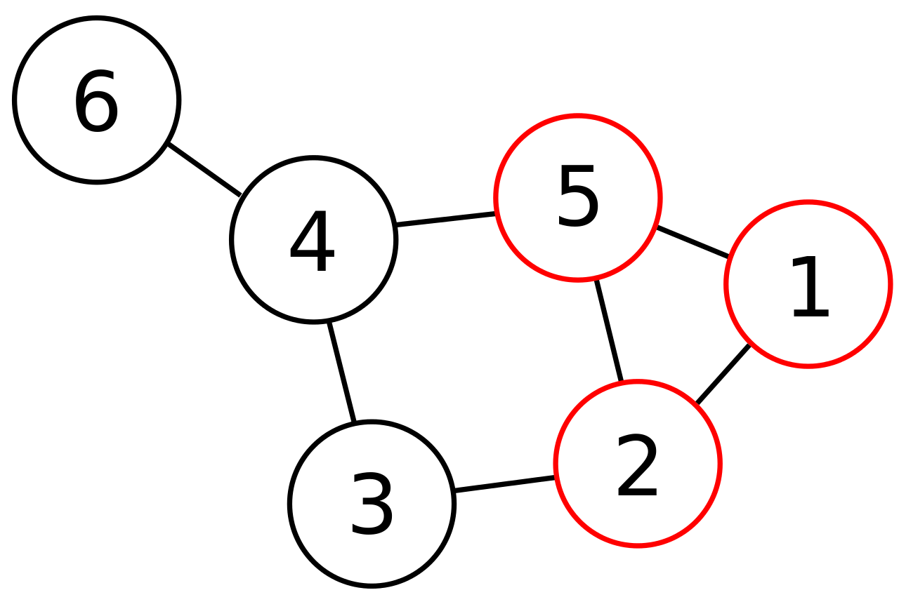

Клики графа

- [Клики графа](#клики-графа)
	- [Наивный поиск клики графа](#наивный-поиск-клики-графа)
		- [Сложность алгоритма](#сложность-алгоритма)
		- [Оптимизации алгоритма](#оптимизации-алгоритма)
	- [Алгоритм Брона-Кербоша](#алгоритм-брона-кербоша)
		- [Псевдокод](#псевдокод)
	- [Применение](#применение)

# Клики графа

**Клика графа** - максимальный полный подграф данного графа.

**Полный подграф** - такое подмножество вершин, любые две из которых соединены ребром.



Граф с кликой размера 3.

## Наивный поиск клики графа

Решается алгоритмом с возвратов:

1. Берется произвольная вершина и добавляется в клику.

2. В граф добавляется одна вершина, инцидентная всем вершинам клики.

3. Если ещё остались вершины, вернутся на шаг 2.

4. Если не осталось, удалить соответствующую вершину и вернутся на шаг 2.

### Сложность алгоритма

- Сложность алгоритма.

- Для проверки инцидентности нужно перебрать все ребра, которые выходят из вершины, худший случай - $O ( |E| )$.

- Количество проверок клики из одной вершины - все возможные размещения вершин - $O ( |V|! )$.

- Это нужно сделать из каждой вершины графа - $O ( |V| )$.

Итого $O ( |E| \cdot |V| \cdot |V|! )$.

### Оптимизации алгоритма

При таком алгоритме каждая клика встретится несколько раз - для любой клики размера $k$ она будет найдена $k!$ раз.

- Возможно запоминать вершины, которые не подошли для клики размера $n-1$ и не проверять их при построении клики размера $n$.

- Если уже был обработан полный подграф, то уже не имеет смысла заходить вглубь в него во второй раз.

## Алгоритм Брона-Кербоша

Алгоритм использует то, что всякая клика - по определению полный подграф. Значит, можно на каждом этапе отсечь вершины, которые заведомо не приведут к построению клики.

### Псевдокод

```
// Алгоритм использует 3 подмножества для вершин графа:
// compsub - на каждом шаге рекурсии содержит полный подграф для данного шага
// candidates - множество вершин, которые могут увеличить compsub
// not - множество вершин, которые уже использовались для расширения compsub
Procedure extend(candidates, not):
	while (candidates ≠ ∅) and ({u ∈ not | ∀v ∈ candidates: ∃uv} =  ∅})
	// пока candidates не пусто и not не содержит вершины,соединённой со всеми вершинами из candidates, 
		v ← candidates //Выбор вершины из candidates
		compsub ← v
		new_candidates ← candidates /{u ∈ candidates | ∄uv}
		new_not ← not /{u ∈ not | ∄uv}
		//Формируем new_candidates и new_not, удаляя из candidates и not вершины, не соединённые с v
		if (new_candidates = ∅) and (new_not = ∅)
			cliques ← compsub //Это клика
		else
			extend(new_candidates, new_not)
		compsub ← compsub/v
		candidates ← candidates/v
		not ← v
        // Удаляем v из compsub и candidates, и помещаем в not
```

**Сложность алгоритма** - линейная относительно количества клик. Худший случай - $O(3^{\frac{|V|}{3}})$.

## Применение

- Задача резервирования и проверки надежности.

- Проектирование электрический сетей и микросхем.

- Поиск сильно связанных групп людей в социальных сетях.

- Системы точной идентификации личности в машинном зрении.

- Анализ данных в биоинформатике - поиск связанных групп генов и т.п.

> Поиск клик графа не применим как алгоритм реального времени из-за сложности.