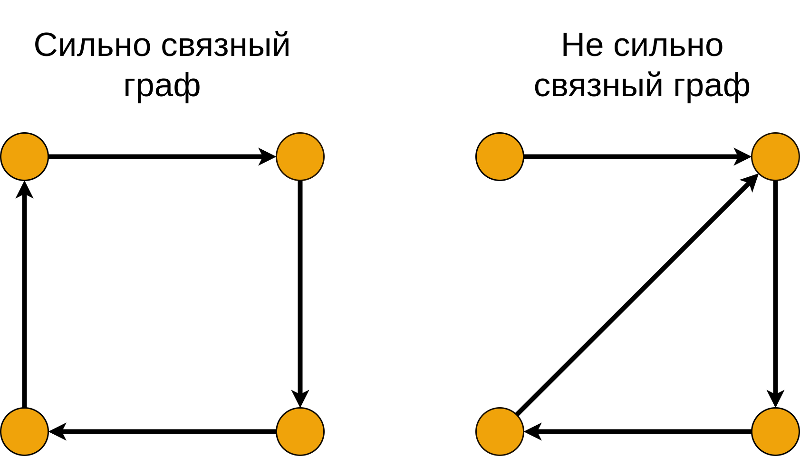

Компоненты связности

- [Компоненты связности](#компоненты-связности)
	- [Алгоритм Косарайю](#алгоритм-косарайю)
		- [Время работы](#время-работы)
	- [Компоненты двусвязности](#компоненты-двусвязности)
		- [Пример](#пример)
	- [Поиск компонент двусвязности поиском в глубину](#поиск-компонент-двусвязности-поиском-в-глубину)
		- [Идея алгоритма](#идея-алгоритма)
		- [Псевдокод](#псевдокод)
		- [Пример](#пример-1)

# Компоненты связности

Дан граф $G = (V, E)$. Нужно найти число компонент связности графа.

**Компонент связности** $G$ - максимальный по включению подграф графа $G$.

Две вершины $u$ и $v$ ориентированного графа называют **сильно связными**, если существует путь из $u$ в $v$ и существует путь из $v$ в $u$.

Ориентированный граф называется **сильно связным**, если любые две его вершины сильно связны.



Заметим: отношение сильной связности — это отношение эквивалентности.

## Алгоритм Косарайю


> **Инвертированием** ориентированного графа назовем процедуру, в ходе которой поменяем направление каждого ребра на противоположное.

Любая компонента связности из нескольких вершин содержит циклы. **Сток** - та часть графа, в которую входят вершины, но не выходят  из неё. Из **истока** выходят вершины, но не входят. Найти исток можно поиском в глубину. Чтобы найти сток, нужно транспонировать граф и найти исток.


Таким образом, поиск происходит в три этапа:

1. Транспонируется граф (так как компоненты сильной связности есть циклы, то они совпадают и у исходного графа и у его инвертированного).

2. В графе делается поиск в глубину, для каждой вершины запоминается время окончания обработки (чёрные цифры, храним в массиве `out = [0...|V|-1]`):

> Под **временем** понимаются логические часы: изначально время равно 0, при переходе в вершину или выходе из неё время увеличивается на 1.

Заводим массив `vertices`, куда добавляем все вершины в порядке увеличения времени выхода (отмечены красным).

```
CBHDIAEKGF
```

3. Производится обход (поиск в глубину) с конца списка и поиск компонент связности. Каждый раз для обхода выбираем ещё не посещенную вершину с максимальным индексом в массиве `vertices`.

### Время работы

Заметим: если граф представлен графом смежности, то нам не требуетcя хранить в памяти инвертированный граф. Иначе нам потребуется $O(V + E)$ доп. памяти. Но, в любом случае, нам требуется $O(V)$ памяти для массивов `out` и `vertices`.

Алгоритм состоит из двух обходов _DFS_. Каждый работает пропорционально $V + E$ для разреженных графов и $V^2$ для насыщенных. Кроме того, нам требуется $O(V \log V)$ для сортировки вершин при построении массива `vertices`.

## Компоненты двусвязности

Пусть $G = (V, E)$ - связный граф, $u$ и $v$ - две его несмежные вершины. Две цепи $<u, v>$ называются **вершинно-непересекающимися**, если у них нет общих вершин, кроме $u$ и $v$.

Две цепи $<u, v>$ называются рёберно-непересекающимся, если у них нет общих рёбер.

> Если две цепи вершинно не пересекаются, то они также не пересекаются рёберно.

Два ребра графа называются **вершинно двусвязными**, если существуют вершинно непересекающиеся пути, соединяющие их концы.

**Компоненты вершинной двусвязности графа** - **блоки** - такие подграфы графа, множества рёбер которых - классы эквивалентности вершинной двусвязности, а множества вершин - множества всевозможных концов ребер и соответствующих классов.

**Точка сочленения графа** - вершины, принадлежащие двум блокам графа. Это такая вершина, при которой увеличивается число компонент связности.

### Пример


Здесь $A_1, A_2, A_3, A_4$ - компоненты двусвязности, а $a_1, a_2, a_3$ - точки сочленения.

**Теорема.**

Пусть $G' = (V, E')$ - остновное дерево графа $G = (V, E)$, построенное методом поиска в глубину от $r \in V$. точки сочленения $v \in V$ - точки сочленения $G$ тогда и только тогда, когда когда верно одно из двух:

- $v = r, \exists va \in E', \exists vb \in E': a \ne b$ - это вершина, имеющая по крайней мере двух сыновей в $G'$.

- $v \ne r, \exists vw \in E':$ ни $w$, ни какой-либо из потомков $w$ в $G'$ не связан ребром ни с одним предком $v$ в  $G$.

## Поиск компонент двусвязности поиском в глубину

### Идея алгоритма

Ищем в два прохода.

**1-ый проход.**

Ищем точки сочленения с помощью обхода в глубину, заполняем массивы `tin` и `up`.

**2-ый проход.**

Точка сочленения принадлежит как минимум двум компонентам вершинной двусвязности. Вершина $v \ne root$ является точкой сочленения, если у нее есть сын $u$, такой что $up[u] \ge tin[v]$.

Это также значит, что ребро $vu$ содержится в другой компоненте вершинной двусвязности, нежели ребро по которому мы пришли в вершину $v$, используя поиск в глубину. Получается, что перейдя по этому ребру, мы окажемся в другой компоненте вершинной двусвязности.

Используем это свойство, чтобы окрасить компоненты вершинной двусвязности в различные цвета.

### Псевдокод

```
function doDfs(G[n]: Graph):
	visited = array[n, false]
    number = array[n, 0] //Номер вершины в порядке обхода
	L = array[n] // Минимальный номер вершины, которая связана обратным ребром с данной или с каким-либо из потомков
	i = 0
	function dfs(u: int, prev: int):
		number[u] = i++
		L[u] = n[u]
		visited[u] = true
		for v: (u, v) ∈ G
			if not visited[v]
				dfs(v, u)
				if L[v] < L[u]
					L[v] = L[u]
			else
				if (number[v] < number[u]) and (v ≠ prev)
					 if (number[v] < L[u])
						L[u] = number[v]
	for i = 1 to n
		if not visited[i]
            dfs(i, -1)
```

### Пример


Для начальной вершины $L = n = 1$. Для вершины $2: L = 1$, т.к. из вершины $4$ - потомка $2$ в остновном дереве - можно вернуться в 1. Аналогично $L_6 = L_7 = 4$, т.к. из вершины $7$ - потомка $6$ - можно вернуться в $4$.

С помощью этого алгоритма можно найти _точки сочленения_ - согласно теореме, это такие вершины, для потомков которых значение $L$ будет _больше или равно номеру самой вершины_.