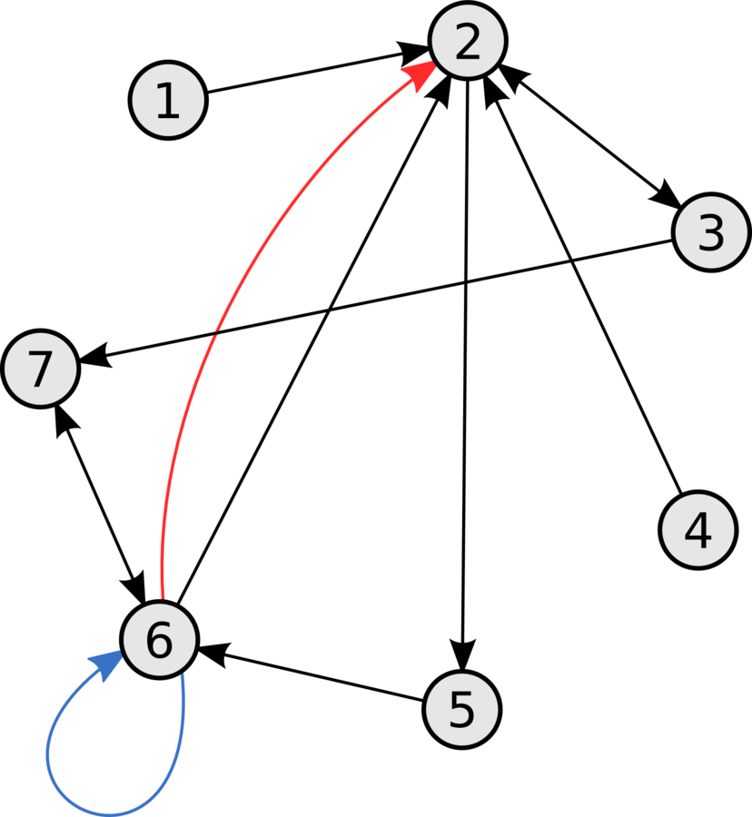
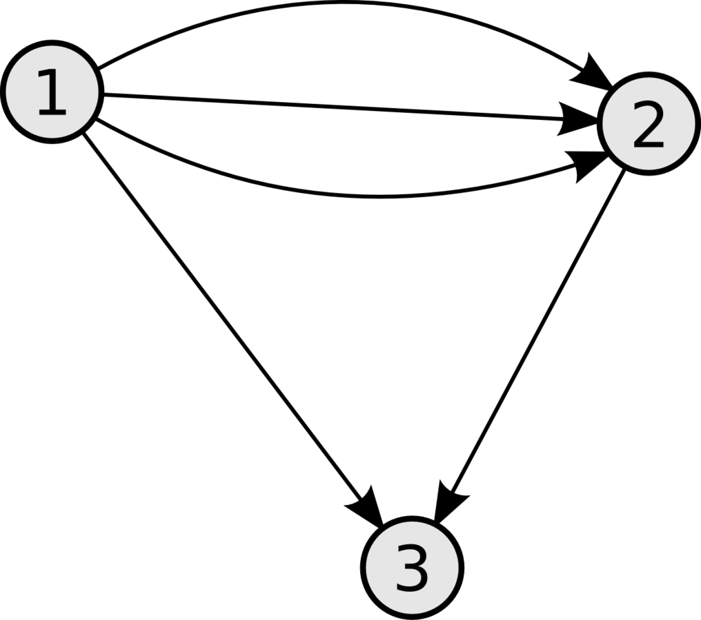
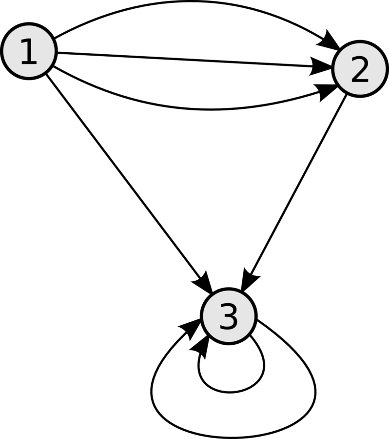
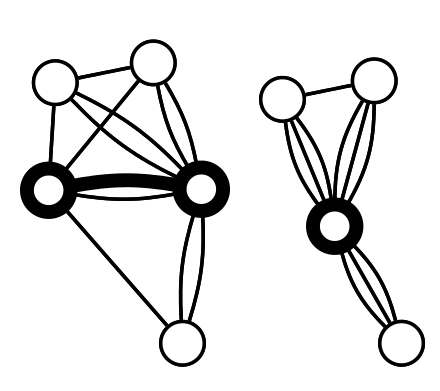
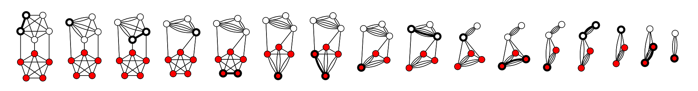

Минимальный разрез

- [Минимальный разрез](#минимальный-разрез)
  - [Основные определения](#основные-определения)
  - [Формулировка задачи](#формулировка-задачи)
  - [Алгоритм Каргера-Штейна](#алгоритм-каргера-штейна)
    - [Идея алгоритма](#идея-алгоритма)
    - [Работа алгоритма](#работа-алгоритма)
    - [Псевдокод](#псевдокод)
    - [Вероятность](#вероятность)
  - [Сложность](#сложность)
  - [Улучшение](#улучшение)
  - [Приложение](#приложение)
    - [Получение информации](#получение-информации)
    - [Компиляторы для параллельных языков программирования](#компиляторы-для-параллельных-языков-программирования)
    - [Остальные](#остальные)

# Минимальный разрез

[Методичка ИТМО](http://se.moevm.info/lib/exe/fetch.php/courses:algorithms_building_and_analysis:min-cut-itmo.pdf)

## Основные определения

Пусть $G$ - неориентированный взвешенный граф с $n$ вершинами и $m$ рёбрами.

**Разрезом** называется такое разбиение множества $V$ на два подмножества $A$ и $B$, что:

- $A, B \subset V$;

- $A, B \ne \emptyset$;

- $A \cap B = \emptyset$;

- $A \cup B = V$.

Весом разреза называется сумма весов рёбер, проходящих через разрез, т.е. таких рёбер, один конец которых принадлежит $A$, а второй конец $B$.

$$
w(A, B) = \sum\limits_{u ~ v \in E, ~ u \in A, ~ v \in B} w(u, v)
$$

**Ориентированным графом** $G$ называется четверка $G = (V, E, beg, end)$, где $V$ и $E$ - некоторые множества, а $beg, end: E \to V$.

Данное определение разрешает соединять вершины более чем одним ребром. Такие рёбра называются **кратными** (иначе — параллельные, англ. multi-edge, parallel edge). Граф с кратными рёбрами принято называть **мультиграфом** (англ. multigraph). Если в мультиграфе присутствуют петли, то такой граф называют **псевдографом** (англ. pseudograph).

Красным выделено кратное ребро (6, 2). Синим обозначена петля (6, 6).



**Мультиграф.**



**Псевдограф**



## Формулировка задачи

Задача о минимальном разрезе – задача разделения вершин взвешенного графа с $n$ вершинами и $m$ ребрами на два множества так, чтобы суммарный вес множества ребер, концевые вершины которых лежат в разных множествах, был минимален.

> Эту задачу называют "глобальным минимальным разрезом". Глобальный минимальный разрез равен минимуму среди разрезов минимальной стоимости по всевозможным парам исток-сток. Хотя эту задачу можно решить с помощью любого алгоритма нахождения максимального потока (запуская его $O(n^2)$ раз для всевозможных пар истока и стока), однако ниже описан гораздо более простой и быстрый алгоритм.

## Алгоритм Каргера-Штейна

Алгоритм Каргера-Штейна - вероятностный алгоритм, позволяющий найти минимальный разрез связного графа.

### Идея алгоритма

Идея алгоритма основана на стягивании ребра в неориентированном графе. Во время стягивания ребра происходит объединение двух вершин в одну, что уменьшает количество вершин графа на единицу. Все рёбра стягиваемых вершин соединяются со вновь образованной вершиной, порождая *мультиграф*.

Алгоритм Каргера итеративно выбирает случайные рёбра и выполняет операцию до тех пор, пока не останется две вершины, которые и представляют собой разрез изначального графа. Если повторять алгоритм достаточное количество раз, то с высокой вероятностью может быть найден минимальный разрез.

### Работа алгоритма

Основной операцией алгоритма Каргера является одна из форм стягивания ребра. Для выполнения этой операции на произвольном ребре $e = \{ u, v \}$ происходит объединение вершин графа $u$ и $v$ в одну $uv$. Если удаляется вершина $v$, то каждое ребро вида ${v, x}$ заменяется на ребро вида $\{ u, x \}$. Петли удаляются, и после этой операции граф не содержит петель.

Алгоритм представляет собой равновероятный выбор случайного имеющегося ребра и объединение вершин согласно описанной операции. Результатом работы алгоритма является пара вершин, множество рёбер между которыми является разрезом графа. Этот разрез может быть не минимальным, но вероятность того, что этот разрез минимальный существенно больше, чем для случайно выбранного разреза.

Ниже представлена операция стягивания ребра.



Пример успешной работы алгоритма для графа с 10 вершинами. Минимальный разрез равен трём.



### Псевдокод

```
Алгоритм Каргера
повторить n − 2 раза
  выбрать случайно ребро e
  стянуть ребро e
результат число рёбер между двумя последними вершинами
```
### Вероятность
Допустим, минимальный разрез - это множество $C$ ребер (пусть $|C|=k$)
Вероятность того, что на первом шаге будет стянуто ребро из этого множества (что плохо):

$P(e_1 \in C)=\frac{|C|}{|E|} \le \frac{k}{k*n/2} = \frac{2}{n}$
$P(e_1 \not\in C) \ge \frac{n-2}{n}$

Тогда вероятность, что алгоритм сработает верно:
$P(success) = \prod\limits_{i=1}^{n-2}P(X_i)=\frac{2}{n(n-1)}$

Вероятность достаточно мала. Поэтому алгоритм нужно прогнать 
$\frac{1}{P(success)}$ и взять лучшее решение (наименьший разрез).
Тогда вероятность успеха после стольких прогонов:

$P(multisuccess)=1-(1-P(success))^{\frac{1}{P(success)}} \approx 1-\frac{1}{e}$
Повторяя алгоритм еще, вероятность возрастает значительно сильнее.

## Сложность
Стягивание вершин - за линейное время. Количество стягиваний соотносится с количеством вершин $n$. Прогнать алгоритм требуется $n^2$ раз.
Итоговая сложность получается $O(n^4)$

## Улучшение 
Если прогонять алгоритм для количества вершин $n-\frac{n}{\sqrt(2)}$, а далее прогонять алгоритм для такого же количества вершин в оставшимся графе (и так далее рекурсивно), то можно улучшить сложность.

$P(success) = \prod\limits_{i=1}^{n-\frac{n}{\sqrt{2}}}P(X_i)=\frac{1}{2}$

Вероятность "выживания" стягивания - $\frac{1}{\log(n)}$

Сложность - $O(|V|^2*\log^3(V))$
## Приложение 

### Получение информации

В области получения информации минимальные разрезы используются при решении задачи выделения совокупности документов, отвечающих теме запроса, в гипертекстовых системах. Если ссылки в наборе гипертекстовых документов трактовать как ребра графа, то минимальный и близкие к нему разрезы соответствуют группе документов, которые имеют мало ссылок между собой, и поэтому, скорее всего, не соответствуют нужной теме.

### Компиляторы для параллельных языков программирования

Необходимость решения задачи о минимальном разрезе возникает и при разработке компиляторов для языков параллельного программирования. Параллельной программой будем считать такую программу, которую мы собираемся запускать на машине с распределенной памятью. В графе для этой программы вершины будут означать программные операции, а ребра – потоки данных между
программными операциями. Когда программные операции распределены среди процессоров, ребра, соединяющие вершины из различных процессоров, являются плохими, поскольку они указывают на необходимость межпроцессорных связей. Поиск оптимального расположения программных операций требует повторного решения задачи о минимальном разрезе в графе.

### Остальные

- Задачи комбинаторной оптимизации

- Теория устойчивости сети

- Построение иерархического дерева детальности сегментации изображения

- Задача оптимального планирования открытых горных разработок

- Анализ изображений: разделение объектов