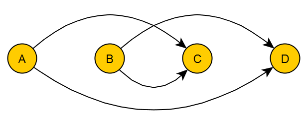

Обходы и сортировки

- [Обходы графа](#обходы-графа)
	- [Поиск в глубину (Depth-First Search, DFS)](#поиск-в-глубину-depth-first-search-dfs)
		- [Алгоритм](#алгоритм)
		- [Псевдокод](#псевдокод)
		- [Использование поиска в глубину для поиска циклов](#использование-поиска-в-глубину-для-поиска-циклов)
			- [Псевдокод](#псевдокод-1)
		- [Использование для построения остовного дерева](#использование-для-построения-остовного-дерева)
		- [Топологическая сортировка](#топологическая-сортировка)
		- [Топологическая сортировка уборкой истоков](#топологическая-сортировка-уборкой-истоков)
			- [Псевдокод](#псевдокод-2)
			- [Пример](#пример)
		- [Алгоритм Тарьяна - топологическая сортировка нумерацией шагов обхода](#алгоритм-тарьяна---топологическая-сортировка-нумерацией-шагов-обхода)
			- [Пример](#пример-1)
			- [Применение](#применение)
	- [Поиск в ширину (BFS, Breadth-first search)](#поиск-в-ширину-bfs-breadth-first-search)

# Обходы графа

## Поиск в глубину (Depth-First Search, DFS)


Поиск в глубину - необходимо идти "вглубь" графа так далеко, как это возможно.

### Алгоритм

1. Все вершины считаются "непросмотренными". Берется произвольная вершина v_0, которая отмечается как просмотренная и кладется в стек.

2. $v$ - вершина, которая находится на вершине стека. Ишется непросмотренная вершина $u$, такая, что $\exists (v, u)$ - ребро.

	a. Если такой вершины нет, переход на следующий шаг.
	
	b. Иначе пометить вершину как просмотренную, записать в стек и повторить текущий шаг.
	
3. Текущая вершина удаляется из стека. Если стек пуст, алгоритм завершен. Иначе переход на предыдущий шаг.

### Псевдокод

```
function doDfs(G[n]: Graph): // функция принимает граф G с количеством вершин n и выполняет обход в глубину во всем графе 
   visited = array[n, false]  // создаём массив посещённых вершины длины n, заполненный false изначально
          
   function dfs(u: int):   
      visited[u] = true
      for v: (u, v) in G        
         if not visited[v]               
            dfs(v)
	for i = 1 to n             
      if not visited[i]                    
         dfs(i)
```

Сложность алгоритма - $O ( |V| + |E| )$

### Использование поиска в глубину для поиска циклов

Нужно модифицировать алгоритм - пусть он при входе в вершину красит её в серый цвет, а при выходе - в чёрный. Тогда, если мы попали в серую вершину - найден цикл. Посещённые вершины можно сохранять в стеке.

#### Псевдокод

```
func dfs(v: vertex):  // v — вершина, в которой мы сейчас находимся 
    color[v] = grey             
    for (u: vu ∈ E)
        if (color[u] == white)
            dfs(v)
        if (color[u] == grey)
            print()   // вывод ответа    
    color[v] = black
```

### Использование для построения остовного дерева

Для построения остовного дерева годятся различные алгоритмы обхода в графа - например, поиск в ширину или в глубину.

В каждом случае нужно запоминать уже посещённые вершины и не посещать их во второй раз.

### Топологическая сортировка

Топологически сортированный граф - граф, у которого из вершины с меньшим номером всегда ребра идут в вершину с большим номером.



> Если в графе есть цикл, топологическая сортировка невозможна.

### Топологическая сортировка уборкой истоков

1. Считается количество входящих вершин.

2. Берется вершина с минимальным количеством входящих.

3. Эта вершина удаляется.

4. Веса пересчитываются.

5. Обратно на шаг 2, если в графе есть ребра.

#### Псевдокод

```
G = (V,E) - граф
L - Пустой список с отсортированными элементами
S - Список элементов без входящих ребер
while (S ≠ Ø)
	for (n: n ∈ S)
		L ← n
		for (m: e = nm ∈ E)
			delete e
			if ({e = nm | e ∈ E} = Ø)
				S ← m
if (E != Ø) 
	return error
else
return L
```

#### Пример


| A | B | C | D | E | F |
|:-:|:-:|:-:|:-:|:-:|:-:|
| 1 | 1 | 2 | 0 | 0 | 2 |

1. $D$: Удалить $D$, удалить ($D \to A, D \to F$).

	| A | B | C | E | F |
	|:-:|:-:|:-:|:-:|:-:|
	| 0 | 1 | 2 | 0 | 1 |
	
2. $A$: Удалить $A$, удалить ($A \to B$)

	| B | C | E | F |
	|:-:|:-:|:-:|:-:|
	| 0 | 2 | 0 | 1 |
	
3. $B$: Удалить $B$, удалить ($B \to C$)

	| C | E | F |
	|:-:|:-:|:-:|
	| 1 | 0 | 1 |
	
4. $C$: Удалить $C$, удалить ($E \to C$)

	| C | F |
	|:-:|:-:|
	| 0 | 1 |
	
5. $C$: Удалить $C$, удалить ($C \to F$)

	| F |
	|:-:|
	| 0 |
	
6. $F$: Удалить $F$

### Алгоритм Тарьяна - топологическая сортировка нумерацией шагов обхода

Топологическую сортировку можно выполнить и с помощью обхода в глубину, отсортировав при этом вершины по времени выхода. Алгоритм при этом похож на поиск цикла в графе.

- Из каждой вершины проводится поиск в глубину.

- При входе вершина красится в серый цвет, при выходе - в чёрный. Если вошли в серую вершину, в алгоритме цикл и сортировка невозможна.

#### Пример

Порядок, в котором выбираем вершины для обхода — `c, d, e, a, b`.


| Шаг | Текущая |     Белые     | Стек (серые) | Выход (чёрные) |
|:---:|:-------:|:-------------:|:------------:|:--------------:|
|  0  |    -    | a, b, c, d, e |       -      |        -       |
|  1  |    c    |   a, b, d, e  |       c      |        -       |
|  2  |    d    |    a, b, e    |     c, d     |        -       |
|  3  |    e    |      a, b     |    c, d, e   |        -       |
|  4  |    d    |      a, b     |     c, d     |        e       |
|  5  |    c    |      a, b     |       c      |      d, e      |
|  6  |    -    |      a, b     |       -      |     c, d, e    |
|  7  |    d    |      a, b     |       -      |     c, d, e    |
|  8  |    e    |      a, b     |       -      |     c, d, e    |
|  9  |    a    |       b       |       a      |     c, d, e    |
|  10 |    b    |       -       |     a, b     |     c, d, e    |
|  11 |    a    |       -       |       a      |   b, c, d, e   |
|  12 |    -    |       -       |       -      |  a, b, c, d, e |
|  13 |    b    |       -       |       -      |  a, b, c, d, e |

#### Применение

При помощи топологической сортировки строится корректная последовательность выполнения действий, всякое из которых может зависеть от другого: последовательность прохождения учебных курсов студентами, установки программ при помощи пакетного менеджера, сборки исходных текстов программ при помощи Makefile'ов.

## Поиск в ширину (BFS, Breadth-first search)


**Алгоритм.**

1. Все вершины считаются "непросмотренными". Берется произвольная вершина $v_0$, которая отмечается как просмотренная и кладется в стек.

2. $v$ − вершина, находящаяся на выходе очереди. Ищется непросмотренная вершина u, такая, что $\exists (v, u)$ − ребро.

	a. Если такой вершины нет, переход на следующий шаг.
	
	b. Иначе пометить вершину как просмотренную, записать в очередь и повторить текущий шаг.
	
3. Текущая вершина удаляется из очереди. Если очередь пуста, алгоритм завершен. Иначе переход на предыдущий шаг.

