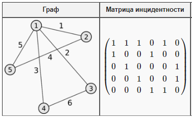
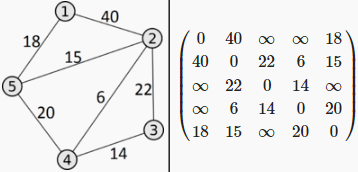

Основные определения

- [Основные определения](#основные-определения)
  - [Представление графов](#представление-графов)
    - [Матрица инциндетности](#матрица-инциндетности)
    - [Матрица смежности](#матрица-смежности)
    - [Список пар](#список-пар)
    - [Список инцидентности](#список-инцидентности)
    - [Сравнение методов](#сравнение-методов)

# Основные определения

Граф - $G = (V, E)$ - пара множеств, $V = \{ v_1, \dots, v_p \} \ne \emptyset$ - непустое конечное множество вершин и $E = \{ \{ v_i, v_j \} | v_i, v_j \in V \}$ - множество неупорядоченных пар вершин - **ребёр**.

- Вершины и ребра графа - его **элементы**.

- Число вершин графа - **порядок**.

- Ребро $(v, v)$ - **петля**.

Ребро - $e = (v, u) \in E$, где $v, u$ - **концы** ребра, ребро $e$ **инциндентно** вершинам $v$ и $u$.

**Степень** вершины - количество инцидентных ребер.

**Изолированная** вершина - вершина степени 0, **висячая** - вершина степени 1.

**Путь** из $A$ в $B$ - непрерывная последовательность ребёр, начавшаяся в $A$ и заканчивающаяся в $B$. Если начало и конец совпадают, путь - **циклический**, иначе - **открытый**. Если две вершины в пути не совпадают, путь **простой**. Простой открытый путь - **цепь**, замкнутый - **цикл**.

Граф - **полный**, если любые две его вершины смежны.

Граф - **связен**, если между любыми двумя вершинами существует путь.

**Мост** - ребро, удаление которого увеличивает число компонентов связности.

**Остов** - связный подграф, проходящий по всем вершинам.

**Упорядоченный граф** - граф, в котором ребра, выходящие из каждой вершины, пронумерованы.

## Представление графов

### Матрица инциндетности

Матрицей инцидентности для неориентированного графа называется матрица $I ( |V| \times |E| )$, для которой $I_{i,j} = 1$, если вершина $v_i$ инциндента ребру $e_j$ в противном случае $I_{i,j} = 0$.

Для ориентированного графа $I_{i,j} = -1$, если $v_i$ - начало дуги $e_j$.

Здесь строки соответсвуют вершинам от 1 до 5, а столбцы - рёбрами от 1 до 6. Например, из вершины 4 исходит ребро 3 и 6.

### Матрица смежности

Матрицей смежности $A = ||a_{i,j}||$ графа $G = (V, E)$ называется матрцица $A( |V| \times |V| )$, в котором $a_{i,j}$ - количество рёбер (или вес для взвешенного графа), соединяющих вершины $v_i$ и $v_j$.

### Список пар

Списком пар графа графа $G = (V, E)$ называется списком из элементов вида $(a_{i1}, a_{i2})$, где $a_{i1}, a_{i2} \in V$ - такие вершины, для которых существует ребро (дуга) $e_i \in E$.

### Список инцидентности

Список инцидентности графа $G = (V, E)$ называется список из элементов вида $(a_i, b_i)$, где $a_i \in V$, а $b_i = <a_{ij}>$ - список всех вершин $e_{ij}$, инцидентных $a_i$.

### Сравнение методов

Преимущества матриц в том, что они позволяют очень быстро проверить, если ли ребро между двумя элементами, но зато они требуют очень много памяти - $O ( |V|^2 )$ или $O ( |V| \cdot |E| )$. Логично применять матрицы, когда число ребёр в графе сопоставимо с числом вершин. Если же граф **разрежен** $|E| \ll |V^2|$, то логичнее использовать списки - они более эффективны по памяти, но менее эффективны по скорости доступа.

|                  |   Матрица инцидентности   | Матрица смежности | Список пар | Список инцидентности |
|:----------------:|:-------------------------:|:-----------------:|:----------:|:--------------------:|
|   Объём памяти   | $O ( \|V\| \cdot \|E\| )$ |   $O( \|V\|^2 )$  |   $O(E)$   |       $O(V+E)$       |
| Скорость доступа |           $O(1)$          |       $O(1)$      |   $O(E)$   |       $O(V+E)$       |

Сложность преобразования представлений графа равна сложности обхода той или иной структуры, т.е. равна объему памяти. Алгоритмы преобразования очевидны.