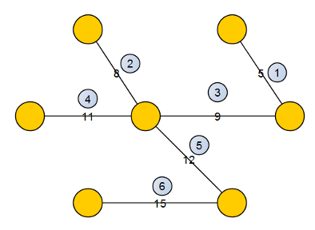

Остовные деревья

- [Остовные деревья](#остовные-деревья)
  - [Задача о связности графа](#задача-о-связности-графа)
  - [Поиск минимального остовного дерева](#поиск-минимального-остовного-дерева)
  - [Теорема о минимальной ребре](#теорема-о-минимальной-ребре)
  - [Алгоритм Борувки](#алгоритм-борувки)
    - [Принци работы](#принци-работы)
    - [Псевдокод](#псевдокод)
    - [Пример](#пример)
    - [Оценка работы](#оценка-работы)
  - [Жадный алгоритм (Краскала)](#жадный-алгоритм-краскала)
    - [Псевдокод](#псевдокод-1)
    - [Пример](#пример-1)
  - [Алгоритм “ближайшего соседа” (Ярник, Прим, Дейкстра)](#алгоритм-ближайшего-соседа-ярник-прим-дейкстра)
      - [Псевдокод](#псевдокод-2)
      - [Пример](#пример-2)
  - [Применение алгоритмов](#применение-алгоритмов)

# Остовные деревья

## Задача о связности графа

Граф $G = (V, E)$ называется **связным**, если для каждой пары вершин $v, w \in V$ в графе $G$ существует $(v, w)$-путь (а значит, и простая $(v, w)$-цепь).

Ориентированный граф называется:

- _слабо связным_, если соответствующий неориентированный граф является связным;

- _сильно связным_, если всякая вершина $v$ достижима из любой другой вершины $w$.

Максимальный (по включению) связный подграф графа $G$ называется его **компонентой связности**.

Если $G$ — связный граф, то у графа $G$ _одна_ компонента связности.

## Поиск минимального остовного дерева

Дан неориентированный граф $G = (V, E); w(u, v)$ - весовая функция. Нужно построить минимальное остовное дерево для $G$.

**Остовное дерево** $G$ - связный ациклический подграф графа $G$, в который входят все его вершины.

**Минимальное остовное дерево** - остовное дерево с минимальным суммарным весом рёбер.

**Основный лес:**

- Не обязательно связный ациклический подграф, включающий все вершины.

- Объединение остовных деревьев для каждой компоненты связности.

## Теорема о минимальной ребре

**Разрез графа** $G = (V, E)$ - разбиение $V$ на два непересекающихся подмножества $S$ и $T$, где $T = V \backslash S$ - обозначается как $<S, T>$.

1. $S \cup T = V$

2. $S \cap T = \emptyset$

3. $s \in S, t \in T$, где $s$ -исток, $t$ - сток.

**Величиной разреза** называется сумма пропускных способностей таких рёбер $(i, j)$, что $i \in S, j \in T$.

Ребро $(u, v) \in E$ **пересекает** разрес $<S, T>$, если $u \in S, v \in T$.

Рассмотрим неориентированный взвешенный граф $G = (V, E)$ с весовой функцией $\omega: E \to \mathbb{R}$. Пусть $G' = (V, E')$ - подграф некоторого минимального остовного дерева $G, <S, T>$ - такой разрез $G$, что ни одно ребро из $E'$ его не пересекает, а $e = (u, v) \notin E'$ - минимальное из рёбер, пересекающих $<S, T>$. Тогда $e$ - **безопасное ребро** для $G'$.

## Алгоритм Борувки

- Минимальное ребро цикла принадлежит остовному дереву.

- Компонента связности графа - это подграф, в котором можно найти из любой вершину в любую.

    Минимальное ребро, которое соединяет эти компоненты связности, обязательно попадает в остовное дерево графа.

### Принци работы

1. Изначально каждая вершина графа $G$ — тривиальное дерево, а ребра не принадлежат никакому дереву.

2. Для каждого дерева $T$ найдём минимальное инцидентое ему ребро, добавим к остовному дереву все такие рёбра.

3. Повторить шаг 2, пока в графе не останется одно дерево $T$.

### Псевдокод

```
// GG — исходный граф
  // ww — весовая функция
  function boruvkaMST()
      while T.size < n−1                                  
           for k ∈ Component    // Component — множество компонент связности в T. Для каждой компоненты связности вес минимального ребра = ∞
               w(minEdge[k])= ∞
           findComp(T)  // Разбиваем граф T на компоненты связности обычным dfs-ом.
           for (u,v) ∈ E
               if u.comp≠v.comp
                   if w(minEdge[u.comp])<w(u,v)
                       minEdge[u.comp]=(u,v)
                   if w(minEdge[v.comp])<w(u,v)
                       minEdge[v.comp]=(u,v)
           for k ∈ Component                                 
               T.addEdge(minEdge[k])  // Добавляем ребро, если его не было в T
      return TT
```

### Пример


**Шаг 1.**

К остовному дереву добавляются все минимальные ребра, инцидентные каждой вершине.


**Шаг 2.**

Компоненты связности "стягиваются" в одну вершину. Для соединения выбирается минимальное ребро. Это ребро добавляется к дереву.


Шаги повторяются, пока не останется одна вершина.

### Оценка работы

В худшем случае на каждом шаге количество вершин каждый раз в два раза, т.е. каждая вершина стягивается только с соседней. Поэтому сложность $O ( |E| \cdot \log |V| )$.

## Жадный алгоритм (Краскала)

**Жадный алгоритм** - на каждом шаге делается лучшая для данного момента операция.

Идея алгоритма в следующем - в множество $E'$ остовного дерева $G' = (V, E')$ графа $G = (V, E)$ в порядке невозростания весов добавляются рёбра.

- Если очередное ребро соединяет вершины одной компоненты связности $G'$, то добавление его создаст цикл.

- Если же оно соединяет вершины разных компонент, то по теореме о минимальном ребре оно безопасно и может быть включено в граф.

### Псевдокод

```
G = (V, E)      // исходный граф
G' = (V', E')   // результат алгоритма
V' ← V
E' ← ∅
for (uv ∈ E ordered by w(u,v))
	if (Component(u) ≠ Component(v))
        E' ← uv
```

### Пример

> В кружках около вершины - номер шага



## Алгоритм “ближайшего соседа” (Ярник, Прим, Дейкстра)

[Вики](https://neerc.ifmo.ru/wiki/index.php?title=%D0%90%D0%BB%D0%B3%D0%BE%D1%80%D0%B8%D1%82%D0%BC_%D0%9F%D1%80%D0%B8%D0%BC%D0%B0)

На вход алгоритма подаётся связный неориентированный граф. Для каждого ребра задаётся его стоимость.

Сначала берётся произвольная вершина и находится ребро, инцидентное данной вершине и обладающее наименьшей стоимостью. Найденное ребро и соединяемые им две вершины образуют дерево. Затем, рассматриваются рёбра графа, один конец которых — уже принадлежащая дереву вершина, а другой — нет; из этих рёбер выбирается ребро наименьшей стоимости. Выбираемое на каждом шаге ребро присоединяется к дереву. Рост дерева происходит до тех пор, пока не будут исчерпаны все вершины исходного графа.

Результатом работы алгоритма является остовное дерево минимальной стоимости.

Сложность зависит от того, как хранить $Q$ - множество еще не вошедших в дерево вершин.
* Наивная реализация - $O(V^2+E)$
* Двоичная куча 	- $O(E*log(V))$
* Фибоначчиева куча 	- $O(V*log(V) + E)$

#### Псевдокод

```
T ← {} // Множество ребер остовного дерева
for (i ∈ V)
	d[i] ← ∞ //Расстояния до i-й вершины дерева
	p[i] ← nil //Предок i-й вершины
d[1] ← 1

Q ← V
v ← Q.Extract_min

while (Q ≠ ∅)
	for (uv ∈ E)
		if (u ∈ Q and w(v,u) < d[u])
			d[u] ← w(v,u)
			p[u] ← v
		v ← Q.Extract_min
T ← T + (p[v], v)
```

#### Пример

**Шаг 0.**


| Множество выбранных вершин $U$ | Ребро $(u, v)$ | Множество невыбранных вершин $V \backslash U$ |                                                           Описание                                                          |
|:------------------------------:|:--------------:|:---------------------------------------------:|:---------------------------------------------------------------------------------------------------------------------------:|
|             $\{\}$             |                |              $\{A,B,C,D,E,F,G\}$              | Исходный взвешенный граф. Числа возле ребер показывают их веса, которые можно рассматривать как расстояния между вершинами. |

**Шаг 1.**


| Множество выбранных вершин $U$ |                   Ребро $(u, v)$                   | Множество невыбранных вершин $V \backslash U$ |                                                                                                       Описание                                                                                                      |
|:------------------------------:|:--------------------------------------------------:|:---------------------------------------------:|:-------------------------------------------------------------------------------------------------------------------------------------------------------------------------------------------------------------------:|
|             $\{D\}$            | $(D,A) = 5 V$ $(D,B) = 9$ $(D,E) = 15$ $(D,F) = 6$ |               $\{A,B,C,E,F,G\}$               | В качестве начальной произвольно выбирается вершина $D$. Каждая из вершин $A, B, E$ и $F$ соединена с $D$ единственным ребром. Вершина $A$ — ближайшая к $D$, и выбирается как вторая вершина вместе с ребром $AD$. |

**Шаг 2.**


| Множество выбранных вершин $U$ | Ребро $(u, v)$                                     | Множество невыбранных вершин $V \backslash U$ | Описание                                                                                                                                                                                                                                           |
|--------------------------------|----------------------------------------------------|-----------------------------------------------|----------------------------------------------------------------------------------------------------------------------------------------------------------------------------------------------------------------------------------------------------|
|            $\{A,D\}$           | $(D,B) = 9$ $(D,E) = 15$ $(D,F) = 6 V$ $(A,B) = 7$ |                $\{B,C,E,F,G\}$                | Следующая вершина — ближайшая к любой из выбранных вершин $D$ или $A$. B удалена от $D$ на 9 и от $A$ — на 7. Расстояние до $E$ равно 15, а до $F$ — 6. $F$ является ближайшей вершиной, поэтому она включается в дерево $F$ вместе с ребром $DF$. |

**Шаг 3.**


| Множество выбранных вершин $U$ |                          Ребро $(u, v)$                         | Множество невыбранных вершин $V \backslash U$ |                              Описание                              |
|:------------------------------:|:---------------------------------------------------------------:|:---------------------------------------------:|:------------------------------------------------------------------:|
|           $\{A,D,F\}$          | $(D,B) = 9$ $(D,E) = 15$ $(A,B) = 7 V$ $(F,E) = 8$ $(F,G) = 11$ |                 $\{B,C,E,G\}$                 | Аналогичным образом выбирается вершина $B$, удаленная от $A$ на 7. |

**Шаг 4.**


| Множество выбранных вершин $U$ |                                  Ребро $(u, v)$                                  | Множество невыбранных вершин $V \backslash U$ |                                                                                                     Описание                                                                                                     |
|:------------------------------:|:--------------------------------------------------------------------------------:|:---------------------------------------------:|:----------------------------------------------------------------------------------------------------------------------------------------------------------------------------------------------------------------:|
|          $\{A,B,D,F\}$         | $(B,C) = 8$ $(B,E) = 7 V$ $(D,B) = 9$ цикл $(D,E) = 15$ $(F,E) = 8$ $(F,G) = 11$ |                  $\{C,E,G\}$                  | В этом случае есть возможность выбрать либо $C$, либо $E$, либо $G$. $C$ удалена от $B$ на 8, $E$ удалена от $B$ на 7, а $G$ удалена от $F$ на 11. $E$ — ближайшая вершина, поэтому выбирается $E$ и ребро $BE$. |

**Шаг 5.**


| Множество выбранных вершин $U$ |                                             Ребро $(u, v)$                                             | Множество невыбранных вершин $V \backslash U$ |                                                            Описание                                                           |
|:------------------------------:|:------------------------------------------------------------------------------------------------------:|:---------------------------------------------:|:-----------------------------------------------------------------------------------------------------------------------------:|
|         $\{A,B,D,E,F\}$        | $(B,C) = 8$ $(D,B) = 9$ цикл $(D,E) = 15$ цикл $(E,C) = 5 V$ $(E,G) = 9$ $(F,E) = 8$ цикл $(F,G) = 11$ |                   $\{C,G\}$                   | Здесь доступны только вершины $C$ и $G$. Расстояние от $E$ до $C$ равно 5, а до $G$ — 9. Выбирается вершина $C$ и ребро $EC$. |

**Шаг 6.**


| Множество выбранных вершин $U$ |                                          Ребро $(u, v)$                                         | Множество невыбранных вершин $V \backslash U$ |                                                                   Описание                                                                   |
|:------------------------------:|:-----------------------------------------------------------------------------------------------:|:---------------------------------------------:|:--------------------------------------------------------------------------------------------------------------------------------------------:|
|        $\{A,B,C,D,E,F\}$       | $(B,C) = 8$ цикл $(D,B) = 9$ цикл $(D,E) = 15$ цикл $(E,G) = 9 V$ $(F,E) = 8$ цикл $(F,G) = 11$ |                    $\{G\}$                    | Единственная оставшаяся вершина — $G$. Расстояние от $F$ до неё равно 11, от $E$ — 9. $E$ ближе, поэтому выбирается вершина $G$и ребро $EG$. |

**Шаг 7.**


| Множество выбранных вершин $U$ |                                     Ребро $(u, v)$                                     | Множество невыбранных вершин $V \backslash U$ |                                                    Описание                                                    |
|:------------------------------:|:--------------------------------------------------------------------------------------:|:---------------------------------------------:|:--------------------------------------------------------------------------------------------------------------:|
|       $\{A,B,C,D,E,F,G\}$      | $(B,C) = 8$ цикл $(D,B) = 9$ цикл $(D,E) = 15$ цикл $(F,E) = 8$ цикл $(F,G) = 11$ цикл |                     $\{\}$                    | Выбраны все вершины, минимальное остовное дерево построено (выделено зелёным). В этом случае его вес равен 39. |

## Применение алгоритмов

Применяется в САПР при разводке печатных плат, чтобы определить минимальное количество дорожек. Это уменьшает затраты материала и вероятности ошибок. 
Кроме того, многие протоколы в телекоммуникационных сетях используют минимальное остовное дерево, например STP (Spine Tree Protocol). Это используется для обхода циклов в сетях и уменьшения нагрузки на сеть. При широковещательной посылке пакетов это также используется.