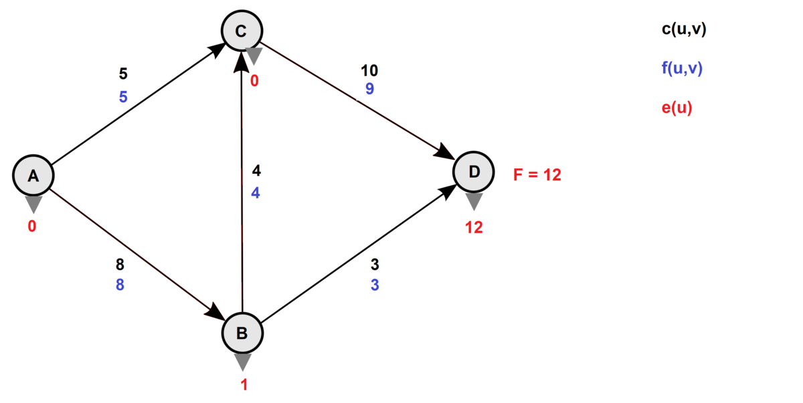
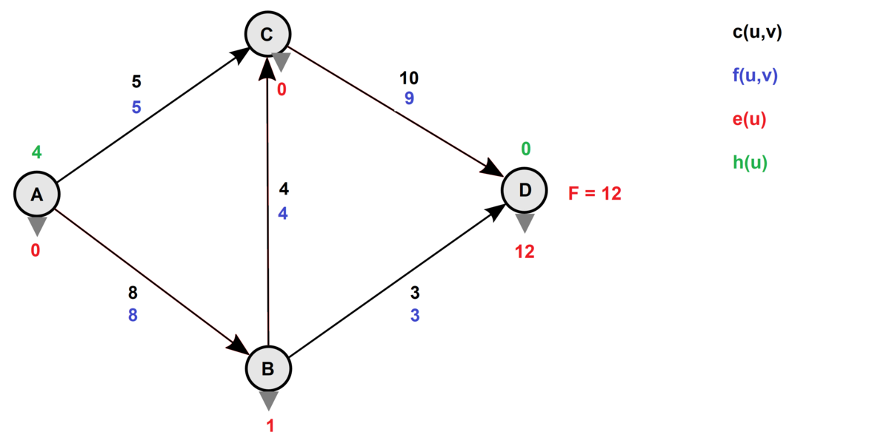
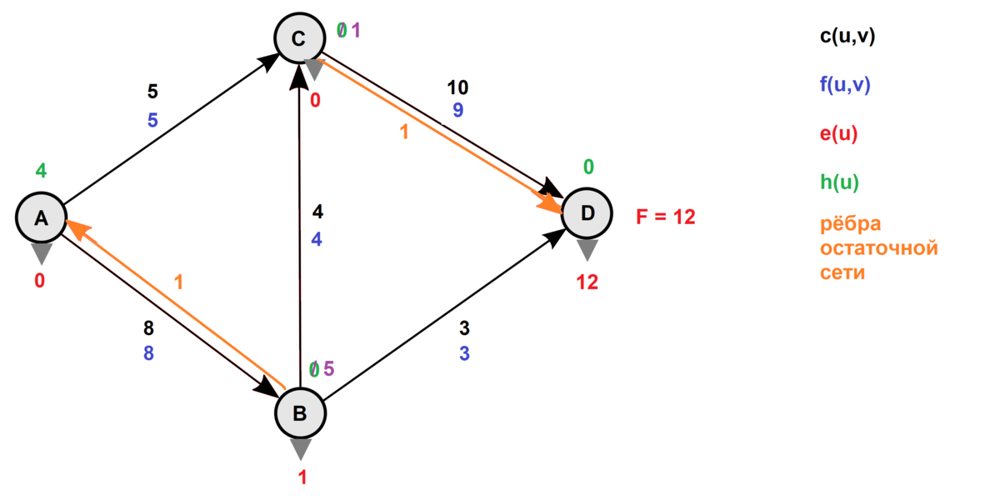
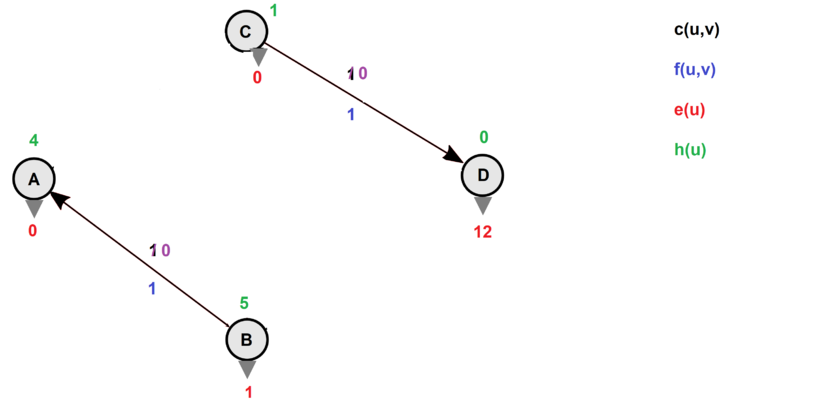

Поиск потоков в графе

- [Поиск потоков в графе](#поиск-потоков-в-графе)
  - [Метод Форда-Фалкерсона](#метод-форда-фалкерсона)
    - [Определения](#определения)
  - [Неформальное описание](#неформальное-описание)
    - [Ход алгоритма](#ход-алгоритма)
    - [Псевдокод](#псевдокод)
    - [Сложность](#сложность)
    - [Дополнения](#дополнения)
  - [Алгоритм Гольдберга (проталкивания предпотока)](#алгоритм-гольдберга-проталкивания-предпотока)
  - [Основные определения](#основные-определения)
  - [Идея алгоритма](#идея-алгоритма)
  - [Операции](#операции)
    - [Проталкивание (push)](#проталкивание-push)
    - [Подъём (relabel)](#подъём-relabel)
  - [Схема алгоритма](#схема-алгоритма)

# Поиск потоков в графе

**Сеть** - ориентированный граф $G = (V, E)$, у которого есть взвешенные ребра. У каждого ребра $(u, v)$ есть сопоставленная ему пропускная способность $c(u, v)$ - capacity. Граф имеет один сток и исток.

**Поток** - подграф графа, который имеет пропускную способность, не больше, чем пропускная способность этого графа. Поток в графе - один из возможных путей распространения вещества от истока к стоку.

Формальное определение поток - функция $f: V \times V \to \mathbb{R}$,

- Пропускные способности не нарушены: $\forall u, v \in V: f(v, u) \le c(u, v)$.

- Кососимметричность: $\forall u, v \in V: f(u, v) = -f(v, u)$

- Сохранение потока: $\forall u \in V$

**Задача** - найти максимальный поток в графе.

## Метод Форда-Фалкерсона

### Определения

- Есть сеть $G$ и поток $f$. Будем называть **остаточной пропускной способностью** $(u, v)$ разность пропускной способности потока и величины потока.

- **Остаточной сетью**, которая порождена потоком, мы будем называть такую сеть, порожденную из тех же вершин, ребра которой будут иметь только остаточную пропускную способность.

- **Дополняющий путь** в сети - обычный путь из истока в сток в остаточной сети.

Если в графе есть хотя бы один дополняющий путь, текущий построенный поток не максимален.

- **Пропускная способность пути** - минимальная из всех пропускных способностей рёбер.

- **Остаточная пропускная способность дополняющего пути** - наибольший поток, который мы можем пропустить по этому пути.

- **Разрез графа** - разделение графа на две части. Поток через любой разрез совпадает с величиной самого потока.

- **Пропускная способность разреза** - суммарная пропускная способность ребер - мостов, соединяющих разрез.

- **Минимальный разрез** - разрез с минимальной пропускной способностью.

Следующие утверждения равносильны:

- Поток $f$ максимален.

- Остаточная сеть не содержит дополняющих путей.

- Существует такой разрез, для которого пропускная способность потока равна пропускной способности разреза.

## Неформальное описание

1. Обнуляем все потоки. Остаточная сеть изначально совпадает с исходной сетью.

2. В остаточной сети находим любой путь из источника в сток. Если такого пути нет, останавливаемся.

3. Пускаем через найденный путь (он называется **увеличивающим путём** или **увеличивающей цепью**) максимально возможный поток:

      1. На найденном пути в остаточной сети ищем ребро с минимальной пропускной способностью $c_{\min}$.

      2. Для каждого ребра на найденном пути увеличиваем поток на $c_{\min}$, а в противоположном ему — уменьшаем на $c_{\min}$.

      3. Модифицируем остаточную сеть. Для всех рёбер на найденном пути, а также для противоположных им рёбер, вычисляем новую пропускную способность. Если она стала ненулевой, добавляем ребро к остаточной сети, а если обнулилась, стираем его.

4. Возвращаемся на шаг 2.

Важно, что алгоритм не конкретизирует, какой именно путь мы ищем на шаге 2 или как мы это делаем. По этой причине алгоритм гарантированно сходится только для целых пропускных способностей, но даже для них при больших значениях пропускных способностей он может работать очень долго. Если пропускные способности вещественны, алгоритм может работать бесконечно долго, не сходясь к оптимальному решению.

Если искать не любой путь, а кратчайший, получится алгоритм Эдмондса — Карпа или алгоритм Диница. Эти алгоритмы сходятся для любых вещественных весов за время $O(|V| \cdot |E|^2)$ и $O(|V|^2 \cdot |E|)$ соответсвенно.

### Ход алгоритма
1. Строится (любой) путь из истока в сток. Здесь ∃ свобода выбора алгоритма (например, поиск в глубину)
1. Рассчитывается максимальный поток в этом пути (ищется ребро, которое меньше всех может пропустить)
2. Создаются противоположные ребра с обратным максимальному потоку пути значением
3. Пункт 1, пока это возможно


### Псевдокод

```
Func F-B(G, s, t)   // G = (V,E) - входная сеть; s - исток; t - сток
for (uv ∈ E) //Инициализация
	f(uv) ← 0
	f(vu) ← 0
while ((p = G.FindPath(s,t)) ≠ ∅)   // Найти путь в остаточной сети поиском в ширину 
	c(p) ← min(c(uv): (uv) ∈ p)     // Установка пропуской способности пути
    for ((uv) ∈ p)  // Формирование остаточной сети
        f(uv) ← f(uv) + c(p)
        f(vu) ← f(uv)
```

**Критерий существования дополняющего пути** - существование входных ребер в сток.

### Сложность

* Найти путь из истока в сток занимает $O(|E|)$.
* Каждый путь принесет в худшем случае $+1$ к максимальному потому в графе. 
* Поэтому если $f$ – это максимальный поток, то сложность: $O(|E|*f)$. Тот самый случай, когда сложность зависит от результата.

### Дополнения

Если существует **несколько истоков** (или стоков), их можно объединить одним истоком (или стоком) ребрами с $\infty$ пропускной способностью.

## Алгоритм Гольдберга (проталкивания предпотока)

[Вики 1](https://ru.wikipedia.org/wiki/%D0%90%D0%BB%D0%B3%D0%BE%D1%80%D0%B8%D1%82%D0%BC_%D0%BF%D1%80%D0%BE%D1%82%D0%B0%D0%BB%D0%BA%D0%B8%D0%B2%D0%B0%D0%BD%D0%B8%D1%8F_%D0%BF%D1%80%D0%B5%D0%B4%D0%BF%D0%BE%D1%82%D0%BE%D0%BA%D0%B0)

[Вики 2](https://neerc.ifmo.ru/wiki/index.php?title=%D0%9C%D0%B5%D1%82%D0%BE%D0%B4_%D0%BF%D1%80%D0%BE%D1%82%D0%B0%D0%BB%D0%BA%D0%B8%D0%B2%D0%B0%D0%BD%D0%B8%D1%8F_%D0%BF%D1%80%D0%B5%D0%B4%D0%BF%D0%BE%D1%82%D0%BE%D0%BA%D0%B0)

[Ещё одно описание](http://masters.donntu.org/2008/fvti/belikov/library/art/21.htm)

[Интерактивный пример работы алгоритма](http://www.adrian-haarbach.de/idp-graph-algorithms/implementation/maxflow-push-relabel/index_en.html)

Алгоритм проталкивания предпотока решает задачу нахождения максимального потока в транспортной сети. В отличие от алгоритма Эдмондса-Карпа и алгоритма Диница **НЕ** является частным случаем алгоритма Форда-Фалкерсона.

Реализованный без специальных усовершенствований, алгоритм выполняется за время $O(V^2 E)$. Некоторые усовершенствования ещё ускоряют алгоритм: правило выбора вершин «поднять в начало» - до $O(V^3)$, выбор высшей активной вершины - до $O(V^2 \sqrt{E})$, реализация с использованием структуры данных Сеанора (Seanor) и Тарьяна - до $O(VE \log \left( \frac{V^2}{E} \right)$.

## Основные определения

Пусть дан ориентированный граф $G = (V, E)$, в котором выделены две вершины: исток $S$ и сток $T$, а у каждого ребра определена пропускная способность $C(u, v)$. Поток $F$ можно представить как поток вещества, которое могло бы пройти по сети от истока к стоку, если рассматривать граф как сеть труб с некоторыми пропускными способностями. То есть поток — функция $F(u, v)$, определённая на множестве рёбер графа. Задача заключается в нахождении максимального потока.

**Предпотоком** (англ. preflow) будем называть функцию $f: V \times V \to \mathbb{R}$, удовлетворяющую следующим свойствам:

- $f(u, u) = -f(v, u)$ (антисимметричность)

- $f(u, v) \le c(u, v)$ (ограничение пропускной способностью)

- $\forall u \in V \backslash \{ s, t \} ~~~ \sum\limits_{u \in V} f(v, u) \ge 0$ (ослабленное условие сохранения потока)

Как можно заметить, по своим свойствам предпоток очень похож на поток и отличается лишь тем, что для него не выполняется закон сохранения потока.

**Избыточным потоком** (англ. excess flow), входящим в вершину $u$, назовём величину $e(u) = \sum\limits_{v \in V} f(v, u)$.

Тогда вершина $u \in V \backslash \{ s, t \}$ будет называться **переполненной** (англ. overflowing), если $e(u) > 0$.

Ниже приведён пример сети с истоком $A$ и стоком $D$. Вершина $B$ является переполненной.



Функция $h: v \to \mathbb{Z}_{+}$ называется **высотой вершины** (англ. vertex label), если она удовлетворяет условиям:

1) $h(s) = |V|$

2) $h(t) = 0$

3) $\forall (u, v) \in E_{f} ~~~ h(u) \le h(v) + 1$

## Идея алгоритма

Представим, что наша сеть - система из резервуаров, находящихся на определенной высоте, и соединяющих их труб с заданными пропускными способностями, соответствующих вершинам и рёбрам в исходной сети.

Сам алгоритм можно представить как процесс поочередного "переливания" жидкости (операция проталкивания) из одного резервуара в другие, находящиеся на меньшей высоте, до тех пор пока не перестанет существовать резервуар, соответствующий переполненной вершине.

Может случиться ситуация, что все трубы, выходящие из переполненной вершины $u$, ведут к вершинам, находящимся на такой же высоте что и $u$ или выше её. В таком случае поднимем резервуар (операция подъёма), соответствующий данной вершине, таким образом, чтобы его высота стала на единицу больше, чем высота самого низкого из смежных резервуаров. После подъёма будет существовать по крайней мере одна труба, по которой можно пропустить жидкость.

В итоге, у нас не останется ни одной переполненной вершины, та часть потока, которая могла пройти к стоку, окажется там, остальная же вернется в исток. В такой ситуации предпоток превращается в обычный поток, так как для каждой вершины выполняется условие сохранения потока. Как будет показано далее, предпоток становится не только обычным, но и максимальным потоком.

## Операции

В алгоритме выполняются две основные операции: проталкивание из переполненной вершины избытка потока в смежные вершины, высота которых меньше, чем у переполненной, и подъём вершины.

### Проталкивание (push)

Операция проталкивания из вершины $u$ в вершину $v$ может применяться тогда, когда $e(u) > 0$, то есть вершина $u$ является переполненной, $c_f (u, v) > 0$ и $h(u) = h(v) + 1$.

Данная операция работает следующим образом: по ребру $(u, v)$ пропускается максимально возможный поток, то есть минимум из избытка вершины $u$ и остаточной пропускной способности ребра $(u, v)$, вследствие чего избыток вершины $u$, остаточная пропускная способность ребра $(u, v)$ и поток по обратному ребру $(v, u)$ уменьшаются на величину потока, а избыток вершины $v$, поток по ребру $(u, v)$ и остаточная пропускная способность обратного ребра $(v, u)$ увеличиваются на эту же величину.

```
function push(Node u, Node v)
    d = min(e(u), c(u, v) - f(u, v))
    f(u, v) += d
    f(v, u) = -f(u, v)
    e(u) -= d
    e(v) += d
```

По своему результату все проталкивания можно разделить на **2** группы. Будем называть проталкивание из вершины $u$ в вершину $v$ **насыщающим**, если после него остаточная пропускная способность ребра $(u, v)$ стала равна нулю. Все остальные проталкивания будем называть **ненасыщающими**. Подобная классификация проталкиваний понадобится нам при оценке их количества.

### Подъём (relabel)

Операция подъёма применима для вершины $u$, если $e(u) > 0$ и $\forall (u, v) \in E_f ~~~ h(u) \le h(v)$.

То есть, для переполненной вершины $u$ применима операция подъёма, если все вершины, для которых в остаточной сети есть рёбра из $u$, расположены не ниже $u$. Следовательно, операцию проталкивания для вершины $u$ произвести нельзя.

В результате подъёма высота текущей вершины становится на единицу больше высоты самый низкой смежной вершины в остаточной сети, вследствие чего появляется как минимум одно ребро, по которому можно протолкнуть поток.

```
function relabel(Node u)
    h(u) = min{h(v): f(u, v) - c(u, v) < 0} + 1
```

## Схема алгоритма

Для начала проинициализируем предпоток. Пропустим максимально возможный поток по рёбрам, инцидентным истоку, увеличив избыточный поток для каждой смежной с истоком вершиной на соответствующую величину. Все остальные потока не несут, следовательно, для вершин не смежных с истоком избыточный поток изначально будет нулевым. Также для всех вершин, кроме, естественно, истока, установим высоту, равную нулю.

Более формально это можно записать так:

$$
f(u, v) =
\begin{cases}
c(u, v), &u = s \\
-c(u, v), &v = s \\
0, &u \ne s \land v \ne s
\end{cases}
$$

$$
h(u) =
\begin{cases}
|V|, &u = s \\
0, &u \ne s
\end{cases}
$$

```
function initializePreflow(Node s)
    for u ∈ V
        h(u) = 0
        e(u) = 0
    for (u, v) ∈ E
        f(u, v) = 0
        f(v, u) = 0
    for u: (s, u) ∈ E
        f(s, u) = c(s, u)
        f(u, s) = -c(s, u)
        e(u) = c(s, u)
        e(s) -= c(s, u)
    h(s) = |V|
```

После инициализации будем выполнять операции проталкивания и подъёма в произвольном порядке. Утверждается, что количество данных операций конечно, и после завершения работы алгоритма наш предпоток является максимальным потоком.

```
function pushRelabelMaxFlow(Node s, Node t)
    initializePreflow(s)
    while e(u) > 0 and (h(u) = h(v) + 1 or ∀ (u, v) ∈ E_f h(u) ⩽ h(v))
        if e(u) > 0 and h(u) = h(v) + 1
          push(u, v)
        if e(u) > 0 and ∀ (u, v) ∈ E_f h(u) ⩽ h(v) 
          relabel(u)
```





