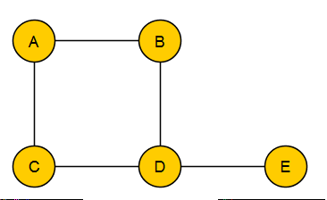
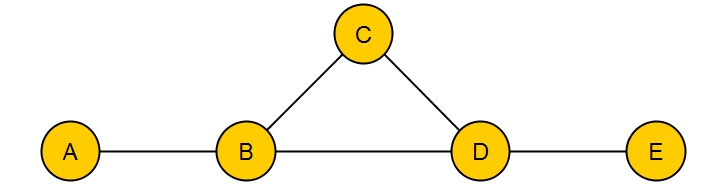
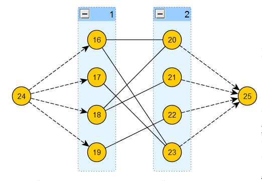

Покрытие графа

- [Покрытие графа](#покрытие-графа)
  - [Теорема Галлаи](#теорема-галлаи)
  - [Алгоритм поиска максимального паросочетания в двудольном графе](#алгоритм-поиска-максимального-паросочетания-в-двудольном-графе)
    - [Через максимальный поток](#через-максимальный-поток)
    - [Алгоритм 2. Задача об устойчивых браках.](#алгоритм-2-задача-об-устойчивых-браках)

# Покрытие графа

1. **Максимальное вершинное независимое множество** - максимальное подмножество всех вершин графа, никакая из которых не имеет ни с какой другой общих ребер.

    

    Для данного графа — это множество $\{ C, B, E \}$ и $\lambda (G) = 3$.

    Полиномиального алгоритма нахождения такого множества пока не существует, и решается она перебором.

2. **Минимальное вершинное покрытие** - набор вершин, таких, что любое ребро инцидентно какой-нибудь из этих вершин.

    Для графа из предыдущего примера это $\{ A, D \}$ и $\beta (G) = 2$.

    **Теорема.**

    $$
    \alpha (G) + \beta (G) = n
    $$

    $\alpha$ - дополнение $\beta$ до $G$.

3. **Максимальное паросочетание** - множество попарно несмежных ребер данного графа.

    

    $\alpha' (G) = 2$, например, $\{ BC, DE \}$.

4. **Реберное покрытие графа** - минимальный набор рёбер, такой, что любая вершина этого графа входит хотя бы в одно ребро данного множества.

    Для предыдущего графа это $\beta' (G) = 3$, например, $\{ AB, BC, DE \}$.

## Теорема Галлаи

$$
\alpha' (G) + \beta' (G) = n
$$

1. 
Максимальное паросочетание покрывает $2 \alpha' (G)$ вершин. Количество непокрытых вершин - $|o| = n - 2 \alpha' (G)$.

Пусть из каждой непокрытой вершины пущено одно ребро. Этих ребер тоже $|o|$ штук.

Этого достаточно, чтобы покрыть все вершины.

Набор $n - 2 \alpha' (G) + \alpha' (G) = n - \alpha' (G) \ge \beta' (G)$.

2.
Рассмотрим наименьшее рёберное покрытие $R$ в графе $G$. Если бы $R$ содержало циклы, то можно было бы удалить одно из рёбер цикла, получив рёберное покрытие размера на единицу меньше. Следовательно, $R$ образует лес на множестве вершин $V$, и выполняется равенство $| V | − | R | = K$, где $K$ — количество компонент связности в этом лесе. Взяв из каждой компоненты связности по одному ребру, получим паросочетание в графе $G$ размера $| V | − \beta' ( G )$. 

Следовательно, размер наибольшего паросочетания:

$\alpha' ( G ) ≥ | V |(=n) − \beta' ( G )$

3. 

Объединяя полученные неравенства: 
$n - \alpha' (G) \ge \beta' (G)$ и $\alpha' ( G ) ≥ n − \beta' ( G )$ получаем, что $\alpha' (G) + \beta' (G) = n$

**Двудольный граф** - такой граф, вершины которого можно разделить на два множества, таких, что все ребра будут проходить между множествами.

**Теорема Кёнига.**

Для двудольных графов размерность минимального вершинного покрытия совпадает с размерностью максимального паросочетания, т.е. $\alpha' (G) = \beta (G)$.

## Алгоритм поиска максимального паросочетания в двудольном графе

Для поиска максимального паросочетания в двудольном графе существуют хорошие алгоритмы. Это важно, т.к. к двудольным графам сводится множество задач - например 2SAT.

### Через максимальный поток

[Алгоритм Форда-Фалкерсона для поиска максимального паросочетания](https://neerc.ifmo.ru/wiki/index.php?title=%D0%90%D0%BB%D0%B3%D0%BE%D1%80%D0%B8%D1%82%D0%BC_%D0%A4%D0%BE%D1%80%D0%B4%D0%B0-%D0%A4%D0%B0%D0%BB%D0%BA%D0%B5%D1%80%D1%81%D0%BE%D0%BD%D0%B0_%D0%B4%D0%BB%D1%8F_%D0%BF%D0%BE%D0%B8%D1%81%D0%BA%D0%B0_%D0%BC%D0%B0%D0%BA%D1%81%D0%B8%D0%BC%D0%B0%D0%BB%D1%8C%D0%BD%D0%BE%D0%B3%D0%BE_%D0%BF%D0%B0%D1%80%D0%BE%D1%81%D0%BE%D1%87%D0%B5%D1%82%D0%B0%D0%BD%D0%B8%D1%8F)

Задачу поиска максимального паросочетания можно свести к поиску максимального потока:

Изначально текущее паросочетание пусто. На каждом шаге алгоритма будем поддерживать следующий инвариант: в текущее найденное паросочетание входят те и только те ребра, которые направлены из L в R.
1. Ищем в графе путь из s в t оиском в глубину.
2. Если путь найден, перезаписываем текущее паросочетание. Далее инвертируем все рёбра на пути (ребро (u,v)
становится ребром (v,u) ) и удаляем (s,L) и (R,t)
ребра, покрывающие вершины, принадлежащие текущему паросочетанию.
3. Если путь не был найден, значит текущее паросочетание является максимальным, и алгоритм завершает работу. Иначе переходим к пункту 1.

Сложность такого алгоритма - полиномиальная. Это гораздо проще, чем для задачи в общем виде.

###  Алгоритм 2. Задача об устойчивых браках.

Пара $\{ A, b \}$ называется неустойчивой, если:

1. В паросочетании уже есть пары $\{ A, a \}$ и $\{ B, b \}$.

2. $A$ предпочитает $b$ элементу $A$.

3. $b$ предпочитает $A$ элементу $B$.

Стоит задача найти полное устойчивое паросочетание между элементами двух множеств размера $n$, имеющими свои предпочтения (т.е. каждый элемент из множества α может отсортировать свои предпочтения из элементов множества $\beta$, и наоборот).

По такому определению строится двудольный граф, где доли - $\alpha, \beta$.

**Описание алгоритма:**

1. $\forall a \in \alpha$ делают предложение элементам $\beta$.

2. $\forall b \in \beta$ отвечают на наилучшее предложение "может быть", отказывая остальные.

3. $\forall a \in \alpha$, получившие отказ, обращаются к следующим элементам $\beta$ из своих список предпочтений.

4. Если $b \in \beta$ пришло предложение от $a \in \alpha$ лучше предыдущего, то $b$ отвергает предыдущее предложение и отвечает $a$ "может быть".

5. Если у $\alpha$ не исчерпался список предложений, повторить шаги 1-4.

6. $\forall b \in \beta$ отвечают согласием на существующие в данный момент "может быть".

Чтобы свести эту задачу к поиску максимального паросочетания, достаточно сказать, что элементы левой доли предпочитают инцидентные им элементы правой доли в лексикографическом порядке.
