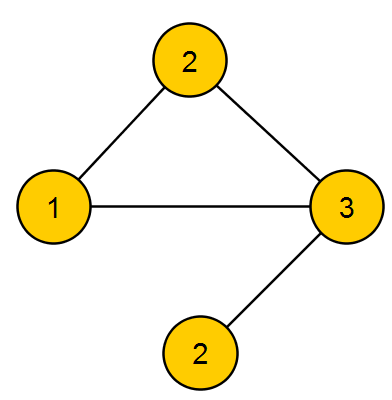

Раскраска графа

- [Раскраска графа](#раскраска-графа)
  - [Алгоритм полного перебора (совсем наивный перебор)](#алгоритм-полного-перебора-совсем-наивный-перебор)
  - [Перебор с учётом выбора только из 2 цветов](#перебор-с-учётом-выбора-только-из-2-цветов)
  - [Перебор подмножеств размера $\Leftarrow \frac{n}{3}$](#перебор-подмножеств-размера-math-xmlnshttpwwww3org1998mathmathmlsemanticsmrowmomomfracminmimn3mnmfracmrowannotation-encodingapplicationx-texleftarrow-fracn3annotationsemanticsmath3n)
  - [Вероятностный алгоритм (Two-List Coloring). Сведение к задаче выполнимости.](#вероятностный-алгоритм-two-list-coloring-сведение-к-задаче-выполнимости)
  - [Алгоритм перебора по инцидентным вершинам](#алгоритм-перебора-по-инцидентным-вершинам)
  - [Примененеи](#примененеи)

# Раскраска графа

[Вики](https://ru.wikipedia.org/wiki/%D0%A0%D0%B0%D1%81%D0%BA%D1%80%D0%B0%D1%81%D0%BA%D0%B0_%D0%B3%D1%80%D0%B0%D1%84%D0%BE%D0%B2#%D0%9E%D0%BF%D1%80%D0%B5%D0%B4%D0%B5%D0%BB%D0%B5%D0%BD%D0%B8%D0%B5_%D0%B8_%D1%82%D0%B5%D1%80%D0%BC%D0%B8%D0%BD%D0%BE%D0%BB%D0%BE%D0%B3%D0%B8%D1%8F)

Когда говорят о раскраске графов, почти всегда подразумевают под этим раскраску их вершин, то есть присвоение цветовых меток вершинам графа так, чтобы любые две вершины, имеющие общее ребро, имели разные цвета. Так как графы, в которых есть петли, не могут быть раскрашены таким образом, они не являются предметом обсуждения.

**Хроматическое число графа** - минимальное количество цветов покрасок.

Соседей вершины нельзя красить в тот же цвет.

Для такого графа хроматическое число - 3.

**Полный граф** - такой граф, у которого есть путь из каждой вершины в каждую. Очевидно, что хроматическое число полного графа совпадает с количеством вершин.

## Алгоритм полного перебора (совсем наивный перебор)

Пусть дан граф и дана его раскраска. Чтобы проверить её корректность, нужно обойти все ребра и проверить, если одинаковые цвета на концах. Значит, сложность проверки - линейная. 

Самый простой вариант - генерация всех возможных три-раскрасок и проверка каждой на корректность. Сложность такого алгоритма - $O(3^n)$, т.к. это число возможных три-раскрасок графа.

Степенную сложность степени не убрать никак, на данный момент самый эффективный алгоритм - $O(1.232^n)$.

## Перебор с учётом выбора только из 2 цветов

Пусть есть некоторая вершина. Мы красим её в первый цвет. Для инцидентных вершин выбор идет не из 3-х цветов, а из 2-х. Сложность такого алгоритма - $O(2^n)$.

Другими словами, используется знание, что инцидентные данной вершины нельзя красить в цвет данной.

## Перебор подмножеств размера $\Leftarrow \frac{n}{3}$

Два соображения:

- Если граф уже раскрашен, то вершины разделяются на множества - первого, второго и третьего цвета. Очевидно, что внутри этих множеств не существует ребер. Если есть $n$ вершин и 3 множества, очевидно, что одно из этих множеств будет иметь мощность $\le \frac{n}{3}$ вершин.

- Пусть нам заранее известно одно из этих множеств. Если это так, то все оставшиеся вершины будут красится гораздо проще - с линейной сложностью.

Значит, нужно найти такое множество. Способов выбрать такое множество:

$$
C_n^0 + C_n^1 + C_n^2 + \dots + C_{n}^{\frac{n}{3}} \le n \cdot C_{n}^{\frac{n}{3}} \le 1.9^n
$$

\- _радиус шара Хэмминга_.

Значит, сложность алгоритма - $O(1.9^n)$.

## Вероятностный алгоритм (Two-List Coloring). Сведение к задаче выполнимости.

Посмотрим все цвета для вершин, в которые можно их покрасить. Можно для каждой вершины случайным образом выкинуть один цвет и красить из оставшихся. В таком случае каждая вершина может быть покрасить в один из двух цветов.

Такую задачу можно свести к **задаче выполнимости булевых формул (2SAT)**.

_Сведение такое:_

Пусть каждый цвет обозначается переменной $a_1, a_2, a_3$. Нужно покрасить все вершины в какие-то цвета. Это значит, что нужно выбрать хотя бы (и только) один из этих цветов. Т.е. для одной вершины верно следующее

$$
( a_1 \lor a_2 \lor a_3 ) \land ( \bar a_1 \lor \bar a_2 ) \land ( \bar a_1 \lor \bar a_3 ) \lor (\bar a_2 \lor \bar a_3)
$$

1-й дизъюнкт - вершину нужно покрасить.

2, 3, 4-е - вершину можно покрасить только в один цвет.

Ещё нужно учесть ограничение три-раскраски, т.е. добавить ограничение на неодинаковость цвета инцидентных вершин.

$$
\land ( \bar a_1 \lor \bar b_1 ) \land ( \bar a_2 \lor \bar b_2 ) \land ( \bar a_3 \lor \bar b_3 )
$$

Вычеркнув неиспользуемые цвета получаем задачу 2SAT, где каждый дизъюнкт содержит не больше чем два литерала. Эту задачу можно решить за полиномиальное время. 

Задачу 2SAT возможно свести к графу, и решением будет поиск компонент связности.

Если найдено решение задачи, то граф точно может быть раскрашен, но обратное неверно - возможно, мы вычеркнули нужные цвета для раскраски. Вероятность того, что раскраска выживет после вычеркивания - $\left( \frac{2}{3} \right)^n$. Это очень мало.

Но если прогнать алгоритм $\left( \frac{3}{2} \right)^n$ раз, то вероятность ошибки - $\frac{1}{e}$.

Если после этого прогнать ещё 100 раз, то вероятность ошибки - $\frac{1}{e^{100}}$.

Сложность алгоритма - $O(1.5^n)$.

## Алгоритм перебора по инцидентным вершинам

Мы можем перебирать множества инцидентных вершин достаточно эффективно: если одна вершина попала в первое множество, то инцидентные гарантированно туда не попадут. Алгоритм, основанный на этой идее, даёт сложность $O(1.45^n)$.

## Примененеи

- Задача планирования. Пусть есть список заказов, которые начинаются и заканчиваются в определенное время. Нужно понять, какое минимальное количество ресурсов нужно выделить для решения этих заказов.
Сводится так: пересечение заказов по времени - ребро графа. Хроматическое число графа и есть ответ.

- Есть карта - отображение информации, которое предполагает, что между объектами есть границы (например - политическая карта мира). Задача - определить минимальное число цветов раскрасить карту, чтобы были видны границы между объектами. Задача очевидным образов сводится к раскраске графа.

- Задача оптимального распределения переменных по регистрам.