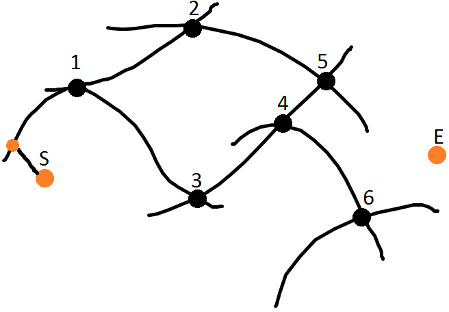

Эвристические алгоритмы. Алгоритм A*.

# Эвристические алгоритмы

**Эвристический алгоритм** - алгоритм решения задачи, правильность которого для всех возможных случаев не доказана, но про который точно известно, что он дает достаточно хорошее решение в большинстве случаев.

**Эвристика** - это не полностью математически обоснованный, но при этом практически полезный алгоритм. Особенности:

- Не гарантирует нахождение лучшего решения.

- Не гарантирует нахождение решения, даже если оно заведомо существует.

- Может давать совершенно неверный результат в определенных случаях.

## Алгоритм поиска $A^*$

Алгоритм поиска "А-звездочка" относится к эвристическим алгоритмам поиска по первому лучшему совпадению на графе с положительными ($>0$) весами рёбер, который находит маршрут с наименьшей стоимостью от одной вершины в другой.

В отличие от алгоритма Дейкстры, использует эвристическую функцию.

**Идея алгоритма:** $A^*$ пошагово просматривает все пути, ведущие от начальной вершины к конечной, пока не найдет минимальный путь. Как и все эвристические алгоритмы поиска, алгоритм сначала просматривает те маршруты и те ребра, которые кажутся ведущими к цели. От жадного алгоритма его отличает то, что при выборе вершины он учитывает весь путь до неё.

В начале работы просматриваются узлы, смежные с начальным. Выбирается тот, который имеет минимальное значение $f(x)$, после чего узел раскрывается. В начале работы алгоритм оперирует с множеством нераскрытых вершин.

Затем $f(x) = h(x) + g(x)$ - к эвристической функции прибавляется путь до текущей вершины.

**Структура Вирта** - удобная структура для хранения планарных графов. Удобнее, чем списки смежности.

### Псевдокод

Для расчета реализуем две функции:

`FUNCTION A*(start, end)` и `FUNCTION RECONSTRUCT_PATH(fromset, start, end)`.

```
FUNCTION A*(start,end)
	closedset = the empty set // Множество вершин, которые уже были обработаны(раскрыты)
	openset = {start} // Множество вершин(очередь), которые предстоит обработать(раскрыть).
					  // Изначально здесь присутствует только начальная вершина start.
	fromset = the empty set // Карта пройденных вершин. Используется функцией RECONSTRUCT_PATH
							для восстановления пути (вывода результата).
	
	// Заполняем свойства вершины start
	G(start) = COST(start,start) = 0 // Стоимость пути от начальной вершины. У start g(x) = 0.
	F(start) = G(start) + H(start,end) // h(x) - эвристическая оценка расстояния до цели.
	
	// Основной цикл алгоритма
	WHILE openset IS NOT EMPTY
		curr = MIN_F(openset) // Вершина из openset имеющая самую низкую оценку f(x).
		IF (curr = end) RETURN RECONSTRUCT_PATH(fromset,start,end) // Выводим результат.
		REMOVE curr FROM openset // Вершина curr пошла на обработку, а значит её следует удалить из очереди на обработку.
		ADD curr TO closedset // И добавить в список уже обработанных.
		
		FOREACH neighbour OF curr neighbours // Проверяем каждого соседа curr
			IF neighbour IN closedset CONTINUE // Пропускаем соседей из закрытого списка (предварительный, ожидаемый)
				tentative_g_score = G(curr) + COST(curr,neighbour) // Вычисляем g(x) для обрабатываемого соседа
			IF neighbour NOT IN openset // Если сосед curr ещё не в открытом списке
				ADD neighbour TO openset //добавим его туда
				tentative_is_better = TRUE // вводим признак того, что нужно обновить свойства для соседней вершины
			ELSE	// Сосед был в открытом списке, а значит мы уже знаем его g(x), h(x) и f(x)
				IF tentative_g_score < G(neighbour) // Вычисленная g(x) оказалась меньше, а значит нужно будет обновить значения g(x), h(x), f(x)
					tentative_is_better = TRUE
				ELSE // Вычисленная g(x) оказалась больше, чем имеющаяся в openset.
					 // Это означает, что из вершины curr путь через этого соседа дороже
					 // т.е. существует менее дорогой маршрут, пролегающий через этого соседа (из какой-то другой вершины, не из curr)
					 // Поэтому данного соседа мы игнорируем
					 tentative_is_better = FALSE
				 // Обновление свойств соседа.
				 IF tentative_is_better = TRUE
					fromset(neighbour) = curr //Вершина с которой мы пришли. Используется для реконструкции пути.
					G(neighbour) = tentative_g_score
					F(neighbour) = G(neighbour) + H(neighbour, end)
				// Обратите внимание, что если происходит обновление свойств - значит neighbour(сосед curr) так или иначе находится в openset.
				// Т.е. при следующей итерации внешнего цикла из openset будет извлечена вершина с наименьшей оценкой f(x).
				// Не исключено, что она окажется соседом нашего curr, которого мы только что добавили.
				// В общем это самая важная особенность алгоритма А*.
RETURN FAILURE // управление передаётся сюда когда openset пуст,а вершина end не найдена (путь найти не удалось)

// Восстанавливаем результироующий путь.
// Путь можно проследить только от заданной вершины(чаще всего это end) к старту(каждая вершина имеет пути находится в fromset, чем мы и воспользуемся).

FUNCTION RECONSTRUCT_PATH(fromset,start,end)
	pathset = the empty list // Упорядоченное множество результирующих вершин пути.
	curr = end // Поиск начинается от финиша.
	ADD curr TO pathset // Добавляем end в результирующий путь.
	
	WHILE curr <> start // Добавляем в путь все вершины от end до start.
		curr = fromset(curr) // Получаем вершину из которой пришли в curr.
		ADD curr TO pathset // Добавить вершину в результирующий путь.
RETURN REVERSE(pathset) // Так как мы построили путь от end к start, то результирующий набор вершин необходимо перевернуть.
```

## Эвристическая функция

Доказано, что $A^*$ всегда дает лучший маршрут для конкретной эвристической функции.

Под **эвристической функцией** понимается аппарат, позволяющий априорно выбрать тот элемент, который быстрее приведет к решению задачи. Для $A^*$ используется несколько эвристических функций:

- **Манхэттенское расстояние.**

    При движении по сетке по четырем направлениям.

    $h(u) = |ux - goal.x| + |uy - goal.y|$

- **Расстояние Чебышева**.

    При движении по 9 направлениям по сетке.

    $h(u) = \max ( |ux - goal.x|,  |uy - goal.y| )$
    
- Для планарного графа.

	$$
    h(u) = \sqrt{(ux - goal.x)^2 + (uy + goal.y)^2}
    $$

Требования к эвристической функции:

- Монотонность.

- Согласование единиц измерения с неэвристической функцией.  Если они измеряются в разных
величинах (например, $g(x)$ — это расстояние в километрах, а $h(x)$ — оценка времени пути в часах) $А^*$ может выдать некорректный результат.

## Свойства $A^*$

1. **Допустимость.** Если решение существует, с помощью этого алгоритма оно будет найдено.

2. **Оптимальность.** Найденное решение всегда оптимально.

3. **Эффективность.** Не существует в данный момент алгоритмов, который находят решение быстрее с применением той же эвристической функции. $A^*$ в ходе решения раскрывает минимальное количество вершин.

## Временная сложность

Обычно алгоритм $А^*$  просматривает только часть вершин. Однако, в лабиринтах быстродействие приближается к худшему случае.  Быстродействие алгоритма существенно зависит от двух факторов:

- Точность эвристической функции.

- Реализация контейнеров известных и исследованных вершин: наиболее затратными операциями в алгоритме есть операции сложения, изъятия и изменения элементов в списках известных и исследованных вершин. По их быстродействие существенно влияют конкретные реализации этих структур данных.

Пусть имеется множество вершин в графе, информация о вершинах и ребрах доступна до начала работы алгоритма, использованная эвристическая функция — монотонная. Список известных вершин реализован как бинарная куча, список исследованных — как массив. Тогда алгоритм $А^*$ имеет квадратичную зависимость от количества вершин графа и худшее время работы:

$$
O ( |V|^2 )
$$

Функция `MIN_F(openset)` может быть оптимизирована. Если каждая вершина хранится как указатель на соответствующий объект в куче, то время работы функции уменьшится с квадратичного до логарифмического, а общее время работы алгоритма — до линейно-логарифмического:

$$
O ( |V| \cdot \log |V| )
$$

## Построение графа



**Вершины** - пересечение дорог. Для нахождения пересечения линий используется алгоритм заметающей линии (прямой).

**Ребро** - длина дороги, а не прямое расстояние между вершинами. 
При расчёте маршрута самая трудоемкая операция - cost. Поэтому эти данные нужно подготавливать и структурировать заранее. Скорость алгоритма зависит от реализации контейнеров.

Нужно рассмотреть три случая для рассмотрения положения начальной и конечной точки:

1. Точка попала в никуда.

    Один из способов решения - построение кратчайшего расстояния до ближайшего ребра.

    Другой способ - расширяющаяся окружность (тоже эвристический алгоритм). Точки пересечения окружности с ребрами - начальные точки алгоритма.

2. Точка попала на ребро.

3. Точка попала на вершину.

Эта операция тоже трудоемкая. Кроме того, структуры графа должны динамически изменятся. Каждое решение не всегда оптимально.