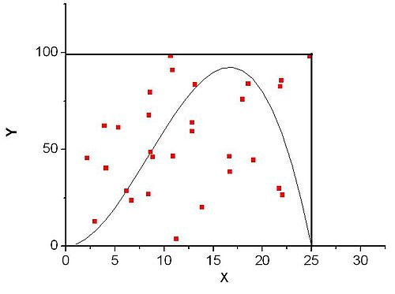

Backtracking

# Backtracking (Поиск с возвратом)

Backtracking - поиск с возвратом. Алгоритм запоминает свои состояния в точках ветвления, и придя в "тупик", возвращается в прошлое состояние и делает другой выбор. Пример - поиск пути в лабиринте.

Такие алгоритмы **детерминированы**, т.е. проверяют все варианты. Это очень неэффективно, если вариантов много - в таких случаях логичнее использовать **эвристические** алгоритмы.

Алгоритмы с возвратом обычно рекурсивны, значит - они используют стек и могут его переполнить, так как расширить стек сложно. Поэтому часто рекурсию нужно "развязать" в линейную структуру.

## Задача о ферзях

Задача - расставить $n$ ферзей на доске $n \times n$ так, чтобы два ферзя не стояли на одной диагонали или прямой.

Нетрудно посчитать, что вариантов расставить 8 фигур на такой доске - $C_{64}^{8} = 4426165368$.

Если учесть, что фигуры не могут стоять на одной вертикали или горизонтали (**Задача о ладьях**), то количество вариантов перебора существенно сократится - всего $8^8 = 16777216$.

Если же учесть атаки по диагоналям, число таких позиций станет $8! = 40320$.

Такую задачу можно решить поиском с возвратом - первый ферзь ставится на первую горизонталь, каждый следующий ставится так, чтобы его не били. Если свободного места не осталось, нужно сделать шаг назад и переставить ранее установленного ферзя.

## Метод Монте-Карло

[Хабр](https://habr.com/ru/post/274975/)

Многие системы слишком сложны для исследования влияния неопределенности с использованием аналитических методов. Однако такие системы можно исследовать, если рассматривать входные данные в виде случайных переменных, повторяя большое количество вычислений $N$ (итераций), для получения результата с необходимой точностью.

### Область применения

Метод обычно используют для оценки диапазона изменения результатов и относительной частоты значений в этом диапазоне для количественных величин, таких как стоимость, продолжительность, производительность, спрос и др.

Моделирование методом Монте-Карло может быть использовано для двух различных целей:

- трансформирование неопределенности для обычных аналитических моделей;

- расчета вероятностей, если аналитические методы не могут быть использованы.

Метод Монте-Карло может быть применен для оценки неопределенности финансовых прогнозов, результатов инвестиционных проектов, при прогнозировании стоимости и графика выполнения проекта, нарушений бизнес-процесса и замены персонала.

#### Примеры

##### Пример 1.

Задача - рассчитать площадь фигуры, вписанной в квадрат.

Метод состоит в следующем - равномерно распределяются точки и считаются точки, попавшие в фигуру. В таком случае

$$
Площадь = \frac{Сколько ~ попало}{Сколько ~ всего} \cdot Площадь ~ квадрата
$$

Сложность алгоритма зависит от:

- Сложности генерации случайных (или псевдослучайных) чисел;

- Сложности оценки попадания в фигуру.

##### Пример 2.

Генерируем случайные точки, у нас есть какая-то ф-ия, которая говорит, попала ли точка в требуемую область или нет.


$$
S = \frac{N_{попавших}}{N_{кол-во}} \cdot S_{\square}
$$

**С каким распределение кидать точки?**

Случайным равномерым (!). Не путать с нормальным распределением.

> Одномерное непрерывное равномерное распределение — распределение случайной вещественной величины, принимающей значения, принадлежащие некоторому промежутку конечной длины, характеризующееся тем, что плотность вероятности на этом промежутке почти всюду постоянна.

##### Пример 3.

Для определения площади под графиком функции можно использовать следующий стохастический алгоритм:



- ограничим функцию прямоугольником ($n$-мерным параллелепипедом в случае многих измерений), площадь которого $S_{par}$ можно легко вычислить; любая сторона прямоугольника содержит хотя бы 1 точку графика функции, но не пересекает его;

- "набросаем" в этот прямоугольник (параллелепипед) некоторое количество точек ($N$ штук), координаты которых будем выбирать случайным образом;

- определим число точек ($K$ штук), которые попадут под график функции;

- площадь области, ограниченной функцией и осями координат, $S$ даётся выражением

$$
S = S_{par} \frac{K}{N}
$$

Для малого числа измерений интегрируемой функции производительность Монте-Карло интегрирования гораздо ниже, чем производительность детерминированных методов. Тем не менее, в некоторых случаях, когда функция задана неявно, а необходимо определить область, заданную в виде сложных неравенств, стохастический метод может оказаться более предпочтительным.

## Рекурсивное программирование поиска с возвратом

Пусть $A$ - множество состояний, $a \in A$. $B \subseteq A$ - множество терминальных состояний (может быть и пустым), $b \in B$.

$\varphi: A \to A$ - рекурсивная функция. Если $\exists b: \varphi(a) = b$, то решение существует, иначе $B = \emptyset$ и решения нет.

```
function Rec(a)
	//Сделать действие
	if (a принадлежит B) //Если решение найдено
		return a
	if (тупик)
		return 0
	for (a2 - все варианты следующих шагов из a)
		b := Rec(a2)
		if (b != 0)
			return b
return 0
```