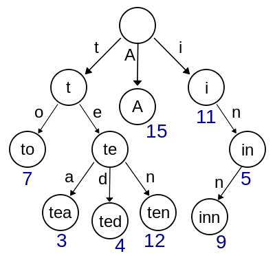

Алгоритм Ахо-Корасик

- [Алгоритм Ахо-Корасик](#алгоритм-ахо-корасик)
  - [Постановка задачи](#постановка-задачи)
  - [Задача о словаре](#задача-о-словаре)
  - [Построение бора](#построение-бора)
    - [Переходы по бору](#переходы-по-бору)
    - [Суффиксные ссылки](#суффиксные-ссылки)
    - [Переход по бору](#переход-по-бору)
    - [Сжатые суффиксные ссылки](#сжатые-суффиксные-ссылки)
    - [Использование автомата](#использование-автомата)

# Алгоритм Ахо-Корасик

## Постановка задачи

Есть множество шаблонов $\Phi = \{ p_1, \dots, p_n \}$ и один текст $|T| = n$.

Суммарная длина всех образцов - $m$.

Нужно найти, какие образцы из данного множества встречаются в этом тексте. Применение алгоритма Кнута-Морриса-Пратта неэффективно, т.к. алгоритм нужно будет запустить для каждого шаблона.

## Задача о словаре

Пусть есть словарь. Задача - как можно более эффективно хранить в нём слова. Структура данных, подходящая для этой цели - **бор**.
Если после этого стоит задача найти в тексте все слова из словаря, то рассматриваемый алгоритм как раз эффективно решает эту задачу.

## Построение бора

**Бор (Trie)** - дерево с корнем в некоторой вершине, каждое ребро которого подписано некоторой буквой.

Пусть дан набор строк - $\{ A, to, tea, ted, ten, i, in, inn \}$.



У дерева каждая дуга имеет пометку в виде одного символа, и не может быть двух дуг из одной вершины, которые имеют одинаковую пометку.

_Элемент бора на псевдокоде:_

```
struct Node:
    Node son[k]                      // массив сыновей
    Node go[k]                       // массив переходов (запоминаем переходы в ленивой рекурсии, используемый для вычисления суффиксных ссылок
    
    Node parent                      // вершина родитель
    Node suffLink                    // суффиксная ссылка (вычисляем в ленивой рекурсии)
    
    Node up                          // сжатая суффиксная ссылка
    char charToParent                // символ, ведущий к родителю
    
    bool isLeaf                      // флаг, является ли вершина терминалом
    vector<int> leafPatternNumber    // номера строк, за которые отвечает терминал
```

_Добавление слова в бор на псевдокоде:_

```
fun addString(string s, int patternNumber):
    Node cur = root
    for i = 0 to s.length - 1
        char c = s[i]
        if cur.son[c] == 0
            cur.son[c] = Node
            /* здесь также нужно обнулить указатели на переходы и сыновей */
            cur.son[c].suffLink = 0
            cur.son[c].up = 0
            cur.son[c].parent = cur
            cur.son[c].charToParent = c
            cur.son[c].isLeaf = false
        cur = cur.son[c]
    cur.isLeaf = true
    cur.leafPatternNumber.pushBack(patternNumber)
```

Пусть $[u]$ − слово, приводящие в вершину $u$ в боре. Узлы бора можно понимать как состояния автомата, корень - как начальное состояние. Соответственно, узлы бора, в которых заканчиваются строки, становятся терминальными.

### Переходы по бору

Заведем несколько функций для перехода по бору:

Во-первых, нужно определить функцию перехода "наверх":

`parent(u)`− возвращает родителя вершины $u$.

### Суффиксные ссылки

$$
\pi (u) = \delta ( \pi ( parent (u) ), c ) - \textbf{суффиксальная ссылка}
$$

и существует переход из `parent(u)` в $u$ по символу $c$.

Суффиксная ссылка для вершины $u$ − вершина, в которой оканчивается наидлиннейший собственный суффикс строки, соответствующей вершине $u$. Суффикс может быть и нулевой длины - т.е. суффиксная ссылка может вести в корень.

Другими словами, $\pi (u) = v$, если $[v]$ - максимальный суффикс $[u], [u] \ne [v]$.

Суффиксные ссылки для вышеуказанного примера:


Если ссылка не обозначена, значит, она ведёт в корень.

_Вычисление суффиксной ссылки на псевдокоде:_

```
Node getSuffLink(Node v):
    if v.suffLink == null                       // если суффиксная ссылка ещё не вычислена
       if v == root or v.parent == root
            v.suffLink = root
       else
            v.suffLink = getLink(getSuffLink(v.parent), v.charToParent)
    return v.suffLink
```

В данном случае и далее используется **ленивая рекурсия** - ссылки не вычисляются, если не нужны, но вычисленные ссылки запоминаются. Это позволяет экономить ресурсы.

### Переход по бору

$$
\delta (u, c) =
\begin{cases}
    v, \text{ если } v - \text{ сын символа } c \\
    root, \text{ если } u - \text{ корень и } c - \text{ не сын } u \\
    \delta ( \pi (u), c ), \text{ иначе}
\end{cases}
$$

Переход осуществляется по текущей вершине $u$ и символу $c$.

_Функция перехода на псевдокоде:_

```
Node getLink(Node v, char c): 
   if v.go[c] == null  // если переход по символу c ещё не вычислен
        if v.son[c]
            v.go[c] = v.son[c]
        else if v == root 
            v.go[c] = root 
        else 
            v.go[c] = getLink(getSuffLink(v), c)
    return v.go[c]
```

### Сжатые суффиксные ссылки

При построении автомата может возникнуть ситуация, что ветвление есть не на каждом символе. Тогда можно использовать **сжатые суффиксные ссылки**:

$$
up (u) =
\begin{cases}
    \pi (u), \text{ если } u - \text{ терминальный} \\
    \emptyset, \text{ если } u - \text{ корень} \\
    up ( \pi (u) ), \text{ иначе}
\end{cases}
$$

$up(u)$ - ближайшее допускающее состояние (терминал) перехода по суффиксным ссылкам.

_Вычисление сжатых суффиксных ссылок на псевдокоде:_

```
Node getUp(Node v):
    if v.up == null // если сжатая суффиксная ссылка ещё не вычислена
        if getSuffLink(v).isLeaf
            v.up = getSuffLink(v)
        else if getSuffLink(v) == root
            v.up = root
        else 
            v.up = getUp(getSuffLink(v))
    return v.up
```

В результате вышеописанных действий построен конечный детерминированный автомат.

### Использование автомата

В общих чертах, получившийся автомат нужно использовать следующим образом: по очереди просматривать символы текста, для каждого символа $c$ осуществляя переход по $\delta (u, c)$, где $\delta$ - текущее состояние. Оказавшись в новом состоянии, отметить по сжатым суффиксным ссылкам строки, которые встретились, и, если требуется, позицию.

_Использование автомата на псевдокоде:_

```
fun processText(string t):   
    Node cur = root
    for i = 0 to t.length - 1 
        char c = t[i] - 'a'
        cur = getLink(cur, c)
        /* В этом месте кода должен выполняться переход по сжатой суффиксной ссылке getUp(cur). 
        Для вершины, обнаруженной по ней тоже ставим, что она найдена, 
        затем повторяем для её сжатой суффиксной ссылки и так до корня. */

```