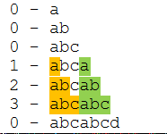

Поиск подстроки

- [Поиск подстроки](#поиск-подстроки)
  - [Основные определения](#основные-определения)
  - [Постановка задачи](#постановка-задачи)
  - [Префикс-функция](#префикс-функция)
  - [Наивный алгоритм](#наивный-алгоритм)
    - [Псевдокод](#псевдокод)
  - [Эффективный алгоритм](#эффективный-алгоритм)
    - [Псевдокод](#псевдокод-1)
  - [Алгоритм Кнута-Морриса-Пратта](#алгоритм-кнута-морриса-пратта)

# Поиск подстроки

## Основные определения

**Алфавит** - конечное непустое множество символов $\Sigma$.

**Язык** - над алфавитом $\Sigma$ - некоторое подмножество $\Sigma^*$. Иногда такие языки называют **формальными**, чтобы подчеркнуть отличие от языков в привычном смысле.

**Строка** - последовательность символов из алфавита $S$.

**Подстрока** - $S[i:j]$ - с $i$-ого по $j$-ый символы.

**Длина строки** - число символов в ней, обычно обозначается как $|w|$.

$\Sigma^k$ - множество всех строк длины $k$ из этого алфавита.

$\Sigma^* = \bigcup\limits_{k=0}^{\infty} \Sigma^k$ - множество всех строк.

$\epsilon = \Sigma^0$ - **пустая строка**.

$\Sigma^+ = \Sigma^* \backslash \Sigma^0$.

$x [ y - x$ **префикс** $y$, если $\exists \omega \in \Sigma^+: y = x \omega$ - подстрока, начинающаяся с первого символа строки.

Пусть $\beta = \underline{abr}acadabra$, тогда $\alpha = abr$ - префикс $\beta$.

$x ] y - x$ **суффикс** $y$, если $\exists \omega \in \Sigma^+: y = \omega x$ - подстрока, заканчивающаяся на последний символ строки.

Пусть $\beta = abracada\underline{bra}$, тогда $\alpha = bra$ - суффикс $\beta$.

**Собственный суффикс** - суффикс, не совпадающий со всей строкой.

$x$ - **бордер** $y$, если $\exists \omega, \gamma \in \Sigma^+: x \omega = \gamma x = y$

Пусть $\beta = \underline{abra} cad \underline{abra}$, тогда $\alpha = abra$ - бордер $\beta$.

$$
\begin{cases}
    x [ z \\
    y [ z \Rightarrow x [ y \\
    |x| < |y|
\end{cases}
$$

**Период** строки $\alpha$ - число $p: \forall i = 1 \dots |\alpha| - p, \alpha[i] = \alpha[i + p]$

Строка $abcabcabcabc$ имеет период 3, так как она может быть образована путём объединения 4-х строк $abc$. Она также имеет период $6$ (объединение двух строк $abcabc$) и 12 (сама строка).

## Постановка задачи

Дана строка $T$ и образец $P$. Нужно найти все позиции, начиная с которых $P$ входит в $T$.

## Префикс-функция

[Префикс-функция](https://brestprog.by/topics/prefixfunction/)

**Префикс-функция** - $\pi ( S, i ): \Sigma^* \to \mathbb{N}$, где $S \in \Sigma^+$ - строка, $i \in [2, |S|]$ - длина префикса в $S$.

Определяет длину наибольшего префикса подстроки $S[1:i]$, который одновременно является её собственным суффиксом (т.е. случай $\pi (S, i) = |S|$ не рассматривается).

Часто результат записывается в виде вектора из $\pi (S, i)$, где $i$ пробегает по всем возможным значениям.

**Пример.**

Строка: $abcabcd$



В таком случасе $\pi (abcabcd) = [0, 0, 0, 1, 2, 3, 0]$.

## Наивный алгоритм

Можно вычислить префикс-функцию по определению, т.е. сравнивая префиксы и суффиксы для всех подстрок.

Здесь и далее обозначения псевдокода:

$p$ - массив со значениями префикс-функции, соответственно $p[i]$ -  префикс-функция от $i$−й подстроки.

$s$ - строка, $s[i]$ - $i$-ый символ. Нумерация с 0.

### Псевдокод

```
int[] prefixFunction(string s):
     int[] p = int[s.length]
     fill(p, 0)
     for i = 0 to s.length - 1
         for k = 0 to i - 1
             if s[0..k] == s[i - k..i]
                 p[i] = k
     return p
```

Реализация на C++:

```c++
vector<int> prefix_function (string s) {
	int n = (int) s.length();
	vector<int> p (n);
	for (int i = 0; i < n; ++i)
		for (int k = 0; k <= i; ++k)
			if (s.substr(0, k) == s.substr(i - k + 1, k))
				p[i] = k;
	return p;
}
```
Сложность такого алгоритма - итераций цикла $O(n^2)$, сравнение - $O(n)$, в итоге $O(n^3)$.


## Эффективный алгоритм

Префикс-функция используется в алгоритме КМП, поэтому её эффективное вычисление важно для работы алгоритма. Для повышения эффективности используются следующие закономерности:

1. $p[i + 1] \le p[i] + 1$. Это очевидно - если рассмотреть суффикс, заканчивающийся на позиции $i+1$ и убрать один символ, получится суффикс длины $p[i + 1] − 1$.

2. Нужно избавится от сравнений строк. Т.е. уже вычислено $p[i]$:

    - Если $s[i + 1] = s [ p[i] + 1 ]$, то $p[i + 1] = p[i] + 1$.

    - Если это неверно, нужно найти подстроку меньшей длины. Это тоже нужно сделать максимально эффективно - сразу перейти к бордеру наибольшей длины.

    Подберем такое $k$, что $k = p[i]−  1$. Исходное $k − p[i − 1]$. Если $s[k + 1] \ne s[i]$, то следующее значение - $p[k]$. Если $k = 0$, то при $s[i] = s[1] p[i] := 1$, иначе $p[i] = 0$.

    

### Псевдокод

```
int[] prefixFunction(string s):
  p[0] = 0
  for i = 1 to s.length - 1
      k = p[i - 1]
      while k > 0 and s[i] != s[k]
          k = p[k - 1]
      if s[i] == s[k]
          k++
      p[i] = k
  return p
```

Реализация на C++:

```c++
vector<int> prefix_function (string s) {
    int n = (int) s.length();
    vector<int> p (n);
    for (int i=1; i<n; ++i) {
        int j = p[i-1];
        while (j > 0 && s[i] != s[j])
            j = p[j-1];
        if (s[i] == s[j])  ++j;
        p[i] = j;
    }
    return p;
}
```

Теперь время работы алгоритма - $O(n)$.

## Алгоритм Кнута-Морриса-Пратта

Дана строка $T$ и образец $P$. Нужно найти все позиции, начиная с которых $P$ входит в $T$.

Для этого строится строка $S = P \# T$, где $\# \notin \Sigma$.

На этой строке вычисляется значение префикс-функции. Если для какого-то $i: p[i] = |P|$, то это - вхождение. Алгоритм выглядит следующим образом:

```
int[] kmp(string P, string T):
   int pl = P.length
   int tl = T.length
   int[] answer
   int[] p = prefixFunction(P + "#" + T)
   int count = 0
   for i = 0 .. tl - 1
      if p[pl + i + 1] == pl
         answer[count++] = i - pl + 1 
   return answer
```

Реализация на C++:

```c++
vector<int> kmp(string P, string T){
    int pl = P.length();
    int tl = T.length();
    vector<int> answer;
    vector<int> p = prefix_function(P + "#" + T);
    for (int i=0; i<tl; i++){
        if (p[pl+i+1] == pl)
            answer.push_back(i - pl + 1);
    }
    return answer;
}
```

Время работы алгоритма оценивается как $O(P + T)$.