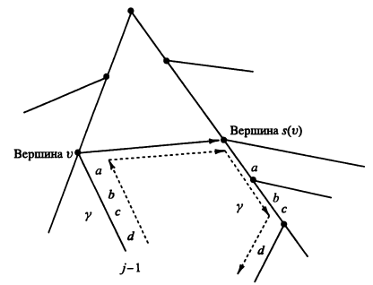

Суффиксные деревья

- [Суффиксные деревья](#суффиксные-деревья)
  - [Суффиксный бор](#суффиксный-бор)
  - [Суффиксное дерево](#суффиксное-дерево)
  - [Поиск наибольшей подстроки в S1 и S2](#поиск-наибольшей-подстроки-в-s1-и-s2)
  - [Эффективное построение суффиксного дерева (Укконена)](#эффективное-построение-суффиксного-дерева-укконена)
    - [Псевдокод](#псевдокод)
  - [Продолжение суффикса](#продолжение-суффикса)
    - [Сложность алгоритма](#сложность-алгоритма)
  - [Улучшение алгоритма](#улучшение-алгоритма)
    - [Переходы по суффиксным связям](#переходы-по-суффиксным-связям)
    - [Алгоритм отдельного продолжения](#алгоритм-отдельного-продолжения)
    - [Скачок по счётчику](#скачок-по-счётчику)
    - [Сжатие дуговых ссылок](#сжатие-дуговых-ссылок)
    - [Ещё оптимизации](#ещё-оптимизации)
    - [Алгоритм одной фазы](#алгоритм-одной-фазы)
    - [Получение суффиксного дерева из неявного суффиксного дерева](#получение-суффиксного-дерева-из-неявного-суффиксного-дерева)

# Суффиксные деревья

## Суффиксный бор

**Суффиксный бор** - бор, содержащий все суффиксы данной строки.

**Пример 1.**

`КОРОВА`

Суффиксы:
```
КОРОВА
ОРОВА
РОВА
ОВА
ВА
А
```


**Пример 2.**

`aaabbb`


Чтобы построить суффиксный бор для строки, достаточно добавить все суффиксы в бор.

Такой суффиксный бор можно использовать для поиска подстроки в строке за линейное время. Чтобы построить его наивным способом, требуется $O(n^2)$ операций.

Суффиксный бор неэффективен по памяти - если хранить в каждом элементе массив перехода размера $|\Sigma|$, где $\Sigma$ - алфавит, то потребуется $O ( n^2 \cdot |\Sigma| )$ памяти.

Если учесть, что число ветвлений не превышает число суффиксов, то число вершин, из которых идёт более одного перехода - $O(n)$.

Поэтому в неветвящихся вершинах можно хранить только символ перехода и ребёнка, чтобы занять $O (n^2 + n |\Sigma|)$ памяти.

## Суффиксное дерево

(Сжатое) суффиксное дерево - это оптимизация суффиксного бора, требующая линейное количество памяти. Свойства суффиксного дерева для строки $|s| = n$.

- Каждая вершина имеет не меньше двух детей.

- Каждое ребро помечено непустой подстрокой строки $s$.

    **Сжатие дуговых веток** - вместо того, чтобы хранить всю строчку, хранятся номера начала и конца. Это сокращает время обращения к данным.

- Никакие два ребра, выходящие из одной вершины, не могут иметь пометок, начинающихся с одного и того же символа.

- Дерево должно содержать все суффиксы $s$, причем каждый суффикс заканчивается в листе и нигде более.

Не для каждой строки можно построить суффиксное дерево. Если в строке есть суффикс, который является префиксом другого суффикса, то суффикс заканчивается не в листе и суффиксное дерево построить невозможно. Чтобы это обойти, нужно добавить в конец строки символ, которого нет нигде в строке. Так, в слове "КОРОВА" этот символ - А.

**Пример.**


Индукцией по $n$  можно доказать, что число листьев дерева - $n$, а число внутренних вершин - меньше $n$.

Представим дерево как двумерный массив размера $|V| \times |E|$, где $|V|$ - число вершин в дереве, $|\Sigma|$ - мощность алфавита.

Для любого суффиксного дерева верна предыдущая лемма (у каждой вершины, по определению, не менее двух детей), значит, $|V| = O (2n)$.

Каждая $a[i][j]$ ячейка содержит информацию о том, в какую вершину ведет ребро из $i$-ой вершины по $j$-ому символу и индексы $l, r$ начала и конца подстроки, записанной на данном переходе. Итак, дерево занимает $O ( n | \Sigma | )$ памяти.

## Поиск наибольшей подстроки в S1 и S2

Кнут считал, что эту задачу невозможно решить за линейное время. Это оказалось неверным.

Сначала нужно добавить в конец строк два символа - например # и $:

```
КОРА$ ОРАТЬ#
```

После чего построить суффиксное дерево для строки.

## Эффективное построение суффиксного дерева (Укконена)

[Вики](https://neerc.ifmo.ru/wiki/index.php?title=%D0%90%D0%BB%D0%B3%D0%BE%D1%80%D0%B8%D1%82%D0%BC_%D0%A3%D0%BA%D0%BA%D0%BE%D0%BD%D0%B5%D0%BD%D0%B0)

Сложность построения дерева описанным способом - $O(m^2)$. Это неэффективно.

**Неявное суффиксное дерево строки** - дерево, полученное из суффиксного дерева удалением всех вхождений терминального символа, удалением после этого дуг без меток и удаление вершин, имеющих меньше двух детей.

**Пример.**

Дерево было построено для строки `xabxa$`, где `$` был добавлен как терминальный символ.


Хотя неявное суффиксное дерево может иметь листья не для всех суффиксов, в нем закодированы все суффиксы $S$.

Алгоритм Укконена строит неявное суффиксное дерево $T_i$ для каждого префикса $s[1 \dots i]$ строки $S$, начиная с 1 и заканчивая $T_m$, где $m = |S|$.

Алгоритм делится на $m$ **фаз**. В фазе $i + 1$ дерево $T_{i+1}$  строится из $T_i$. Каждая фаза $i + 1$ делится на $i + 1$ **продолжений**. В продолжении $j$ фазы $i + 1$ алгоритм сначала находит конец пути из корня, помеченного подстрокой $S[j \dots i]$. Затем он продолжает строку, добавляя к её концу символ $S ( i + 1 )$, если $S ( i + 1 )$ ещё не существует.

Таким образом, в фазе $i + 1$ в дерево помещается строка $S (1 \dots i + 1)$, а за ней строки $S[2 \dots i + 1], S[3 \dots i + 1]$ в продолжениях $1, 2, 3, \dots$. Продолжение $i + 1$ фазы $i + 1$ продолжает **пустой** суффикс строки $S[1 \dots i]$, т.е.  включает в дерево строку из одного символа $S ( i + 1 )$ (опять же, если её там не было).

### Псевдокод

```
Построить дерево T1
for (i = 1...m-1)       // Фаза i+1
	for (j = 1...i+1)   // Продолжение j
		Найти в текущем дереве конец пути из корня с меткой S[j...i]
		Если нужно, продолжить путь, добавить символ S(ш+1), обеспечив
            Появление строки S[j...i] в дереве
```

## Продолжение суффикса

Пусть $S[j \dots i] = \beta$ - суффикс $S[1 \dots i]$. В продолжении $j$, когда алгоритм находит конец $\beta$ в текущем дереве, он продолжает $\beta$, чтобы обеспечить присутствие суффикса $\beta S(i + 1)$ корне. Он действует по одному из следущих правил:

1. Если путь $\beta$ кончает в листе, то это значит,  что путь от корня с меткой $\beta$ доходит до конца некоторой дуги, входящей в лист. В этом случае нужно добавить к концу метки листовой дуги символ $S ( i + 1 )$.

2. Ни один путь из конца строки $\beta$ не начинается символом $S ( i + 1 )$, но по крайней мере один начинающийся путь оттуда имеется. В этом случае должна быть создана новая листовая дуга, начинающаяся в конце $\beta$ и помеченная символом $S ( i + 1 )$. При этом, если $\beta$ кончается внутри дуги, должна быть создана новая вершина. Листу в конце новой листовой дуги сопоставляется номер $j$.

3. Если некоторый путь из конца строки $\beta$ начинается символом $S ( i + 1 )$, то эта строка уже есть в дереве и ничего не надо делать.

**Пример.**


Фаза 6. Суффиксы:

- `axabxb` - в конец добавлен `b`

- `xabxb` - в конец добавлен `b`

- `abxb` - в конец добавлен `b`

- `bxb` - в конец добавлен `b`

- `xb` - уже есть

- `b` - уже есть

### Сложность алгоритма

- Поиск конца суффикса $\beta - O(|\beta|)$

- Продолжение $j$ в фазе $i + 1 - O(i - j + 1)$

- Построение $T_i - O(i^2)$

Итого: $O(m^3)$.

## Улучшение алгоритма

Пусть $xa$ − произвольная строка, где $x$ − её первый символ, а $\alpha$ − оставшаяся подстрока.

Если для внутренней вершины $v$ с её путевой меткой $x \alpha$ существует другая вершина $s(v)$ с путевой меткой $\alpha$, то указатель из $v$ в $s(v)$ называют суффиксной связью. Обозначается так: $( v, s(v) )$.

Если $\alpha$ пуста, то суффиксная связь идёт в корневую вершину.

Можно доказать, что из каждой внутренней вершины неявного суффиксного дерева выходит суффиксная связь.

### Переходы по суффиксным связям

В фазе $i + 1$ алгоритм находит место суффикса $S[j \dots i]$ строки $S[1 \dots i]$ в продолжении $j$ и $j = 1 \dots i + 1$. При наивном подходе строка $S[j \dots i]$ просматривается вдоль всего пути от корня в текущем дереве. Суффиксные связи могут сократить это движение и каждое его продолжение.

Рассмотрим первые два продолжения $(j = 1,2)$ фазы $i + 1$.

**Первое продолжение** - особый случай: конец полной строки $S[1 \dots i]$ должен быть в листе дерева $T_i$, т.к. $S[1 \dots i]$ - самая длинная строка в нем. Значит, при конструировании деревьев мы можем всё время поддерживать указатель на лист, соответствующей текущей полной строке и достраивать продолжение по правилу 1, чтобы строить его за константное время.

Представим строку $S[1 \dots i]$ в виде $x \alpha$ и пусть $(v, l)$ - дуга дерева, входящая в лист $l$.
Следующее действие алгоритма - нахождение конца $S[2 \dots i]$. В этом месте $v$ является либо корнем, либо внутренней вершиной $T_i$. Если это корень, то для нахождения конца алгоритм спускается по дереву пути, помеченному $\alpha$. А если это внутренняя вершина, то $v$ имеет суффиксную связь с $s(v)$. Поскольку $s(v)$ имеет префикс строки $\alpha$, то конец строки $\alpha$ находится в поддереве $s (v)$. Значит, при поиске конца $\alpha$ не нужно проходить от корня, достаточно пройти путь от вершины $s(v)$.

Таким образом, для **второго продолжения** нужно пройти вверх от листа $l$ до вершины $v$, далее по суффиксной связи из $v$ в $s(v)$, после чего от $s(v)$ − вниз по пути и в конце пути изменить дерево по правилам продолжения суффикса.

**В общем случае** идея такая же: при продолжении любой строки $S[j \dots i]$ до $S[j \dots i + 1]$ мы поднимаемся вверх, попадая либо в корень, либо в вершину $v$, из которой выходит суффиксная связь. Если $v$ − не корень, то пусть $\gamma$ - дуговая метка.



### Алгоритм отдельного продолжения

Продолжение $j \ge 2$ фазы $i + 1$

1. Найти в конце строки $S[j - 1 \dots i]$ или выше его первую вершину $v$, которая либо имеет исходящую суффиксную связь, либо является корнем. Для этого нужно пройти вверх до конца $S[j - 1 \dots i]$. Пусть $\gamma$ - строка между $v$ и концом $S[j - 1 \dots i]$.

2. Если $v$ не корень, пройти суффиксную связь из $v$ в вершину $s(v)$ и спустится из $s(v)$ по пути $\gamma$.

    Если $v$ - корень, пройти, как в наивном алгоритме.

3. С помощью правил продолжения, обеспечить вхождение строки $S[j \dots i] S(i + 1)$ в дерево.

4. Если в продолжении $j − 1$ была создана новая внутренняя вершина $\omega$, то строка $\alpha$ должна кончаться в вершине $s (\omega)$  в конце суффиксной связи из $\omega$.

    Нужно создать суффиксную связь $(\omega, s(\omega))$.

Это ещё не улучшает скорость работы алгоритма.

### Скачок по счётчику

На шаге 2 алгоритм идёт в вниз из вершины $s(v)$ по пути с меткой $\gamma$. Это прохождение занимает время $| \gamma |$  и всё время, затрачиваемое на это - $O(m)$.

Пусть $g = |\gamma|$. Пусть $g'$ -  число символов в дуге, исходящей по нужному символу. Если $g' < g$, то можно просто перепрыгнуть в конец. Затем $g := g - g'; h = g' + 1$ и просматриваются выходящие дуги, чтобы найти среди них правильно продолжение - с начальным символом $h$.

При идентификации следующей дуги пути, он сравнивает текущее значение $g$ с числом символов на этой дуге $g'$. Если $g \ge g'$, алгоритм перескакивает к концу дуги.


Это обеспечивает переход за время, пропорциональное числу вершин, а не символов.

Можно доказать, что вершинная глубина $v$ не более чем на единицу превосходит $s(v)$.

Теперь суффиксные связи обеспечивают время работы $O(m^2)$.

### Сжатие дуговых ссылок

**Сжатие дуговых ссылок** позволяет хранить дерево в памяти за $O(m)$.


### Ещё оптимизации

1. После первого использования правила 3 заканчивать работу с продолжением.

2. Если в какой-то момент будет создан лист с меткой $j$, то он останется листом во всех последующих итерациях продолжения. Из такого наблюдения следует следующая оптимизация:

    В фазе $i + 1$ запоминать $e = i + 1$ − символ текущего конца. В результате, когда алгоритм узнает, что в продолжениях с 1 до $j_i$ будет применено правило 1, в первых $j_i$ продолжениях не потребуется никакой дополнительной работы.

###  Алгоритм одной фазы

1. Увеличить индекс $e$ до $i+1$.

2. Явно вычислить последовательные продолжения от $j_i + 1$ до достижения первого продолжения $j^*$, где применяется правило 3, или до конца этой фазы.

3. Приготовляясь к следующей фазе, положить $j_{i + 1}$ равным $j^* - 1$.

Шаг 3 устанавливает корректное значение $j_{i + 1}$, т.к. исходная последовательность продолжений, в которых используются правила 1 и 2, должна заканчиваться в точке, где применяется правило 3.

Теперь время линейное - $O(m)$.


### Получение суффиксного дерева из неявного суффиксного дерева

Для этого достаточно добавить к строке терминальный символ и снова запустить алгоритм Укконена.